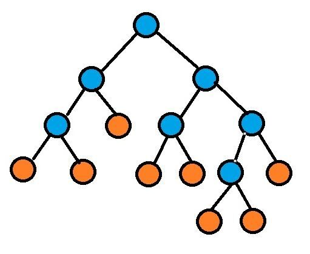

## 一、业务负载分配

### 描述

给定一个任务数组tasks，tasks[i]表示第 i 号任务的个数。给定服务器的数量serverNum，表示有serverNum个服务器可使用。任务需要分配到服务器上运行，规则如下

一台服务器只能运行一种类型的任务，但可以运行任意个同类型的任务，也可以不运行任务（资源浪费）。
所有服务器上中运行任务数量最多的那台服务器上的任务数，称为最大负荷。
求最小的最大负荷。数据范围：1<=tasks.length<=1e5 , 1<=tasks[i]<=10e9 , 1<=serverNum<=1e5

```
输入：tasks={7,4} serverNum=5
输出：3

第一个任务分配3台服务器，负荷分别为：3,3,1 或者 3，2，2
第二个任务分配2台服务器，负荷分别为：3,1 或者 2,2
所以最小的最大负荷为3
```

### 题解

思路：二分搜索。对单台服务器的最大负荷进行二分枚举，最大的枚举范围是 [1, 1e9]

```c++

	#include <iostream>
	#include <vector>
	 
	using namespace std;
	 
	class Solution {
	public:
	    //检查最大负荷为load的情况，能否执行这批任务
	    bool check(const vector<int> &task, int load, int serverNum)
	    {
	        int res = 0;
	        for (const auto &item : task) {
	            res += (item + load - 1) / load;
	        }
	        return res <= serverNum;
	    }
	 
	    // 待实现函数，在此函数中填入答题代码;
	    int GetMinLoad(int serverNum, const vector<int> &task)
	    {
	        int left = 1, right = 1;
	        for (const auto &item : task) {
	            right = max(right, item);
	        }
	 
	        while (left < right) {
	            int mid = left + (right - left) / 2;
	            if (check(task, mid, serverNum)) {
	                right = mid;
	            } else {
	                left = mid + 1;
	            }
	        }
	        return left;
	    }
	};
	 
	int main()
	{
	    Solution solution;
	    vector<int> task = { 7, 4 };
	    solution.GetMinLoad(5, task);
	}

```


## 二、表达式并发计算

### 描述
有一个二叉树状的计算图，叶子节点表示数字（下图的橙色节点），非叶子节点表示运算符号：`+、-、*、/`（下图的蓝色节点），蓝色节点运算完了后用运行结果（数字）代替原来的运算符号（相当于蓝色变橙色）。完成整个计算过程需要从叶子节点一路运算到根节点。



并行运算：比如上图 第三层的左边第一个蓝色节点和第四层的蓝色节点是可以并行计算的。

现在有一个n核的CPU，每个CPU时钟周期可以进行n个运算操作，问完成整颗树的运算**最少需要多少个周期**？

```
题目提示：层次遍历可以借助队列构建二叉树
```

### 思路


第一步处理输入，根据层次遍历构建出二叉树。

第二步，解题。

分析1：运算过程一定是下层节点优先于上层节点。因为假如是一颗不平衡的二叉树，右子树比左子树高很多，如果先运行完了左子树的蓝色节点，根节点还是需要等待右子树的运行。所以要使用层次遍历。

分析2：非叶子节点在哪个CPU周期运行，有两个影响因素：

左右子树所在的运行周期最大的那个+1 和 CPU该周期核的使用情况

第一个因素使用 递归 + 回溯 。第二个因素使用一个 数组记录每个CPU周期核的使用 情况，当根据第一个因素求出的周期里CPU核数使用满了的话，就线性往后寻找第一个有空闲的周期。

综合：先建树，然后使用递归的方式进行层次遍历，每层进入一次递归，递归的深度就是树的高度。再回溯，根据左右子树所在的运算周期以及CPU目前的运行情况，计算出非叶子节点所在的CPU运算周期


```c++
	#include <iostream>
	#include <vector>
	#include <queue>
	#include <cassert>
	 
	using namespace std;
	 
	class TreeNode {
	public:
	    int val;
	    TreeNode *left = nullptr;
	    TreeNode *right = nullptr;
	 
	    explicit TreeNode(int val) : val(val) {}
	 
	    ~TreeNode() {
	        delete left;
	        delete right;
	    }
	};
	 
	 
	class Solution {
	public:
	    TreeNode *buildTree(const vector<int> &nodeValues) {
	        queue<TreeNode *> queue;
	        TreeNode *root = new TreeNode(nodeValues[0]);
	        queue.push(root);
	        int headChildCnt = 0;
	        for (int i = 1; i < nodeValues.size(); ++i) {
	            TreeNode *node = nullptr;
	            if (nodeValues[i] != -1) {
	                node = new TreeNode(nodeValues[i]);
	                queue.push(node);
	            }
	            if (headChildCnt % 2 == 0) {
	                queue.front()->left = node;
	            } else {
	                queue.front()->right = node;
	            }
	            headChildCnt++;
	            if (headChildCnt % 2 == 0) {
	                queue.pop();
	            }
	        }
	        return root;
	    }
	 
	 
	    void dfs(vector<pair<TreeNode *, int>> &parents, vector<int> &cpuTimes, int coreCount, int &res) {
	        //pair.first表示树节点，pair.second表示树节点在哪个CPU运算周期运行
	        vector<pair<TreeNode *, int>> next;
	        //父节点反查索引（儿子找爸爸用）。next数组中 next[i] 的父节点是 parents[parentIdx[i]]
	        vector<int> parentIdx;
	 
	        /**
	         * 分析 1 使用层次遍历
	         */
	        for (int i = 0; i < parents.size(); ++i) {
	            TreeNode *node = parents[i].first->left;
	            if (node != nullptr) {
	                parentIdx.emplace_back(i);
	                next.emplace_back(node, 0);
	            }
	            node = parents[i].first->right;
	            if (node != nullptr) {
	                parentIdx.emplace_back(i);
	                next.emplace_back(node, 0);
	            }
	        }
	 
	        //递归出口
	        if (next.empty()) {
	            return;
	        }
	 
	        /**
	         * 进入下一层递归
	         */
	        dfs(next, cpuTimes, coreCount, res);
	 
	        /**
	         * 回溯
	         */
	        //分析 2 中的第一个影响因素，左右子树所在的运算周期。
	        //根据左右子树的周期得到父节点最早的运算周期
	        for (int i = 0; i < next.size(); ++i) {
	            const auto &child = next[i];
	            //这里就是儿子找爸爸
	            int idx = parentIdx[i];
	            auto &parent = parents[idx];
	            //子节点的运算周期 影响 父节点的运算周期
	            parent.second = max(parent.second, child.second + 1);
	        }
	 
	        //分析 2 中的第二个影响因素，CPU目前的运行情况
	        for (auto &node : parents) {
	            if (node.second == 0) {
	                continue;
	            }
	            int minTime = node.second;
	 
	            //线性探测，寻找第一个有空闲的周期
	            while (cpuTimes[minTime] >= coreCount) {
	                minTime++;
	            }
	            cpuTimes[minTime]++;
	            res = max(res, minTime);
	            node.second = minTime;
	        }
	    }
	 
	    // 待实现函数，在此函数中填入答题代码
	    int GetCycleCount(int coreCount, const vector<int> &nodeValues) {
	        TreeNode *root = buildTree(nodeValues);
	 
	        //记录CPU每个周期运行情况的数组
	        vector<int> cpuTimes(nodeValues.size(), 0);
	        cpuTimes.emplace_back(0);
	        int res = 0;
	        vector<pair<TreeNode *, int>> parent;
	        parent.emplace_back(root, 0);
	        dfs(parent, cpuTimes, coreCount, res);
	 
	        delete root;
	        return res;
	    }
	};
	 
	 
	int main() {
	    Solution solution;
	    vector<int> nodes = {0, 0, 0, 0, 1, 0, 0, 1, 1, -1, -1, 1, 1, 0, 1, -1, -1, -1, -1, -1, -1, -1, -1, 1, 1};
	    int res;
	    res = solution.GetCycleCount(2, nodes);
	    assert(res == 4);
	 
	    nodes = {0, 0, 0, 1, 1, 1, 1};
	    res = solution.GetCycleCount(3, nodes);
	    assert(res == 2);
	}

```


## 三、编解码歧义
### 2.1 题目描述
一个编解码系统采用一种编解码策略，一个数字后面跟相应数目个字符，比如118computer1a,可以拆成11 +“ 8computer1a”，也可以拆成1+“1”+8+“computer”+1+“a”，这种情况称为歧义。

给一个字符串，如果按编码策略只有一种解码方式即无歧义则返回去掉数字后的长度，否则返回-1。

### 解题思路

#### 2.2 解题思路
这道题第一眼的想法，肯定需要回溯去拿到所有的可能解，如果有唯一解，去掉数字后的长度就是答案，如果没有解或者多个解则返回-1；

分析题目可以想到，没有必要每次逐个的扫描字符串中的每个字符。可以生成一个字符串中数字所在位置及值的索引数组，索引数组的长度就是字符串的长度。

1、查看当前位置是否是字符串结束位置，若是字符串结束位置，则将数字列表添加到可能解列表中，若不是，进入步骤2

2、从起始位置第一个数字开始，拿到数字对应的值，往后跳，跳到下一个位置，同时将当前数字维护进数字列表中，进入下一次回溯，回溯结束后进入步骤3

3、判断当前位置下一个位置是不是也是数字，如果是，则与当前位置数字拼成一个更大的数字，并计算下次起始位置，重新进入步骤1

回溯结束后，就拿到了所有的可能解，唯一解返回去掉数字后的字符串长度，无解或者多解返回-1即可

#### 2.3 题解

``` java
public class Solution {
    public int getLength(String encodedString) {
        int length = encodedString.length();
        // 维护单个数字位置及值的索引数组
        Character[] digits = new Character[length];
        for (int i = 0; i < length; i++) {
            if (Character.isDigit(encodedString.charAt(i))) {
                digits[i] = encodedString.charAt(i);
            }
        }
        // 单个解的数字列表
        List<String> codes = new ArrayList<>();
        // 所有可能解的列表
        List<List<String>> allResults = new ArrayList<>();
        // 回溯遍历
        checkBack(0, length, digits, codes, allResults);

        // 查看解列表数量，构造返回值
        if (allResults.size() == 1) {
            // 唯一解返回去除数字列表中数字后的字符串长度
            int countCodesLength = 0;
            codes = allResults.get(0);
            for (String code : codes) {
                countCodesLength += code.length();
            }
            return length - countCodesLength;
        } else {
            // 多个解或无解返回-1
            return -1;
        }
    }
    
    public void checkBack(int begin, int sourceLength, Character[] digits, List<String> codes,
        List<List<String>> allResults) {
        // 到达字符串末尾，说明是解，加入解列表中
        if (begin == sourceLength) {
            allResults.add(new ArrayList<>(codes));
        }
        //未到达字符串末尾，继续判断
        if (begin < sourceLength && digits[begin] != null) {
            //temp维护当前位置起连续数字的位置索引
            int temp = begin;
            String tempNumStr = "";
            while (digits[temp] != null) {
                //拼接数字字符串，比如第一个位置是“1”，第二个位置是"1",拼接为11
                tempNumStr += digits[temp];
                //进入下一次检查前，将数字加入数字列表
                codes.add(tempNumStr);
                //进入下一次检查要跳跃的步数
                int jump = Integer.parseInt(tempNumStr);
                checkBack(temp + jump + 1, sourceLength, digits, codes, allResults);
                //上一个可能数字检查完毕，连续数字位置索引后移一位，移除上次的数字，进入下一次回溯
                temp++;
                codes.remove(codes.size() - 1);
            }
        }
    }
}
```
可能不太好理解，手笨，不会画动图，可以debug一把看看codes和allResults列表的内容，帮助理解。以“118computer1a”为例，程序回溯得到的解为
回溯共得到解 2 个
回溯共得到解 [[1, 8, 1], [11]]
最终结果为：-1

#### 2.4 思考及优化：
这种方法应该不是最优解，因为虽然回溯到了所有解。以“118computer1a118computer1a”为例，得到的解为
回溯共得到解 4 个
回溯共得到解 [[1, 8, 1, 1, 8, 1], [1, 8, 1, 11], [11, 1, 8, 1], [11, 11]]
最终结果为：-1
但是实际题目并不需要所有解，当判断到解列表中有多个解就可以结束回溯了，修改如下。

``` java
public class Solution {
    public int getLength(String encodedString) {
        int length = encodedString.length();
        // 维护单个数字位置及值的索引数组
        Character[] digits = new Character[length];
        for (int i = 0; i < length; i++) {
            if (Character.isDigit(encodedString.charAt(i))) {
                digits[i] = encodedString.charAt(i);
            }
        }
        // 单个解的数字列表
        List<String> codes = new ArrayList<>();
        // 所有可能解的列表
        List<List<String>> allResults = new ArrayList<>();
        // 回溯遍历
        checkBack(0, length, digits, codes, allResults);

        // 查看解列表数量，构造返回值
        if (allResults.size() == 1) {
            // 唯一解返回去除数字列表中数字后的字符串长度
            int countCodesLength = 0;
            codes = allResults.get(0);
            for (String code : codes) {
                countCodesLength += code.length();
            }
            return length - countCodesLength;
        } else {
            // 多个解或无解返回-1
            return -1;
        }
    }
    
    public void checkBack(int begin, int sourceLength, Character[] digits, List<String> codes,
        List<List<String>> allResults) {
        // 到达字符串末尾，说明是解，加入解列表中
        if (begin == sourceLength) {
            allResults.add(new ArrayList<>(codes));
            // 检查到多个解的时候，结束回溯。
            if (allResults.size() > 1) {
                return;
            }
        }
        // 未到达字符串末尾，继续判断
        if (begin < sourceLength && digits[begin] != null) {
            // temp维护当前位置起连续数字的位置索引
            int temp = begin;
            String tempNumStr = "";
            while (digits[temp] != null) {
                // 拼接数字字符串，比如第一个位置是“1”，第二个位置是"1",拼接为11
                tempNumStr += digits[temp];
                // 进入下一次检查前，将数字加入数字列表
                codes.add(tempNumStr);
                // 进入下一次检查要跳跃的步数
                int jump = Integer.parseInt(tempNumStr);
                checkBack(temp + jump + 1, sourceLength, digits, codes, allResults);
                // 检查到多个解的时候，结束回溯。
                if (allResults.size() > 1) {
                    return;
                }
                // 上一个可能数字检查完毕，连续数字位置索引后移一位，移除上次的数字，进入下一次回溯
                temp++;
                codes.remove(codes.size() - 1);
            }
        }
    }
}
```

以“118computer1a118computer1a”为例，运行之后得到的解及最终输出结果为
回溯共得到解 2 个
回溯共得到解 [[1, 8, 1, 1, 8, 1], [1, 8, 1, 11]]
最终结果为：-1


## 商品折购

### 题目描述
1、商品折购
给定一个商品价格列表，下标代表商品，值代表商品的单价。
如： price[6] = {10,5,8,8,6,3}; // 商品 0 单价10， 商品1 单价5

给定折扣规则列表及折扣值:
```
pro[][] = {
         {0， 7}，
         {4， 10}，
         {2, 6，1,  9}，
         {5，2}
};
dis[] = {4, 3, 5, 1};
上面共有4个折扣规则，1.  0号商品买7个，可以减4元，2. 4号商品买10个可以减3元。 3.  2号商品买6个 && 1号商品买9个可以减5元

**折扣列表里面商品不会重复。**

？折扣规则，可以重复使用吗？比如，0号商品买了14个，可否享受量2次的4元折扣？？ 个人觉的是可以使用的。
```

顾客需要买的商品列表:
```
order[] = {2,17,3,10,1,27,5,2,4,9}；
```
问： 按最大折扣后，用户最终需要支付多少？

### 题解

```c++

	#include <vector>
	#include <unordered_map>
	#include <cassert>
	#include <iostream>
	 
	using namespace std;
	 
	class Solution {
	public:
	    bool canDis(vector<int> &pro, unordered_map<int, int> &orders) {
	        for (int j = 1; j < pro.size(); j += 2) {
	            if (pro[j] > orders[pro[j - 1]]) {
	                return false;
	            }
	        }
	        return true;
	    }
	 
	    void dfs(int idx, vector<vector<int>> &pro, vector<int> &dis, unordered_map<int, int> &orders, int &maxDisc,
	             int curDis) {
	        if (maxDisc < curDis) {
	            maxDisc = curDis;
	        }
	 
	        if (idx >= pro.size()) {
	            return;
	        }
	 
	        for (int i = idx; i < pro.size(); ++i) {
	            if (canDis(pro[i], orders)) {
	                for (int j = 0; j < pro[i].size(); ++j) {
	                    int num = pro[i][j];
	                    int cnt = pro[i][++j];
	                    orders[num] -= cnt;
	                }
	                dfs(i + 1, pro, dis, orders, maxDisc, curDis + dis[i]);
	                for (int j = 0; j < pro[i].size(); ++j) {
	                    int num = pro[i][j];
	                    int cnt = pro[i][++j];
	                    orders[num] += cnt;
	                }
	            }
	        }
	    }
	 
	    int solve(vector<int> &price, vector<vector<int>> &pro, vector<int> &dis, vector<int> &order) {
	        int res = 0;
	        unordered_map<int, int> orders;
	        for (int i = 0; i < order.size(); i += 2) {
	            res += price[order[i]] * order[i + 1];
	            orders.insert({order[i], order[i + 1]});
	        }
	 
	        int maxDisc = 0;
	        dfs(0, pro, dis, orders, maxDisc, 0);
	 
	        return res - maxDisc;
	    }
	};
	 
	int main() {
	    vector<int> price = {10, 5, 8, 8, 6, 3};
	    vector<vector<int>> pro = {
	            {0, 7},
	            {4, 10},
	            {2, 6, 1, 9},
	            {5, 2}
	    };
	    vector<int> dis = {4, 3, 5, 1};
	    vector<int> order = {2, 17, 3, 10, 1, 27, 5, 2, 4, 9};
	 
	    Solution solution;
	    int res = solution.solve(price, pro, dis, order);
	    cout << res << endl;
	    assert(res == 405);
	}

```


## 20210813
### 1、礼物组合
输入为无序的两个整型数组goods和fruits，分别为good与fruit的价格。从两个整型数组中各取一个礼物（即取一个数）组合成一份礼物（即计算两数之和），取礼物价值最小的前n份。

简单说，就是两个数组各取一个数，构成一个组合。输出两数之和最小的前n个组合。
排序规则
两数之和最小优先
如果两个组合的数量和相等，则good更小的优先

### 题解
思路：排序 + 优先级队列。时间复杂度：O(nlgn)，n是数组长度。

Tips： 排序 + 优先级队列， 两个元素大顶堆的使用； 另一个是两个有序数组，进行组合时，如何进行组合的“剪枝”

``` c++
#include <vector>
#include <queue>
#include <algorithm>
#include <iostream>

using namespace std;

struct camp {
    bool operator()(pair<int, int> a, pair<int, int> b) {
        if (a.first + a.second == b.first + b.second) {
            return a.first <= b.first;
        }
        return a.first + a.second <= b.first + b.second;
    }
};

class Solution {
public:
    vector<int> solve(vector<int> &&goods, vector<int> &&fruits, int n) {
        sort(goods.begin(), goods.end());
        sort(fruits.begin(), fruits.end());

        priority_queue<pair<int, int>, vector<pair<int, int>>, camp> queue;
        
        for (const auto &good : goods) {
            for (const auto &fruit : fruits) {
                if (queue.size() < n) {
                    queue.push({good, fruit});
                    continue;
                }
                auto node = queue.top();
                if (node.first + node.second > good + fruit) {
                    queue.pop();
                    queue.push({good, fruit});
                } else {
                    break;
                }
            }
        }
     
        while (!queue.empty()) {
            auto node = queue.top();
            queue.pop();
            cout << node.first + node.second << "=" << node.first << "+" << node.second << endl;
        }
    }
};

int main() {
    Solution solution;
    solution.solve({1, 2, 6, 7, 10}, {3, 5, 7, 8, 12, 15}, 3);
}

```

### 2、文件路径打印
输入：例如usr/local/lib64，文件路径以‘/’表示目录层级。

输出：要求每深入一层，输出时缩进2个空格，同一层目录下要求字典升序，对大小写敏感。

测试用例
```
5
usr/local/lib64
GAMES
usr/DRIVERS
home
var/log/

GAMES
home
usr
  DRIVERS
  local
    lib64
var
  log
```

### 题解

思路：多叉树建树 + map排序 + dfs输出树状路径

TIPS: 
怎么构建多叉树？ 
怎么进行多叉树的遍历？ 有点dfs又有点层次遍历感觉。

``` c++
#include <iostream>
#include <vector>
#include <string>
#include <map>

using namespace std;

class Node {
public:
    string name;
    map<string, Node> children;
public:
    explicit Node(const string &name) : name(name) {}
};

class Solution {
public:
    void dfsPrint(map<string, Node> pathsMap, int level) {
        if (pathsMap.empty()) {
            return;
        }
        for (const auto &item : pathsMap) {
            for (int i = 0; i < level; ++i) {
                cout << "  ";
            }
            cout << item.second.name << endl;
            dfsPrint(item.second.children, level + 1);
        }
    }

    void solve(vector<string> paths) {
        Node root("/");
     
        map<string, Node> *p;
        int left, right;
        for (const auto &path : paths) {
            right = -1;
            p = &root.children;
            do {
                left = right + 1;
                right = path.find('/', left);
                string part = path.substr(left, right - left);
     
                auto node = p->find(part);
                if (node == p->end()) {
                    p->insert({part, Node(part)});
                    p = &p->find(part)->second.children;
                } else {
                    p = &node->second.children;
                }
            } while (right > 0 && right + 1 < path.length());
        }
     
        dfsPrint(root.children, 0);
    }
};

int main() {
    Solution solution;
    solution.solve({
                           "usr/local/lib64",
                           "GAMES",
                           "usr/DRIVERS",
                           "home",
                           "var/log/",
                   });
    cout << endl;
    solution.solve({
                           "Root/A",
                           "drv",
                           "root/b/",
                           "Root/"
                   });

}

```


## 20210903
### 1、商品销售
某司为实现商品销售的多样化，将多个产品绑定作为一个商品销售，每个商品中只有一个主产品，给定一个二维数组，数组的行下标，表示为商品序号:

如 {{100, 30, 10}}，[主产品ID， 成本， 利润] 意味着商品0 的主产品 为100 ，成本为 30, 利润为10,

给定需要购买的商品数目cnt，购买的优先级为优先购买成本低的，成本相同购买利润高的，利润相同购买序号小的，

给定限制limit 如 {{100, 1}},意味着以100 为主产品的商品只能购买1 件 。

如果能够在给定商品中购买够cnt 个商品，则返回商品序号升序排列，如果不能则返回空数组。

sales: [[100,30,10],[200,10,10],[100,50,20],[200,10,10],[400,20,20],[200,20,10]]
cnt: 3
limit: [[100,1],[200,1],[400,2]]

优先级排序后应为 [200, 10, 10][200, 10, 10][400, 20, 20][200, 20, 10][100, 30, 10][100, 50, 20]

返回: [0,1,4]

### 题解

思路：根据题目的优先级规则排序（下标排序） + hash表记录商品限定次数。时间复杂度：O(nlgn)，n是商品个数

TIPS： 
1、多维度排序的实现？根据第1个维度升序，第2个维度降序，第3个维度升序

``` c++

#include "iostream"
#include <vector>
#include <algorithm>
#include <unordered_map>

using namespace std;

class Solution {
public:
    vector<int> solve(vector<vector<int>> &goods, vector<vector<int>> &limits, int cnt) {
        vector<int> indexSort(goods.size());
        for (int i = 0; i < indexSort.size(); ++i) {
            indexSort[i] = i;
        }

        sort(indexSort.begin(), indexSort.end(), [&goods](int a, int b) {
            if (goods[a][1] != goods[b][1]) {
                return goods[a][1] <= goods[b][1];
            }
            if (goods[a][2] != goods[b][2]) {
                return goods[b][2] <= goods[a][2];
            }
            return a <= b;
        });
     
        unordered_map<int, int> hash;
        for (auto & limit : limits) {
            hash.insert({limit[0], limit[1]});
        }
     
        vector<int> res;
        for (int idx : indexSort) {
            auto node = hash.find(goods[idx][0]);
            if (node != hash.end()) {
                if (node->second > 0) {
                    node->second--;
                    res.emplace_back(idx);
                }
            } else {
                res.emplace_back(idx);
            }
        }
     
        if (res.size() < cnt) {
            res.resize(0);
        }
        sort(res.begin(), res.end(), [](int a, int b) { return a <= b; });
        return res;
    }
};

int main() {
    vector<vector<int>> sales = {{100, 30, 10},
                                 {200, 10, 10},
                                 {100, 50, 20},
                                 {200, 10, 10},
                                 {400, 20, 20},
                                 {200, 20, 10}};
    vector<vector<int>> limit = {{100, 1},
                                 {200, 1},
                                 {400, 2}};
    Solution solution;
    auto res = solution.solve(sales, limit, 3);
    for (const auto &item : res) {
        cout << item << endl;
    }
}
```

### 2、基站距离
给出一个MN的矩阵区域，用二维数组grid[m][n]表示，数组元素由“A”，“B”，“.”，“”，“#”组成。其中，“A”“B”分别表示基站A和基站B，“.”表示可达道路，“*”表示障碍物（无法通过），“#”表示地铁站。

现要求得出矩阵局域内，维修人员从基站A到达基站B的最短移动距离，有如下规则：
1.如果区域内没有同时具备基站A和基站B，则返回-1。
2.维修人员每移动一格，视为移动距离1。
3.所有地铁站互通，即维修人员到达“#”后，可以将距离+1后出现在任意其他一个“#”。
4.可能存在多个基站，需计算所有基站A到基站B中距离最短的那一对。
【输入输出示例】
输入：
["#A...*", "......", "....#*", "A....", "*...B."]
输出：
5

### 题解
思路：bfs求最短距离。

分析题目，A、B两个基站之间的路径有两种可能：1. A -> B。2. A -> # -> # ->B。

A、B、#三点，需要计算任意两点之间的最短距离。例如：对于地图上的每个 A，需要分别计算其到任意 # 和任意 B 的最短距离。B 和 # 同理。

记：A 和 #最短距离为：disA。A 和 B 为：disAb。B 和 # 为：disB

最终的答案是：min(disAb, disA + disB + 1)


``` c++
#include <string>
#include <vector>
#include <queue>
#include <iostream>

using namespace std;
#define MAX_VALUE 0x3f3f3f3f

class Solution {
public:
    //计算距离
    void findDis(int row, int col, char target, vector<string> &matrix, int &distance) {
        int n = matrix.size(), m = matrix[0].size();
        queue<pair<int, int>> queue;
        queue.push({row, col});
        int dir[3] = {0, 1, 0};
        int step = 1;
        while (!queue.empty()) {
            int len = queue.size();

            //剪枝
            if (step >= distance) {
                break;
            }
     
            for (int num = 0; num < len; ++num) {
                auto node = queue.front();
                queue.pop();
                for (int i = 0; i < 2; ++i) {
                    int x = node.first + dir[i];
                    int y = node.second + dir[i + 1];
     
                    if (x < 0 || y < 0 || x >= n || y >= m || matrix[x][y] == '*') {
                        continue;
                    }
     
                    if (matrix[x][y] == target) {
                        distance = step;
                        return;
                    }
                    queue.push({x, y});
                }
            }
            step++;
        }
     
    }
     
    int solve(vector<string> &matrix) {
        //A B 最短距离
        int distanceAb = MAX_VALUE;
        //# A 最短距离
        int distanceA = MAX_VALUE;
        //# B 最短距离
        int distanceB = MAX_VALUE;
     
        for (int i = 0; i < matrix.size(); ++i) {
            for (int j = 0; j < matrix[0].size(); ++j) {
                if ('A' == matrix[i][j]) {
                    //求 A B 最短距离
                    findDis(i, j, 'B', matrix, distanceAb);
                    //求 A # 最短距离
                    findDis(i, j, '#', matrix, distanceA);
                } else if ('#' == matrix[i][j]) {
                    //求 # B 最短距离
                    findDis(i, j, 'B', matrix, distanceB);
                    //求 # A 最短距离
                    findDis(i, j, 'A', matrix, distanceA);
                } else if ('B' == matrix[i][j]) {
                    //求 B A 最短距离
                    findDis(i, j, 'A', matrix, distanceAb);
                    //求 B # 最短距离
                    findDis(i, j, '#', matrix, distanceB);
                }
            }
        }
        int res = min(distanceAb, distanceA + distanceB + 1);
        return res == MAX_VALUE ? -1 : res;
    }
};

int main() {
    Solution solution;
    vector<string> graph = {
            "#A...*",
            "......",
            "....#*",
            "A....",
            "*....B"};
    int res = solution.solve(graph);
    cout << res << endl;
}
```

## 20210924
### 1、二叉树的最大深度
现有一个二叉树 root ，每个节点都有一个值，它的深度为从根到该节点的唯一路径长（根的深度为 1）。

给定一个整型列表 target，target[i]对应的「最大深度」定义为：

若二叉树中存在节点值大于 target[i] 的节点，则这些节点中最大的深度为 target[i] 的「最大深度」；

若二叉树中不存在节点值大于 target[i] 的节点，则 target[i] 的「最大深度」为 -1。

请计算 target 中每个元素的「最大深度」，并按 target 下标顺序依次存入序列返回。

### 题解思路
思路一：排序 + 单调队列。排序和队列操作的目标都是下标！时间复杂度：O(nlgn)，n是树节点数。

根据值排序，根据高度构造单调队列。

题目意思转换：

给你两个数组，targets：[2，4，6，8]，nodes：[[2，2]，[3，4]，[5，3]，[6，2]]

nodes数组中每个元素分别表示值和高度，如：[5, 1]表示值为5，高度为1。

对于targets中的每个元素 ai，在nodes数组中找到所有值 比 ai 大的元素里高度最大的那个。

例如：targets的第一个元素 2 ，nodes中值比2大的元素有：[3，4]，[5，3]，[6，2]，其中高度最大的是 [3, 4]。第一个元素对应的答案就是 4

附:354. 俄罗斯套娃信封问题

``` c++
#include <iostream>
#include <vector>
#include <algorithm>
#include <deque>

using namespace std;

class Solution {
public:
    void dfs(int high, TreeNode *root, vector<pair<int, int>> &nodes) {
        if (root == nullptr) {
            return;
        }
        nodes.emplace_back(pair<int, int>{root->val, high});
        dfs(high + 1, root->left, nodes);
        dfs(high + 1, root->right, nodes);
    }

    vector<int> getResult(vector<pair<int, int>> &nodes, vector<int> &target) {
        //target下标排序
        vector<int> indexSort(nodes.size());
        for (int i = 0; i < indexSort.size(); ++i) {
            indexSort[i] = i;
        }
        sort(indexSort.begin(), indexSort.end(), [target](int a, int b) { return target[a] <= target[b]; });
     
        //树节点值排序
        sort(nodes.begin(), nodes.end(), [](auto a, auto b) { return a.first <= b.first; });
     
        //对排序后树的节点，根据节点高度构造单调队列
        deque<int> deque;
        int minTar = target[indexSort[0]];
        for (int i = 0; i < nodes.size(); ++i) {
            int var = nodes[i].first;
            int high = nodes[i].second;
     
            if (var < minTar) {
                continue;
            }
     
            while (!deque.empty() && nodes[deque.back()].second <= high) {
                deque.pop_back();
            }
            deque.emplace_back(i);
        }
     
        vector<int> res(target.size());
     
        for (const auto &idx : indexSort) {
            while (!deque.empty() && nodes[deque.front()].first <= target[idx]) {
                deque.pop_front();
            }
            if (deque.empty()) {
                res[idx] = -1;
            } else {
                res[idx] = nodes[deque.front()].second;
            }
        }
     
        return res;
    }
     
    vector<int> solve(TreeNode *root, vector<int> &target) {
        vector<pair<int, int>> nodes;
        dfs(1, root, nodes);
     
        //问题转换
        return getResult(nodes, target);
    }
};

int main() {
    Solution solution;
    vector<int> targets = {2, 4, 5, 8};
    vector<pair<int, int>> nodes = {{2, 2},
                                    {3, 4},
                                    {5, 3},
                                    {6, 2}};
    vector<int> res = solution.getResult(nodes, targets);
    for (const auto &item : res) {
        cout << item << " ";
    }
    //4 3 2 -1
}
```

### 思路二：二叉树层次遍历。

层次遍历找出每层的最大值levelMax，然后遍历target数组，将levelMax与target[i]比较，更新结果res[i]。时间复杂度：O(mlg(n))。m是target数组长度，n是树节点数。

``` c++
//层次遍历解法
vector<int> solveII(TreeNode *root, vector<int> &target) {
    vector<int> res(target.size(), -1);

    queue<TreeNode *> queue;
    queue.push(root);
    int high = 1;
    while (!queue.empty()) {
        int cnt = queue.size();
        //树每层的最大值
        int levelMax = -0x3f3f3f3f;
        for (int i = 0; i < cnt; ++i) {
            auto node = queue.front();
            queue.pop();
            levelMax = max(levelMax, node->val);
            if (node->left) {
                queue.push(node->left);
            }
            if (node->right) {
                queue.push(node->right);
            }
        }
     
        for (int i = 0; i < target.size(); ++i) {
            if (target[i] < levelMax) {
                res[i] = high;
            }
        }
     
        high++;
    }
    return res;
}
```

### 2、货物抓取
码头抓取货物，优先抓取编号连续数目最多的货物，如果多个货物数目相同，优先抓取最左侧的货物。

如果货物被抓取后，右侧货物自动向左侧补齐。

输出抓取完货物的次数

输入：[8,8,8,5,5,5,8,1,1,2,3]
输出：6

用例解析：依次抓取[8,8,8]、[5,5,5]、[1,1]、[8]、[2]、[3]
货物编号取值范围[1, 10^5]，货物个数[1, 10^5] 

### 题解
思路一：暴力模拟。用两个数组来回拷贝。时间复杂度：O(n^2)

``` c++
#include "vector"
#include <iostream>

using namespace std;

class Solution {
public:
    int solve(vector<int> &&goods) {
        vector<int> bak;
        vector<int> *cur = &goods, *next = &bak, *temp;

        int res = 0;
        while (!cur->empty()) {
            int last = (*cur)[0], cnt = 1;
            int maxCnt = 1, idx = 0;
            for (int i = 1; i < cur->size(); ++i) {
                if ((*cur)[i] == last) {
                    cnt++;
                    continue;
                }
                if (maxCnt < cnt) {
                    maxCnt = cnt;
                    idx = i - cnt;
                }
                last = (*cur)[i];
                cnt = 1;
            }
     
            res++;
            next->resize(0);
            for (int i = 0; i < idx; ++i) {
                next->emplace_back((*cur)[i]);
            }
     
            for (int i = idx + maxCnt; i < cur->size(); ++i) {
                next->emplace_back((*cur)[i]);
            }
            temp = cur;
            cur = next;
            next = temp;
        }
        return res;
    }
};

int main() {
    Solution solution;
    int res = solution.solve({8, 8, 8, 5, 5, 5, 8, 1, 1, 2, 3});
    cout << res << endl;
}
```
### 题解2
思路二：延迟删除 + 优先级队列 + map二叉搜索树。优先级队列维护最长连续数字及其开始下标，当删除一个最长连续数字后，通过二叉搜索树快速找到删除位置的前后元素（下标），再判断是否需要合并，然后更新优先级队列和二叉搜索树。

时间复杂度：O(nlgn)。n是goods数组长度。

``` c++
int Solution::solveII(vector<int> &&goods) {
    // key: goods的下标 i；value: goods[i]的值。
    map<int, int> indexCntMap;
    // pair.first: goods的下标；pair.second: goods的下标的值连续个数。
    priority_queue<pair<int, int>, vector<pair<int, int>>, camp> queue;

    int last = goods[0], beginIdx = 0;
    for (int i = 1; i < goods.size(); ++i) {
        if (last == goods[i]) {
            continue;
        }
        indexCntMap.emplace(beginIdx, goods[beginIdx]);
        queue.push({beginIdx, i - beginIdx});
        beginIdx = i;
        last = goods[i];
    }
    indexCntMap.emplace(beginIdx, goods.size() - beginIdx);
    queue.push({beginIdx, goods.size() - beginIdx});
     
    vector<bool> lazyDel(goods.size());
     
    int res = 0;
    while (!queue.empty()) {
        auto top = queue.top();
        queue.pop();
        if (lazyDel[top.first]) {
            continue;
        }
     
        // 待删除元素
        auto toRemove = indexCntMap.find(top.first);
        auto post = ++toRemove--;
        auto pre = --toRemove++;
     
        //合并
        if (post != indexCntMap.end() && pre != indexCntMap.begin() && goods[post->first] == goods[pre->first]) {
            indexCntMap.emplace(post->first - 1, post->second);
            queue.push({post->first - 1, pre->second + post->second});
            lazyDel[pre->first] = true;
            lazyDel[post->first] = true;
            indexCntMap.erase(pre->first);
            indexCntMap.erase(post->first);
        }
     
        indexCntMap.erase(toRemove->first);
        res++;
    }
     
    return res;
}
```

## 20211022
### 1、字符串子集
所有可能性子串组合的问题，入参messages=“ABBCDCDAB”、keys = “BAC”

（keys非重复，最多为26个大写字母）

求满足条件的messages的子串的个数（即该子串包含keys中所有的字母），用例中有13种情况。

1. **ABBC**DCDAB
2. **ABBCD**CDAB
3. **ABBCDC**DAB
4. **ABBCDCD**AB
5. **ABBCDCDA**B
6. **ABBCDCDAB**
7. A**BBCDCDA**B
8. A**BBCDCDAB**
9. AB**BCDCDA**B
10. AB**BCDCDAB**
11. ABB**CDCDAB**
12. ABBC**DCDAB**
13. ABBCD**CDAB**

### 题解
思路：滑动窗口之最小窗口变种。

附原题：3. 无重复字符的最长子串

``` c++
#include <iostream>
#include "string"
#include "algorithm"

using namespace std;

class Solution {
public:
    bool check(const int hash[26], string keys) {
        return std::all_of(keys.begin(), keys.end(), [hash](const char &c) { return hash[c - 'A'] > 0; });
    }

    int solve(string message, string keys) {
        int hash[26] = {0};
     
        int left = -1;
        int res = 0;
        for (int i = 0; i < message.size(); ++i) {
            hash[message[i] - 'A']++;
     
            if (i - left < keys.size()) {
                continue;
            }
     
            while (check(hash, keys)) {
                res += message.size() - i;
                hash[message[++left] - 'A']--;
            }
        }
     
        return res;
    }
};

int main() {
    Solution solution;
    int res = solution.solve("ABBCDCDAB", "ABC");
    std::cout << res << endl;
}
```

### 2、预定往返机票
有个工程师出差支持某项目。

要求找到最便宜的往返机票价格。

给定两个数组：

表示去程的连续N天机票价格，例：go:[10,9,1,3,5,7,3,8,6]

表示返程的连续N天机票价格，例：back[9,4,3,7,2,7,2,6,1,6]

给定一个最大支撑天数和最小支持天数maxdays,mindays。

表示这次出差最多支持maxdays天，最少支持mindays天。

支撑天数=返程时间-出发时间。

（数组大小量级为10^5）

（1<=maxdays,mindays<=10^5）

（0<=go[i],back[i]<=10^6）

### 题解
思路：单调队列。时间复杂度：O(n)。

对于每个go[i]，找出 下标 j 属于 (i + minDays, i + maxDays] 范围，使得 back[j] 范围内最小。显然这是一个滑动窗口问题，可以用单调队列动态维护窗口内的最值。

``` c++
#include <iostream>
#include "vector"
#include "deque"
#include <cassert>

using namespace std;

class Solution {
public:
    int solve(vector<int> &&go, vector<int> &&back, int maxDay, int minDay) {
        deque<int> deque;

        int res = 0x3f3f3f3f;
        for (int i = 0; i + minDay < go.size(); ++i) {
            //维护队列的队头是范围内的最小值
            for (int j = i + minDay; j <= i + maxDay && j < back.size(); ++j) {
                while (!deque.empty() && back[deque.back()] >= back[j]) {
                    deque.pop_back();
                }
                deque.push_back(j);
            }
    		//当队头超出(i + minDays, i + maxDays]范围时，移除队头元素
            while (deque.front() < i + minDay) {
                deque.pop_front();
            }
     
            res = min(res, go[i] + back[deque.front()]);
        }
        return res;
    }
};

int main() {
    Solution solution;
    int res = solution.solve({10, 9, 1, 3, 5, 7, 3, 8, 6, 8}, {9, 4, 3, 7, 2, 7, 2, 6, 1, 6}, 9, 3);
    assert(res == 2);
    res = solution.solve({10, 9, 1, 3, 5, 7, 3, 8, 6, 8}, {9, 4, 3, 7, 2, 7, 2, 6, 1, 6}, 5, 3);
    assert(res == 3);
    return 0;
}

````

## 20211105
### 1、中国结问题
给定一个整数数组 ribbons 和一个整数 k，数组每项 ribbons[i] 表示第 i 条绳子的长度。

对于每条绳子，你可以将任意切割成一系列长度为正整数的部分，或者选择不进行切割。

例如，如果给你一条长度为 4 的绳子，你可以：

保持绳子的长度为 4 不变；

切割成一条长度为 3 和一条长度为 1 的绳子；

切割成两条长度为 2 的绳子；

切割成一条长度为 2 和两条长度为 1 的绳子；

切割成四条长度为 1 的绳子。

你的任务是最终得到 k 条完全一样的绳子，他们的长度均为相同的正整数。

如果绳子切割后有剩余，你可以直接舍弃掉多余的部分。

对于这 k 根绳子，返回你能得到的绳子最大长度；

如果你无法得到 k 根相同长度的绳子，返回 0。

示例 1:

输入: ribbons = [9,7,5], k = 3
输出: 5

解释:
 把第一条绳子切成两部分，一条长度为 5，一条长度为 4；
 把第二条绳子切成两部分，一条长度为 5，一条长度为 2；
 第三条绳子不进行切割；
现在，你得到了 3 条长度为 5 的绳子。
示例 2:

输入: ribbons = [7,5,9], k = 4
输出: 4

解释:
 把第一条绳子切成两部分，一条长度为 4，一条长度为 3；
 把第二条绳子切成两部分，一条长度为 4，一条长度为 1；
 把第二条绳子切成三部分，一条长度为 4，一条长度为 4，还有一条长度为 1；
现在，你得到了 4 条长度为 4 的绳子。
示例 3:

输入: ribbons = [5,7,9], k = 22
输出: 0

解释: 由于绳子长度需要为正整数，你无法得到 22 条长度相同的绳子。
提示:

1 <= ribbons.length <= 10^5
1 <= ribbons[i] <= 10^5
1 <= k <= 10^9

### 题解

思路：对最后k条绳子的长度进行二分搜索。时间复杂度：O(nlgn)，n是 max( ribbons[i] ) 最大值

``` c++
#include <vector>
#include <cassert>

using namespace std;

class Solution {
public:
    bool check(vector<int> &ribbons, int len, int n) {
        int cnt = 0;
        for (const auto &ribbon : ribbons) {
            cnt += ribbon / len;
            if (cnt >= n) {
                return true;
            }
        }
        return false;
    }

    int solve(vector<int> &&ribbons, int n) {
        int left = 1, right = 100000;
     
        int res = 0;
        while (left < right) {
            int mid = left + right >> 1;
     
            if (check(ribbons, mid, n)) {
                res = max(res, mid);
                left = mid + 1;
            } else {
                right = mid;
            }
        }
        return res;
    }
};

int main() {
    Solution solution;
    int res = solution.solve({9, 7, 5}, 3);
    assert(res == 5);
    res = solution.solve({9, 7, 5}, 4);
    assert(res == 4);
    res = solution.solve({9, 7, 5}, 22);
    assert(res == 0);
    res = solution.solve({802, 743, 457, 539}, 11);
    assert(res == 200);
}
```

### 2、排列组合
给定一个范围[minNum, maxNum)，再给定一个权重weight，问该范围内数字的二进制表示中，1的个数为weight的数有多少个？

返回值：若有则返回对应数量，若无则返回0。

数据范围：

0 <= minNum, maxNum <= 2^31 - 1

0 <= weight <= 31

样例1

输入：
3 10 2
输出：
4

解释：
表示数字[3, 10)中，二进制表示中1的个数为2的数字有：3，5, 6, 9，共4个，故输出结果为4。
样例2

输入：
17483649 123456789 15
输出：
14311708
样例3

输入：
0 4294967295 3
输出：
4960

### 题解
思路：比特数组 + 排列组合

参考本场考试选手的题解：http://3ms.huawei.com/km/blogs/details/11247655

``` c++
#include <cassert>

using namespace std;

class Solution {
public:
    //C m,n
    static int combine(int m, int n) {
        static int cache[32][32] = {0};

        if (n == 0 || n == m) {
            return 1;
        } else if (n > m) {
            return 0;
        }
     
        if (cache[m][n] == 0) {
            cache[m][n] = combine(m - 1, n) + combine(m - 1, n - 1);
        }
        return cache[m][n];
    }
     
    int getCnt(unsigned num, unsigned n) {
        int bitArr[32] = {0};
        int len = 0;
        while (num != 0) {
            if ((num & 1) == 1) {
                bitArr[len] = 1;
            }
            len++;
            num /= 2;
        }
     
        int res = 0;
        int oneCnt = 0;
        for (int i = len - 1; i >= 0 && oneCnt <= n; --i) {
            if (bitArr[i] == 0) {
                continue;
            }
            res += combine(i, n - oneCnt);
            oneCnt++;
        }
        return res;
    }
     
    int solve(unsigned minNum, unsigned maxNum, int n) {
        return getCnt(maxNum, n) - getCnt(minNum, n);
    }
};

int main() {
    Solution solution;
    int res = solution.solve(0, 4294967295, 3);
    assert(res == 4960);
    res = solution.solve(17483649, 123456789, 15);
    assert(res == 14311708);
    res = solution.getCnt(20, 3);
    assert(res==5);
}
```

## 20211119
### 1、商品折购
给定一个商品价格列表，下标代表商品，值代表商品的单价。

如： price[6] = {10,5,8,8,6,3}; // 商品 0 单价10， 商品1 单价5，。。。。。。

给定折扣规则列表及折扣值

如：

pro[][] = {
         {0， 7}，
         {4， 10}，
         {2, 6，1,  9}，
         {5，2}
};
dis[] = {4, 3, 5, 1};
上面共有4个折扣规则，1.  0号商品买7个，可以减4元，2. 4号商品买10个可以减3元。 3.  2号商品买6个 && 1号商品买9个可以减5元。。。。。。

**注意： 折扣列表里面商品不会重复。**
顾客需要买的商品列表
order[] = {2,17,3,10,1,27,5,2,4,9}；
问： 按最大折扣后，用户最终需要支付多少？

### 题解
思路：只想到暴力法，dfs + 回溯

``` c++
#include <vector>
#include <unordered_map>
#include <cassert>
#include <iostream>

using namespace std;

class Solution {
public:
    bool canDis(vector<int> &pro, unordered_map<int, int> &orders) {
        for (int j = 1; j < pro.size(); j += 2) {
            if (pro[j] > orders[pro[j - 1]]) {
                return false;
            }
        }
        return true;
    }

    void dfs(int idx, vector<vector<int>> &pro, vector<int> &dis, unordered_map<int, int> &orders, int &maxDisc,
             int curDis) {
        if (maxDisc < curDis) {
            maxDisc = curDis;
        }
     
        if (idx >= pro.size()) {
            return;
        }
     
        for (int i = idx; i < pro.size(); ++i) {
            if (canDis(pro[i], orders)) {
                for (int j = 0; j < pro[i].size(); ++j) {
                    int num = pro[i][j];
                    int cnt = pro[i][++j];
                    orders[num] -= cnt;
                }
                dfs(i + 1, pro, dis, orders, maxDisc, curDis + dis[i]);
                for (int j = 0; j < pro[i].size(); ++j) {
                    int num = pro[i][j];
                    int cnt = pro[i][++j];
                    orders[num] += cnt;
                }
            }
        }
    }
     
    int solve(vector<int> &price, vector<vector<int>> &pro, vector<int> &dis, vector<int> &order) {
        int res = 0;
        unordered_map<int, int> orders;
        for (int i = 0; i < order.size(); i += 2) {
            res += price[order[i]] * order[i + 1];
            orders.insert({order[i], order[i + 1]});
        }
     
        int maxDisc = 0;
        dfs(0, pro, dis, orders, maxDisc, 0);
     
        return res - maxDisc;
    }
};

int main() {
    vector<int> price = {10, 5, 8, 8, 6, 3};
    vector<vector<int>> pro = {
            {0, 7},
            {4, 10},
            {2, 6, 1, 9},
            {5, 2}
    };
    vector<int> dis = {4, 3, 5, 1};
    vector<int> order = {2, 17, 3, 10, 1, 27, 5, 2, 4, 9};

    Solution solution;
    int res = solution.solve(price, pro, dis, order);
    cout << res << endl;
    assert(res == 405);
}

```
### 2、拆积木
一个积木，有三个值，左坐标，右坐标和拆掉积木的时间

入参有n个积木，按先后顺序可以重叠

例如：

{[0,4,3], [2,3,4], [4,5,1]}

会这样组合：
          ------
          |    |
--------------------------
|                   |    |
--------------------------
0    1    2    3    4    5
给定一个limit，输出limit时间内能拆除的方块数量。

例：

输入：Limit = 5，vector = {[0,4,3], [2,3,4], [4,5,1]}
输出：2

只能拆[2,3,4], [4,5,1]两个方块
注：重叠先拆上面的方块

### 题解
思路：建图 + 优先级队列。时间复杂度：O(n^2)，n是积木个数。

优先级队列维护当前入度为0的节点（可拆除积木）

```c++
#include <vector>
#include <queue>
#include <cassert>

using namespace std;

class Node {
public:
    //入度
    int degree;
    //压着的积木下标
    vector<int> children;
    vector<int> &board;

    explicit Node(vector<int> &board) : degree(0), board(board) {}
};

struct camp {
    bool operator()(Node *a, Node *b) {
        return a->board[2] <= b->board[2];
    }
};

class Solution {
public:
    int solve(vector<vector<int>> &&boards, int limit) {
        vector<Node> nodes;
        nodes.reserve(boards.size());
        for (auto &board : boards) {
            nodes.emplace_back(Node(board));
        }

        //建图
        for (int i = 0; i < boards.size(); ++i) {
            vector<int> down = boards[i];
            for (int j = i + 1; j < boards.size(); ++j) {
                vector<int> up = boards[i];
                if (up[1] <= down[0] || down[1] <= up[0]) {
                    continue;
                }
                nodes[j].children.emplace_back(i);
                nodes[i].degree++;
            }
        }
     
        priority_queue<Node *, vector<Node *>, camp> queue;
     
        for (auto &node : nodes) {
            if (node.degree == 0) {
                queue.push(&node);
            }
        }
     
        int res = 0;
        while (!queue.empty()) {
            auto top = queue.top();
            queue.pop();
     
            if (top->board[2] > limit) {
                break;
            }
            limit -= top->board[2];
            res++;
    		
            //下面的积木入度 -1
            for (const auto &idx : top->children) {
                nodes[idx].degree--;
                if (nodes[idx].degree == 0 && nodes[idx].board[3] <= limit) {
                    queue.push(&nodes[idx]);
                }
            }
        }
     
        return res;
    }
};

int main() {
    Solution solution;
    int res = solution.solve({{0, 4, 3},
                              {2, 3, 4},
                              {4, 5, 1}}, 5);
    assert(res == 2);
}
```
