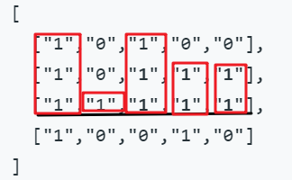

## 1 单调栈介绍

（https://zhuanlan.zhihu.com/p/26465701）

单调栈是一种理解起来很容易，但是运用起来并不那么简单的数据结构。一句话解释单调栈，就是一个堆栈，里面的元素的大小按照他们所在栈内的位置，满足一定的单调性，说直白点，就是递增存储元素或者递减存储元素，当该单调性（递增性或者递减性）被打破时要进行适当出栈，这是该算法的关键。那么到底什么时候用这个单调栈，怎么用单调栈呢。下面我们来看几个例子。

### 1.1  开胃菜-谷歌面试题

先来分享一道非常简单的谷歌面试题目：

给一个数组，返回一个大小相同的数组。返回的数组的第i个位置的值应当是，对于原数组中的第i个元素，至少往右走多少步，才能遇到一个比自己大的元素（如果之后没有比自己大的元素，或者已经是最后一个元素，则在返回数组的对应位置放上-1）。

示例：
输入: 5, 3, 1, 2, 4
输出: -1  3  1  1  -1

解释: 对于第0个数字5，之后没有比它更大的数字，因此是-1，对于第1个数字3，需要走3步才能达到4（第一个比3大的元素），对于第2和第3个数字，都只需要走1步，就可以遇到比自己大的元素。对于最后一个数字4，因为之后没有更多的元素，所以是-1。

暴力做的结果就是O(n^2)的时间复杂度，例如对于一个单调递减的数组，每次都要走到数组的末尾。

``` java
//java暴力计算法    
public    int[] nextExceed(int[] input) {
    int[] result    = new int[input.length];
    Arrays.fill(result, -1);       
    for (int i = 0; i < input.length; i++) {         
        int anchor =    input[i];         
        for (int j = i + 1; j < input.length; j++) {           
            if (input[j]    > anchor) {             
                result[i] = j - i;           
             }         
        }       
     }       
    return result;     
}        
```

用单调栈怎么做呢？先来看代码：


``` java
//单调栈示例：  单调递减的栈
public static int[] nextExceed(int[] input) {
   int[] result = new int[input.length];
   Arrays.fill(result, -1);
   Deque<Integer> stack = new ArrayDeque<>(input.length);
   for (int i = 0; i < input.length; i++) {
     while (!stack.isEmpty() && input[i] > input[stack.peek()]) {
       int top = stack.pop();
       result[top] = i - top;
     }
     stack.push(i);
   }
   return result;
 }
```


```java
//示例：[5,3,1,2,4]

// step1. 第0个数值5栈空入栈 栈顶：索引0，数值：5
// step2. 第1个数值3比栈顶数值5小入栈 栈顶：索引1,数值：3
// step3. 第2个数值1比栈顶数值3小入栈 栈顶：索引2，数值：1
// step4. loop:
//      第3个数值2比栈顶数值1大，先计算后入栈；
//      计算索引2数值=result[2]=3-2=1，出栈删除索引2；
//     入栈；栈顶：索引3,数值：2
// step5. loop:
//      第4个数值4比栈顶数值2大，计算索引3数值=result[3]=4-3 = 1；
//         出栈删除索引3，栈顶：索引1，数值3。
//      第4个数值4比栈顶索引[1]=3大，计算索引1数值=result[1] = 4 - 1 =3
//         出栈删除索引1，栈顶：索引0，数值5。
//     入栈；栈顶：索引4, 数值：4
// step6. 堆栈剩余元素2个，游标i超出for循环边界，循环结束
```


我们维护这样一个单调递减的stack，stack内部存的是原数组的每个index。每当我们遇到一个比当前栈顶所对应的数（就是input[monoStack.top()]）大的数的时候，我们就遇到了一个“大数”。这个“大数”比它之前多少个数大我们不知道，但是至少比当前栈顶所对应的数大。我们弹出栈内所有对应数比这个数小的栈内元素，并更新它在返回数组中对应位置的值。因为这个栈本身的单调性，当我们栈顶元素所对应的数比这个元素大的时候，我们可以保证，栈内所有元素都比这个元素大。对于每一个元素，当它出栈的时候，说明它遇到了自己的next greater element，我们也就要更新return数组中的对应位置的值。如果一个元素一直不曾出栈，那么说明不存在next greater element，我们也就不用更新return数组了。

在这个例子中，对于每一个元素都只有一次入栈和出栈的操作，因此时间复杂度只有O(n)。

解决了这个开胃菜，我们来看一道稍微复杂一点的题目。

 

### 1.2 单调栈的性质

1.单调栈里的元素具有单调性，栈中元素只能是单调递增或者单调递减

2.元素加入栈前，会在栈顶端把破坏栈单调性的元素都删除；

3.使用单调栈可以找到元素向左遍历第一个比它小的元素，也可以找到元素向左遍历第一个比它大的元素。 

（原文链接：https://blog.csdn.net/liujian20150808/article/details/50752861）


单调栈分为单调递增栈和单调递减栈

* 单调递增栈即栈内元素保持单调递增的栈

* 同理单调递减栈即栈内元素保持单调递减的栈

操作规则（下面都以单调递增栈为例）

* 如果新的元素比栈顶元素大，就入栈

* 如果新的元素较小，那就一直把栈内元素弹出来，直到栈顶比新元素小

加入这样一个规则之后，会有什么效果，单调递增的栈: (大顶栈)

*  栈内的元素是递增的

*  **当元素出栈时，说明当前元素是出栈元素向后找第一个比其小的元素**

*  **最后站内剩余元素的性质：是一个单调递增栈。整个数组中的最小元素是栈顶元素**

 最后再总结一下单调栈。单调栈这种数据结构，通常应用在一维数组上。如果遇到的问题，和前后元素之间的大小关系有关系的话，（例如第一题中我们要找比某个元素大的元素，第二个题目中，前后的bar的高低影响了最终矩形的计算），我们可以试图用单调栈来解决。在思考如何使用单调栈的时候，可以回忆一下这两题的解题套路，然后想清楚，如果使用单调栈，每个元素出栈时候的意义。最后的时间复杂度，因为每个元素都出栈入栈各一次，所以是线性时间的复杂度。

 

## 2 代表题目

### 2.1 [柱状图中最大的矩形](https://leetcode-cn.com/problems/largest-rectangle-in-histogram/)([#84](https://leetcode-cn.com/problems/largest-rectangle-in-histogram/))


#### 方法一、暴力求解法
首先，我们可以想到，两个柱子间矩形的高由它们之间最矮的柱子决定。如下图所示：


因此，我们可以考虑所有两两柱子之间形成的矩形面积，该矩形的高为它们之间最矮柱子的高度，宽为它们之间的距离，这样可以找到所要求的最大面积的矩形。代码参考如下：

```java
//暴力求解：超时，94 / 96 个通过测试用例
public    int largestRectangleArea(int[]    heights) {       
    if(heights.length == 0) {         
        return 0;       
    }       
    int maxArea =    Integer.MIN_VALUE;       
    for(int i = 0; i < heights.length; i++) {         
        for(int j = i; j < heights.length; j++) {           
            int minHeight    = Integer.MAX_VALUE;           
            for(int k = i; k <= j; k++) {             
                minHeight = Math.min(heights[k],minHeight); //查找[i,j]之间最小高度          
            }           
            maxArea = Math.max(maxArea,(j-i+1) * minHeight);         
        }       
    }       
    return maxArea;     
}             
```

#### 方法二、单调栈的解法

单调栈是本次算法说明的重点，先看单调栈的代码实现：

``` java
//Java 单调栈实现方法    
public int largestRectangleArea(int[] heights) {   
    if (heights.length == 0) {     
        return 0;   
    }   
    int maxArea = Integer.MIN_VALUE;   
    Deque<Integer> stack = new ArrayDeque<>();   //放置一个冗余元素方便计算   
    stack.push(-1);   
    for (int i = 0; i < heights.length; i++) {     
        while (stack.peek() != -1 && heights[i] < heights[stack.peek()]) {       
            int top = stack.pop();       
            int width = i - stack.peek() - 1;       
            maxArea = Math.max(maxArea, heights[top] * width);     
        }     
        stack.push(i);   
    }   
    while (stack.peek() != -1) {    
        int area = heights[stack.pop()] * (heights.length - stack.peek() - 1);        
        maxArea = Math.*max*(maxArea, area);      
    }       
    return maxArea;     
}             
```


``` c++
// c++ 版本实现
class Solution {

public:
    int largestRectangleArea(std::vector<int> &heights)
    {
        int result = 0;
        std::size_t len = heights.size();
        if (len <= 0) {
            return result;
        }
        std::stack<int> st;
        st.push(-1); // 下限，哨兵

        for (std::size_t i = 0; i < len; ++i) {

            while (st.top() != -1 && heights[i] < heights[st.top()]) {
                // 保持单调递增的栈
                int top_elem = heights[st.top()];
                int top_idx = st.top();
                st.pop();
                // 计算面积
                int width = i - st.top() - 1;  // 以i-1为上限构成的矩形；每个出栈的元素到上限i-1，构成的矩形是可能形成的最大矩形；因为单调递增，同时由较短元素决定了面积；
                // int width = top_idx - st.top();  // 不能用top_idx,因为值是发生变化的，上限顶，是i-1不动
                result = std::max(result , width * top_elem);
            }
            st.push(i); // 所有元素入栈
        }

        // 处理栈内剩余元素, 上限是len
        while (st.top() != -1) {

            int top_elem = heights[st.top()];
            st.pop();
            int width = len - st.top() - 1;
            result = std::max(result, top_elem * width);
        }
        return result;
    }
};
```

[代码可参考](https://github.com/ww5365/tiny_util/blob/master/src/leetcode/cpp/leetcode_my/004_84_largest_rectangle_area.cpp)这个解法的关键点：

* 使用了大顶栈
* 出栈时，计算width是理解的难点和关键点；每次出栈时，自下而上的看构成的矩形；以i-1元素为上边界构成的矩形；轮询结束后，是以len-1为上边界构成的矩形；


### 2.2 最大矩形面积([#85](https://leetcode-cn.com/problems/maximal-rectangle/))

给定一个仅包含 0 和 1 的二维二进制矩阵，找出只包含 1 的最大矩形，并返回其面积。

示例:

输入:

[

 ["1","0","1","0","0"],

 ["1","0","1","1","1"],

 ["1","1","1","1","1"],

 ["1","0","0","1","0"]

]

输出: 6

**解题思路**




 row= 0~3

 histogram[0]=[1,0,1,0,0];

 histogram [1]=[2,0,2,1,1];

histogram [2]=[3,1,3,2,2];

histogram [3]=[4,0,0,3,0];

这道题可以轻松地转化成上一题,求柱状图形成的最大矩形的面积，如上图1.2.2.1所示。对于每一行，我们都可以构建一个直方图(histogram)，然后计算。在构建新的直方图(histogram)的时候，我们不需要全部遍历，只需要对已有的直方图(histogram)进行略微的修改（运用DP的思想）。为了在视觉上更加清晰，可以直接调用上一题中的函数。思路还是异常简单的。

[代码可参考](https://github.com/ww5365/tiny_util/blob/master/src/leetcode/cpp/leetcode_my/004_85_largest_rectangle_area_v2.cpp)：

```c++
// c ++ 实现代码
class Solution {
public:
    int MaximalRectangle(vector<vector<char>>& matrix)
    {
        if (matrix.size() <= 0) {
            return 0;
        }
        std::vector<int> height(matrix[0].size(), 0);
        int max_area = 0;
        for (size_t i = 0; i < matrix.size(); ++i) {
            for (size_t j = 0; j < matrix[i].size(); ++j) {
                if (matrix[i][j] == '1') {
                    height[j] += 1; //形成当前行的柱状图
                } else {
                    height[j] = 0;
                }
            }
            max_area = std::max(max_area, LargestRectangleArea(height));
        }
        return max_area;
    }
private:
    int LargestRectangleArea(vector<int>& heights) //求柱状图形成的最大面积
    {
        if (heights.size() <= 0) {
            return 0;
        }

        stack<int> st;
        st.push(-1); // 栈底作为-1，哨兵
        int result = 0;
        for (int i = 0; i < heights.size(); ++i) {
            while (st.top() != -1 && heights[i] < heights[st.top()]) {
                // 大顶栈，递增的；比栈顶元素小，不能直接入栈了
                int top_idx = st.top();
                st.pop();
                int width = i - st.top() - 1; // 难
                result = std::max(result, width * heights[top_idx]); // 计算了以i-1为顶的构成的矩形的面积
            }
            st.push(i);
        }
        // 剩余的站内元素，是一个大顶栈
        int len = heights.size();
        while (st.top() != -1) {
            int top_idx = st.top();
            st.pop();
            int width = len - 1  - st.top(); // 以最后一个元素为顶
            result = std::max(result, width * heights[top_idx]);
        }

        return result;
    }
};
```

## 3 触类旁通

### 3.1 [每日温度](https://leetcode-cn.com/problems/daily-temperatures/)([#739](https://leetcode-cn.com/problems/daily-temperatures/))

* 题目描述：
请根据每日*气温*列表temperatures ，请计算在每一天需要等几天才会有更高的温度。如果气温在这之后都不会升高，请在该位置用 0 来代替。
示例 1:
输入: temperatures = [73,74,75,71,69,72,76,73]
输出: [1,1,4,2,1,1,0,0]
* 解题思路：
  1. 每个元素依次入栈，构建：小顶栈
  2. 比栈顶元素小，正常入栈；如果比栈顶元素大，是栈顶元素向右看，第一个比它大的值，计算索引距离，就是栈顶元素要等待几天后才有的更高温度。
  3. 遍历结束后，栈内剩余元素，就是后面没有比自身大的温度值了，相应位置置为0;
* 代码如下：
  [代码可参考](https://github.com/ww5365/tiny_util/blob/master/src/leetcode/cpp/leetcode_my/004_739_daily_temprature.cpp)
  
  ``` c++
  class Solution {
  public:
    vector<int> DailyTemperatures(vector<int>& temperatures)
    {
        if (temperatures.size() <= 0) {
            return std::vector<int> (); 
        }
        std::vector<int> res (temperatures.size(), 0); 
        std::stack<int> st;
        for (int i = 0; i < temperatures.size(); ++i) {
            while (!st.empty() && temperatures[i] > temperatures[st.top()]) {
                // 破坏了小顶栈的规则，出栈，计算栈顶元素与当前元素距离
                int top_idx = st.top();
                st.pop();
                int dist = i - top_idx;
                res[top_idx] = dist;
            }
            st.push(i);
        }
        while (!st.empty()) {
            res[st.top()] = 0;
            st.pop();
        }
        return res;
    }
  };
  ```
  
  
### 3.2	下一个更大元素II([#503](https://leetcode-cn.com/problems/next-greater-element-ii/))
* 题目描述：
  给定一个循环数组（最后一个元素的下一个元素是数组的第一个元素），输出每个元素的下一个更大元素。数字 x 的下一个更大的元素是按数组遍历顺序，这个数字之后的第一个比它更大的数，这意味着你应该循环地搜索它的下一个更大的数。如果不存在，则输出 -1。
  示例 1:
  输入: [1,2,1]
  输出: [2,-1,2]
  解释: 第一个 1 的下一个更大的数是 2；
  数字 2 找不到下一个更大的数； 
  第二个 1 的下一个最大的数需要循环搜索，结果也是 2。
  注意: 输入数组的长度不会超过 10000。
* 解题思路：
  （1）第一轮循环数组： 使用小顶栈（自下而上变小），按照下一个最大元素I的思路，可以定位数组中部分元素下一个更大元素。
  （2）栈内剩余元素的是一个自下而上的单调递减的队列，其中整个数组中的最大元素是栈底元素。
  （3）第二轮循环数组：(也可以考虑使用循环数组来实现)主要的目的是把栈内的元素，出栈，并找到下一个最大元素；这个过程中，不再进行入栈操作；如果大于栈顶元素，出栈，得到下一个最大元素结果；
  （4）最后，栈内只剩最大元素，对应的输出下一个最大值为-1。
* 参考代码：
  [代码连接]()  
  ``` c++
    vector<int> NextGreaterElements2(vector<int>& nums)
    {
        if (nums.size() <= 0) {
            return std::vector<int> (); 
        }
        std::vector<int> res (nums.size(), -1); 
        std::stack<int> st;
        for (int i = 0; i < nums.size(); ++i) {
            while (!st.empty() && nums[i] > nums[st.top()]) {
                // 破坏了小顶栈的规则，出栈，计算栈顶元素与当前元素距离
                int top_idx = st.top();
                st.pop();
                res[top_idx] = nums[i];
            }
            st.push(i);
        } // 第一轮计算可以确定的元素的下一个最大元素

        for (int i = 0; i < nums.size(); ++i) { // 以数组为维度
            while (!st.empty() && nums[st.top()] < nums[i]) {
                res[st.top()] = nums[i];
                st.pop();
            } 
            // 不再入栈了，栈内剩余元素的下一个最大元素都是-1， 初始化的时，已经搞定
        } 
        return res;

    }

    vector<int> NextGreaterElements3(vector<int>& nums)
    {
        if (nums.size() <= 0) {
            return std::vector<int> (); 
        }
        std::vector<int> res (nums.size(), -1); 
        std::stack<int> st;
        for (int i = 0; i < 2 * nums.size(); ++i) {
            int num = nums[i % nums.size()];
            while (!st.empty() && num > nums[st.top()]) {
                // 使用另外一种思路: 更加简练
                int top_idx = st.top();
                st.pop();
               res[top_idx] = num;
            }
            if (i < nums.size()) st.push(i);
        } 
        return res;
    }

  ```
