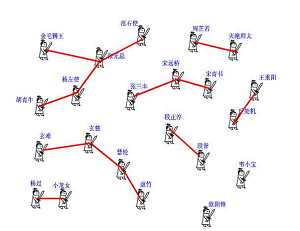

# 五 并查集


## 5.1、并查集介绍

并查集DSU：Disjoint Set Union

并查集顾名思义就是具有“合并集合”和“查找集合中元素”两种操作的一种算法。但是，实际并查集的基本操作有三个：
makeSet(size)：建立一个新的并查集，其中包含size个单元素集合。通常该操作比较隐晦，用一句int[] parent = new int[size];直接替代了make set的过程。
unionSet(x, y)：把元素x和元素y所在的集合合并，要求x和y所在的集合不相交，如果相交则不合并。
find(x)：找到元素x所在的集合的代表，该操作也可以用于判断两个元素是否位于同一个集合，只要将它们各自的代表比较一下就可以了。find(x)有两种实现方法，一种是递归，一种是非递归形式。

算法描述：
用集合中的某个元素来代表这个集合，该元素称为集合的代表元。一个集合内的所有元素组织成以代表元为根的树形结构。对于每一个元素x来说， parent[x]指向x在树形结构上的父亲节点，如果x是根节点，则令parent[x] = x。对于查找操作，假设需要确定x所在的的集合，也就是确定集合的代表元。可以沿着parent[x]不断在树形结构中向上移动，直到到达根节点。
因为创建的树可能会严重不平衡，并查集可以用两种办法优化。
并查集有两种优化策略：
1.按秩合并 Union by Rank
“按秩合并”，即总是将更小的树连接至更大的树上。在这个算法中，术语“秩”替代了“深度”，因为同时应用了路径压缩时秩将不会与高度相同。
2.路径压缩 Path Compression
路径压缩：为了加快查找速度，查找时将x到根节点路径上的所有点的parent设为根节点，该优化方法称为压缩路径。

算法用途：
1、求连通子图 ： 维护无向图的连通性。支持判断两个点是否在同一连通块内。
2、求最小生成树的 Kruskal 算法
3、求最近公共祖先（Least Common Ancestors, LCA）等。

使用该优化后，平均复杂度可视为Ackerman函数的反函数，实际应用中可粗略认为其是一个常数。
并查集是统计图中连通块数量的一种方法。使用一个大小为N的parent数组，遍历这个图，每个节点我们都遍历所有相邻点，并让相邻点指向它，并设置成一个由 parent节点决定的单独组。这个过程被称为 union。这样每个组都有一个唯一的 parent节点，这些节点的父亲为 -1。

两篇并查集参考博文：
https://segmentfault.com/a/1190000004023326
https://www.jianshu.com/p/8c74df1db116




## 5.2 典型题目

### 5.2.1 朋友圈((#547)())

####  题目描述
班上有 N 名学生。其中有些人是朋友，有些则不是。他们的友谊具有传递性。如果已知 A 是 B 的朋友，B 是 C 的朋友，那么我们可以认为 A 也是 C 的朋友。所谓的朋友圈，是指所有朋友的集合。
给定一个 N * N 的矩阵 M，表示班级中学生之间的朋友关系。如果M\[i]\[j] = 1，表示已知第 i 个和 j 个学生互为朋友关系，否则为不知道。你必须输出所有学生中的已知的朋友圈总数。
示例 1:
输入: 
[[1,1,0],
 [1,1,0],
 [0,0,1]]
输出: 2 
说明：已知学生0和学生1互为朋友，他们在一个朋友圈。
第2个学生自己在一个朋友圈，所以返回2。

示例 2:
输入: 
[ [1,1,0],
 [1,1,1],
 [0,1,1] ]
输出: 1
说明：已知学生0和学生1互为朋友，学生1和学生2互为朋友，所以学生0和学生2也是朋友，所以他们三个在一个朋友圈，返回1。
注意：
N 在[1,200]的范围内。
对于所有学生，有M\[i]\[i] = 1。
如果有M\[i][j] = 1，则有M\[j]\[i] = 1。


#### 解题思路


#### 参考代码

```java
//并查集实现朋友圈算法
public int findCircleNum(int[][] matrix) {
    int[] parent = new int[matrix.length];
    Arrays.fill(parent, -1);
    int rows = matrix.length;
    int cols = matrix [0].length;
    for (int i = 0; i < rows; i++) {
        for (int j = 0; j < cols; j++) {
            if (matrix[i][j] == 1 && i != j) {
                union(parent, i, j);
            }
        }
    }
    return countCircleNum(parent);
}
private void union(int[] parent, int i, int j) {
    int xset = find(parent, i);
    int yset = find(parent, j);
    if (xset != yset) {
        //合并i和j的两个集合
        parent[xset] = yset;
    }
}
/**
* 查找集合i（一个元素是一个集合）的源头
 * 如果集合i的父亲是-1，说明自己就是源头，返回自己的标号；
* 否则查找集合i的父亲的源头。
*/
private int find(int[] parent, int i) {
    if (parent[i] == -1) {
//i的父亲为-1时，i就是掌门人
return i;
    }
//使用路径压缩，让这条路径上所有人的上级直接变为掌门人
    return find(parent, parent[i]);
}

private int countCircleNum(int[] parent) {
    int count = 0;
    for (int i = 0; i < parent.length; i++) {
        if (parent[i] == -1) {
            count++;
        }
    }
    return count;
}
```
Find除了递归实现之外，还有一种非递归实现方式，注意此处x一开始并未设定初始值为-1，初始值设定为自己，非递归实现方式参考如下代码：
```java
public int find(int x) {
    while (x != parent[x]) {
        parent[x] = parent[parent[x]];
        x = parent[x];
    }
    return x;
}
```
