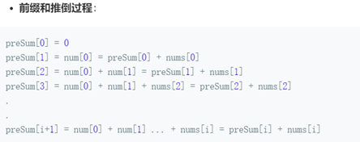
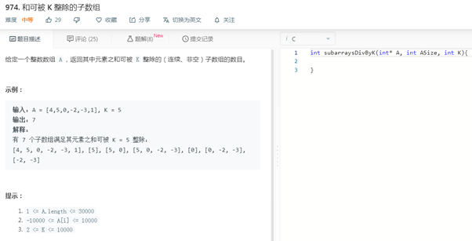

# 前缀和

## 介绍

前缀和（Prefix Sum）定义：前缀和是一种重要的预处理，能大大降低查询的时间复杂度。结合Hash缓存，能够进一步优化提升算法执行效率。
对数组nums进行前缀和初始化需要O(n)时间：
新建数组prefixSum，数组长度定义为nums.length+1，确保第nums.length个元素存储了前面0到nums.length-1个元素的和。将数组nums的累加依次放入数组prefixSum中
prefixSum [0] = 0 【备注：此处不要定义prefix[0]=nums[0]，这种定义违背前缀和的意义】
prefixSum [1] = prefixSum[0] + nums[0] = 0 + num[0] 
…
prefixSum [i] = prefixSum [i-1] + nums [i-1]。
prefixSum [i + 1] = prefixSum [i] + nums [i]。

由此推导出两个变换公式： 
（1）nums[某一项] = 两个相邻 前缀和 之差：
nums[x] = prefixSum[x + 1] - prefixSum[x]
（2）从left到right的元素和等于prefixSum[right+1] – prefix[left];



前缀和数组初始化过程伪代码示例：

划重点:

（1）按照for循环的正常边界进行初始化，避免了int i = 1或者<=len等等可能的各种调整；

（2）前缀和长度比数据长度多一个，前缀和第0个元素要初始化为0

```c++
int len = nums.length;
// 计算前缀和数组
int[] prefixSum = new int[len + 1];
prefixSum[0] = 0;
for (int i = 0; i < len; i++) {
    prefixSum[i + 1] = prefixSum[i] + nums[i];
}
```

拓展解惑：另外一种前缀和初始化方法：前缀和长度为nums.length，第0个元素存储自己的和

```java
int[] prefixSum = new int[nums.length];
 prefixSum[0] = nums[0];
 for (int i = 1; i < nums.length; i++) {
   prefixSum[i] = prefixSum[i - 1] + nums[i];
 }
```

划重点:

（1）   预处理过程看似简单，但是考试计算容易出现混乱；
（2）   prefixSum[i] – prefixSum[i-1]; 容易出现错误理解和计算丢失。
示例：prefixSum[1] – prefixSum[0] = nums[1]，造成nums[0]丢失，出现后续错误

## 代表题目：和为K的子数组(#560中等)
给定一个整数数组和一个整数 k，你需要找到该数组中和为 k 的连续的子数组的个数。
示例 1 :
输入:nums = [1,1,1], k = 2
输出: 2 , [1,1] 与 [1,1] 为两种不同的情况。
说明 :
数组的长度为 [1, 20,000]。
数组中元素的范围是 [-1000, 1000] ，且整数 k 的范围是 [-1e7, 1e7]。
代码实现提供三种算法，避免学习算法过程中思维被限制。


### 思路1： 暴力

### 思路2： 前缀和

### 思路3： 前缀和  +  hash


## 触类旁通

### 1 连续的子数组和(#523)
题目描述：
给定一个包含非负数的数组和一个目标整数 k，编写一个函数来判断该数组是否含有连续的子数组，其大小至少为 2，总和为 k 的倍数，即总和为 n*k，其中 n 也是一个整数。
示例 1:
输入: [23,2,4,6,7], k = 6
输出: True
解释: [2,4] 是一个大小为 2 的子数组，并且和为 6。
示例 2:
输入: [23,2,6,4,7], k = 6
输出: True
解释: [23,2,6,4,7]是大小为 5 的子数组，并且和为 42。
说明:
数组的长度不会超过10,000。
你可以认为所有数字总和在 32 位有符号整数范围内。


### 2	和可被 K 整除的子数组(#974)



给定一个整数数组 nums 和一个整数 k ，返回其中元素之和可被 k 整除的（连续、非空） 子数组 的数目。

子数组 是数组的 连续 部分。

输入：nums = [4,5,0,-2,-3,1], k = 5
输出：7
解释：
有 7 个子数组满足其元素之和可被 k = 5 整除：
[4, 5, 0, -2, -3, 1], [5], [5, 0], [5, 0, -2, -3], [0], [0, -2, -3], [-2, -3]

