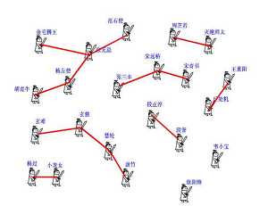
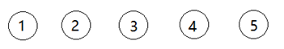

# 五 并查集


## 5.1、并查集介绍

并查集DSU：Disjoint Set Union

并查集顾名思义就是具有“合并集合”和“查找集合中元素”两种操作的一种算法。但是，实际并查集的基本操作有三个：
makeSet(size)：建立一个新的并查集，其中包含size个单元素集合。通常该操作比较隐晦，用一句int[] parent = new int[size];直接替代了make set的过程。


Union(x, y)：把元素x和元素y所在的集合合并，要求x和y所在的集合不相交，如果相交则不合并。
``` c++
x_parent = Find(parent, x)
y_parent = Find(parent, y)

if (x_parent != y_parent) {
	parent[x_parent] = y_parent; // 把x元素的父节点(代表元)挂到y元素的父节点上
}
```

Find(x)：找到元素x所在的集合的代表，该操作也可以用于判断两个元素是否位于同一个集合，只要将它们各自的代表比较一下就可以了。find(x)有两种实现方法，一种是递归，一种是非递归形式。

``` c++
//非递归 Find(x)

origin_x = x;
while(x != parent[x]){
	x = parent[x]; //向上找父节点
}
parent[origin_x] = x;  //把节点x的路径优化了
return x;


//递归 Find(x)
if (x == parent[x]){
	return x;
}
end = Find(parent[x]); //递归的查找x的父节点
while (end != parent[x]){
	int tmp = x;
	x = parent[x];
	parent[tmp] = end; //优化路径
}
return end;
```


算法描述：
用集合中的某个元素来代表这个集合，该元素称为集合的代表元。一个集合内的所有元素组织成以代表元为根的树形结构。对于每一个元素x来说， parent[x]指向x在树形结构上的父亲节点，如果x是根节点，则令parent[x] = x。对于查找操作，假设需要确定x所在的的集合，也就是确定集合的代表元。可以沿着parent[x]不断在树形结构中向上移动，直到到达根节点。
因为创建的树可能会严重不平衡，并查集可以用两种办法优化。
并查集有两种优化策略：
1.按秩合并 Union by Rank
“按秩合并”，即总是将更小的树连接至更大的树上。在这个算法中，术语“秩”替代了“深度”，因为同时应用了路径压缩时秩将不会与高度相同。
2.路径压缩 Path Compression
路径压缩：为了加快查找速度，查找时将x到根节点路径上的所有点的parent设为根节点，该优化方法称为压缩路径。

算法用途：
1、求连通子图 ： 维护无向图的连通性。支持判断两个点是否在同一连通块内。
2、求最小生成树的 Kruskal 算法
3、求最近公共祖先（Least Common Ancestors, LCA）等。

使用该优化后，平均复杂度可视为Ackerman函数的反函数，实际应用中可粗略认为其是一个常数。
并查集是统计图中连通块数量的一种方法。使用一个大小为N的parent数组，遍历这个图，每个节点我们都遍历所有相邻点，并让相邻点指向它，并设置成一个由 parent节点决定的单独组。这个过程被称为 union。这样每个组都有一个唯一的 parent节点，这些节点的父亲为 -1。

两篇并查集参考博文：
https://segmentfault.com/a/1190000004023326
https://www.jianshu.com/p/8c74df1db116




## 5.2 典型题目

### 5.2.1 朋友圈((#547)())

####  题目描述
班上有 N 名学生。其中有些人是朋友，有些则不是。他们的友谊具有传递性。如果已知 A 是 B 的朋友，B 是 C 的朋友，那么我们可以认为 A 也是 C 的朋友。所谓的朋友圈，是指所有朋友的集合。
给定一个 N * N 的矩阵 M，表示班级中学生之间的朋友关系。如果M\[i]\[j] = 1，表示已知第 i 个和 j 个学生互为朋友关系，否则为不知道。你必须输出所有学生中的已知的朋友圈总数。
示例 1:
输入: 
[[1,1,0],
 [1,1,0],
 [0,0,1]]
输出: 2 
说明：已知学生0和学生1互为朋友，他们在一个朋友圈。
第2个学生自己在一个朋友圈，所以返回2。

示例 2:
输入: 
[ [1,1,0],
 [1,1,1],
 [0,1,1] ]
输出: 1
说明：已知学生0和学生1互为朋友，学生1和学生2互为朋友，所以学生0和学生2也是朋友，所以他们三个在一个朋友圈，返回1。
注意：
N 在[1,200]的范围内。
对于所有学生，有M\[i]\[i] = 1。
如果有M\[i][j] = 1，则有M\[j]\[i] = 1。


#### 解题思路


#### 参考代码

```java
//并查集实现朋友圈算法
public int findCircleNum(int[][] matrix) {
    int[] parent = new int[matrix.length];
    Arrays.fill(parent, -1);
    int rows = matrix.length;
    int cols = matrix [0].length;
    for (int i = 0; i < rows; i++) {
        for (int j = 0; j < cols; j++) {
            if (matrix[i][j] == 1 && i != j) {
                union(parent, i, j);
            }
        }
    }
    return countCircleNum(parent);
}
private void union(int[] parent, int i, int j) {
    int xset = find(parent, i);
    int yset = find(parent, j);
    if (xset != yset) {
        //合并i和j的两个集合
        parent[xset] = yset;
    }
}
/**
* 查找集合i（一个元素是一个集合）的源头
 * 如果集合i的父亲是-1，说明自己就是源头，返回自己的标号；
* 否则查找集合i的父亲的源头。
*/
private int find(int[] parent, int i) {
    if (parent[i] == -1) {
//i的父亲为-1时，i就是掌门人
return i;
    }
//使用路径压缩，让这条路径上所有人的上级直接变为掌门人
    return find(parent, parent[i]);
}

private int countCircleNum(int[] parent) {
    int count = 0;
    for (int i = 0; i < parent.length; i++) {
        if (parent[i] == -1) {
            count++;
        }
    }
    return count;
}
```
Find除了递归实现之外，还有一种非递归实现方式，注意此处x一开始并未设定初始值为-1，初始值设定为自己，非递归实现方式参考如下代码：
```java
public int find(int x) {
    while (x != parent[x]) {
        parent[x] = parent[parent[x]];
        x = parent[x];
    }
    return x;
}
```
**对比学习DFS实现方案**
使用深度优先搜索，从每个节点开始，使用一个大小为 N 的 visited 数组（M 大小为 N×N），这样 visited[i]表示第 i 个元素是否被深度优先搜索访问过。首先选择一个节点，访问任一相邻的节点。然后再访问这一节点的任一相邻节点。这样不断遍历到没有未访问的相邻节点时，回溯到之前的节点进行访问。

``` java
//DFS实现朋友圈算法
 public int findCircleNum(int[][] matrix) {
   int rows = matrix.length;
   int cols = matrix[0].length;
   int[] visited = new int[rows];
   int count = 0;
   for (int i = 0; i < rows; i++) {
     if (visited[i] == 0) {
       dfs(matrix, visited, i);
       count++;
     }
   }
   return count;
 }

 private void dfs(int[][] matrix, int[] visited, int i) {
   for (int j = 0; j < matrix.length; j++) {
     if (matrix[i][j] == 1 && visited[j] == 0) {
       visited[j] = 1;
       dfs(matrix, visited, j);
     }
   }
 }
```

**对比学习BFS实现**
广度优先搜索，把当前人员相关的所有人员全部访问完，然后再访问自己每个朋友的关系圈子。不同于DFS，访问到一个朋友之后，立刻看整个朋友的关系圈子。

```java
public int findCircleNum(int[][] matrix) {
    int[] visited = new int[matrix.length];
    int count = 0;
    Queue<Integer> queue = new LinkedList<>();
    for (int i = 0; i < matrix.length; i++) {
        if (visited[i] == 0) {
            queue.add(i);
            while (!queue.isEmpty()) {
                int s = queue.poll();
                visited[s] = 1;
                for (int j = 0; j < matrix.length; j++) {
                    if (matrix[s][j] == 1 && visited[j] == 0) {
                        queue.add(j);
                   }               
                }
            }
            count++;
        }
    }
    return count;
}
```

 

## 5.3  触类旁通

### 5.3.1  冗余连接（[#684](https://leetcode-cn.com/problems/redundant-connection/)）

* 问题描述：
  在本问题中, 树指的是一个连通且无环的无向图。
  输入一个图，该图由一个有着N个节点 (节点值不重复1, 2, ..., N) 的树及一条附加的边构成。附加的边的两个顶点包含在1到N中间，这条附加的边不属于树中已存在的边。
  结果图是一个以边组成的二维数组。每一个边的元素是一对[u, v] ，满足 u < v，表示连接顶点u 和v的无向图的边。
  返回一条可以删去的边，使得结果图是一个有着N个节点的树。如果有多个答案，则返回二维数组中最后出现的边。答案边 [u, v] 应满足相同的格式 u < v。

  
  **示例1** ：
  输入: [[1,2], [1,3], [2,3]]
  输出: [2,3]
  解释:给定的无向图为:
   1
   / \
  2 - 3
  **示例2** ：
  输入: [[1,2], [2,3], [3,4], [1,4], [1,5]]
  输出: [1,4]
  解释: 给定的无向图为:
  5 - 1 - 2
       |     |
      4 – 3 
  
* 解题思路
删除这条边后，还保持是N个节点的树(连通)。
（1） 第一步，应该可以输出一个基本的算法起点代码
（2） 第二步，根据并查集算法去做计算

第一步示例代码（与算法实现关系不大，主要是梳理思路）：
``` java
public int[] findRedundantConnection(int[][] edges) {
   int rowLen = edges.length;
   int colLen = edges[0].length;
   int[] ans = new int[2];
   for (int[] edge : edges) {
     int u = edge[0];
     int v = edge[1];
     //TODO：此处书写算法
   }
   return ans;
 }
```
第二步并查集的说明:
在没有添加边的时候，各个节点集合独立，我们需要初始化各个节点集合的代表节点为其自身。初始化后，集合图如下图所示：

然后我们开始遍历边集合，将边转化为集合的关系
这里有一点很重要：边[a,b]意味着a所在集合可以和b所在集合合并
合并方法很多，这里我们简单地将a集合的代表节点戳到b集合的代表节点上

* 代码实现
``` java
//java版本 重点关注find函数
private int find(int[] parent, int x) {

//未采用递归实现，采用非递归形式实现
   int node = x;
   while (parent[node] != node) {
     node = parent[node];
   }
   return node;
 }

 private void union(int[] parent, int x, int y) {
   int setX = find(parent, x);
   int setY = find(parent, y);
   if (setX != setY) {
     parent[setX] = setY;
   }
 }

 public int[] findRedundantConnection(int[][] edges) {
   int N = edges.length;
   int[] parent = new int[N + 1];
   for (int i = 1; i < N + 1; i++) {
     parent[i] = i;
   }

   for (int[] edge : edges) {
     if (find(parent, edge[0]) == find(parent, edge[1])) {
       return edge;
     } else {
       union(parent, edge[0], edge[1]);
     }
   }

   return new int[0];
 }
```

``` c++
//c++ 版本

class Solution {
public:
    vector<int> FindRedundantConnection(vector<vector<int>>& edges)
    {

        if (edges.size() <= 0) {
            return vector<int>(2, 0);
        }

        int rows = edges.size();
        vector<int> parent(rows + 1, 0); //总共有N条边，N-1条形成树，1条时冗余。节点的个数也是N,但序号从1开始，所以多加1个空间
        for (int i = 0; i < parent.size(); ++i) {
            parent[i] = i;
        }
        for (int i = 0; i < rows; ++i) {
            int u = edges[i][0];
            int v = edges[i][1];
            int p_u = Find(parent, u);
            int p_v = Find(parent, v);
            if (p_u == p_v) {
                return vector<int>{u, v};
            } else {
                Union1(parent, p_u, p_v);
            }
        }
        return vector<int>{0, 0};
    }

private:

    int Find(vector<int> &parent, int idx) {

        if (parent[idx] == idx) {
            return idx;
        }
        int end = Find(parent, parent[idx]); 
        // 路径优化
        while (end != parent[idx]) {
            int tmp = idx;
            idx = parent[idx];
            parent[tmp] = end;
        } 
        return end;      
    }

    void Union1(vector<int> &parent, int u, int v) {
        if (u != v) {
            parent[v] = u;
        }
        return;
    }

};

```

### 5.3.2  岛屿数量（[#200](https://leetcode-cn.com/problems/number-of-islands/)必做 简单）

岛屿问题是一类典型的网格问题。每个格子中的数字可能是 0 或者 1。我们把数字为 0 的格子看成海洋格子，数字为 1 的格子看成陆地格子，这样相邻的陆地格子就连接成一个岛屿。

岛屿问题最常见的做法包括三类，DFS，BFS和并查集实现方式三种，需要注意的是，DFS，BFS指的是针对某个连通块（此处称之为岛屿）采用深搜或者广搜实现，而不是针对整个二维矩阵，后续说采用深搜或者广搜，一定是针对图或者树进行，而不是二维矩阵。在 LeetCode 中，「岛屿问题」是一个系列问题，比如：

200. 岛屿数量 （Easy）
463. [岛屿的周长 （Easy）](https://leetcode-cn.com/problems/island-perimeter/)
695. [岛屿的最大面积 （Medium）](https://leetcode-cn.com/problems/max-area-of-island/)
827. [最大人工岛 （Hard)](https://leetcode-cn.com/problems/making-a-large-island/)
934. 最短的桥

本题目示例代码：

https://leetcode-cn.com/problems/number-of-islands/solution/dao-yu-lei-wen-ti-de-tong-yong-jie-fa-dfs-bian-li-/

```c++
class Solution {
public:

    //DSU 归并集的思路
    int numIslands(vector<vector<char>>& grid)
    {

        if (grid.size() <= 0) {
            return 0;
        }

        int rows = grid.size();
        int cols = grid[0].size();

        std::vector<int> parent(rows * cols, -1); //归并集的思路，也是要用空间换取时间
        int result = 0;

        //初始化
        for (int i = 0; i < rows; ++i) {
            for (int j = 0; j < cols; ++j) {
                if (grid[i][j] == '1') {
                    parent[i * cols + j] = i * cols + j; //初始化，把matrix拉平，形成一维度的数组; 每个元素的代表元都是自己；
                    result++;
                }
            }
        }

        //cout << "the result: " << result << std::endl;
        //printParent(parent);

        //DSU:归并法计算岛数量
        for (int i = 0; i < rows; ++i) {
            for (int j = 0; j < cols; ++j) {
                int idx = i * cols + j;
                if (grid[i][j] == '1') {
                    // 此位置为1，上下左右进行探测归并
                    for (int r = 0; r < moveX.size(); ++r) {
                        int new_x = i + moveX[r];
                        int new_y = j + moveY[r];
                        int new_idx = new_x * cols + new_y;
                        if (IsValid(grid, new_x, new_y)) {
                            Union(grid, idx, new_idx, parent, result); //上下左右进行归并
                            //std::cout << "update parent: " << idx << " " << new_x << "," << new_y <<std::endl;
                            //printParent(parent);
                        }
                    }
                }//if
            }
        }
        return result;  
    }

    //BFS  连通分量的个数, 这种方法，在leetcode中会超时。。

    int numIslands2(vector<vector<char>>& grid)
    {
        if (grid.size() <= 0) return 0;
        queue<Point> qu;
        int rows = grid.size();
        int cols = grid[0].size();
        int result = 0;
        vector<vector<bool>> visited(rows, vector<bool>(cols, false)); //当前位置是否被访问过标识
        for (int i = 0; i < rows; ++i) {
            for (int j = 0; j < cols; ++j) {
                if (grid[i][j] == '1' && !visited[i][j]) {
                    qu.push(Point(i,j));
                    while (!qu.empty()) {
                        Point tmp(qu.front().x,qu.front().y);
                        qu.pop(); 
                        visited[tmp.x][tmp.y] = true;
                        //std::cout <<"this is a test in whil!" << std::endl;
                        //上下左右在入队
                        for (int k = 0; k < moveX.size(); ++k) {
                            int new_x = tmp.x + moveX[k];
                            int new_y = tmp.y + moveY[k];
                            if (IsValid(grid, new_x, new_y) && !visited[new_x][new_y]) {
                                qu.emplace(Point(new_x, new_y));
                            }
                        }
                    }//while
                    result ++; //遍历完一个连通分量
                }
            }
        }
        return result;
    }

    //DFS 思路
    int numIslands3(vector<vector<char>>& grid)
    {
        if (grid.size() <= 0) return 0;
        int rows = grid.size();
        int cols = grid[0].size();
        int result = 0;
        vector<vector<bool>> visited(rows, vector<bool>(cols, false)); //当前位置是否被访问过标识
        for (int i = 0; i < rows; ++i) {
            for (int j = 0; j < cols; ++j) {

                if (grid[i][j] == '1' && !visited[i][j]) {
                    dfs(grid, i, j, visited);
                    result ++;
                }
            }
        }
        return result;
    }

private:
    //DFS
    void dfs(vector<vector<char>> &grid, int i, int j, vector<vector<bool>> &visited) {

        if (!IsValid(grid, i, j) || grid[i][j] == '0' || visited[i][j] ){
            return;
        }
        visited[i][j] = true;
        for (int k = 0; k < moveX.size(); ++k){
            dfs(grid, i + moveX[k], j + moveY[k], visited);
        }

    }
    void printParent(vector<int> &parent) {
        if (parent.size() <= 0) {
            return;
        }
        int len = parent.size();
        for (int i = 0; i < len; ++i) {
            std::cout << parent[i] << " ";
        }
        std::cout << std::endl;
    }

    //判断是否为有效的元素
    bool IsValid (vector<vector<char>> &grid, int x, int y)
    {   
        int rows = grid.size();
        int cols = grid[0].size();
        return x >= 0 && x < rows && y >= 0 && y < cols && grid[x][y] == '1';
    }

    //并操作
    void Union(std::vector<std::vector<char>> &grid, int idx, int new_idx, std::vector<int> &parent, int &result)
    {

        int cur_idx = Find(parent, idx); //查找idx的代表元
        int neighbor_idx = Find(parent, new_idx); //查找相邻探测idx的代表元(上下左右)

        if (cur_idx != neighbor_idx) {
            parent[neighbor_idx] = cur_idx; 
            //探测位置的代表元的父节点，设置为当前元素;从而cur_idx成为最新的父节点(代表元)
            result --;  //归并一次，'1'不可能单独成岛了，所以岛的数量减1
        }
        return;
    }

    //查操作：这块稍难理解 重点理解
    int Find(std::vector<int> &parent, int idx) {

        //代表元就是自身的
        if (parent[idx] == idx) {
            return idx;
        }

        int end = Find(parent, parent[idx]);
        
        while (parent[idx] != end) { 
            //优化并查集合并, 进行树的压缩, 把原来路径上以parent[idx]为父节点的元素，都把父节点重置为最新的代表元
            int temp = idx;
            idx = parent[idx];
            parent[temp] = end;
        }
        return end;
    }


private:
    const std::vector<int> moveX = {-1, 1, 0, 0}; //上下左右
    const std::vector<int> moveY = {0, 0, -1, 1};

    struct Point {
        int x;
        int y;
        Point():x(-1),y(-1){}
        Point(int i, int j):x(i), y(j){}
    };

};
```

### 5.3.3  句子相似性II ([**#737**](https://leetcode-cn.com/problems/sentence-similarity-ii/))

#### 问题描述
给定两个句子 words1, words2 （每个用字符串数组表示），和一个相似单词对的列表 pairs ，判断是否两个句子是相似的。

例如，当相似单词对是 pairs = [["great", "fine"], ["acting","drama"], ["skills","talent"]]的时候，words1 = ["great", "acting", "skills"] 和 words2 = ["fine", "drama", "talent"] 是相似的。

注意相似关系是 具有 传递性的。
例如，如果 “great” 和 “fine” 是相似的，“fine” 和 “good” 是相似的，则 “great” 和 “good” 是相似的。

而且，相似关系是具有对称性的。
例如，“great” 和 “fine” 是相似的相当于 “fine” 和 “great” 是相似的。

并且，一个单词总是与其自身相似。
例如，句子 words1 = [“great”], words2 = [“great”], pairs = [] 是相似的，尽管没有输入特定的相似单词对。

最后，句子只会在具有相同单词个数的前提下才会相似。
所以一个句子 words1 = [“great”] 永远不可能和句子 words2 = [“doubleplus”,“good”] 相似。


#### 示例代码

``` c++
class Solution {
public:
    bool areSentencesSimilarTwo(vector<string>& words1, vector<string>& words2, vector<vector<string>>& pairs) {

        if (words1.size() != words2.size()) {
            return false;
        }
        unordered_map<string, string> parent; //下面的find时,必须先初始化
        std::cout << "pairs size: " << pairs.size() << std::endl;

        for (int i = 0; i < pairs.size(); ++i) {
            // 归并数组初始化
            string key1 = pairs[i][0];
            string key2 = pairs[i][1];
            auto it1 = parent.find(key1);
            if (it1 == parent.end()){
                // parent[key1] = key1;
                parent.insert(make_pair(key1, key1));
             }
            auto it2 = parent.find(key2);
            if (it2 == parent.end()){
                //parent[key2] = key2;
                parent.insert(make_pair(key2, key2));
            }
        }
        //归并
        Union(parent, pairs);
        for (int i = 0; i < words1.size(); ++i) {
            if (words1[i] == words2[i]) {
                continue;
            }
            string p1 = Find2(parent, words1[i]);
            string p2 = Find2(parent, words2[i]);
            if (p1 != p2) {
                return false;
            }
        }
        return true;
    }

private:

    void Union(unordered_map<string, string> & parent, const vector<vector<string>> & pairs)
    {
        if (pairs.size() <= 0 ){
            return;
        }
        for (int i = 0; i < pairs.size(); ++i) {
            // 归并数组归并
            string key1 = pairs[i][0];
            string key2 = pairs[i][1];

            string p_key1 =  Find2(parent, key1);
            string p_key2 =  Find2(parent, key2);
            parent[p_key1] = p_key2;
        }
    }

    string Find2(unordered_map<string,string> &parent, string key) {

        string origin_key = key;
        while (key != parent[key]) {
            key = parent[key];
        }
        parent[origin_key] = key;
        return key;
    }
};

```


### 1.1.4  得分最高的路径（[**#1102**](https://leetcode-cn.com/problems/path-with-maximum-minimum-value/)会员）

 

使用并查集的一种解法：

\1.   将所有路径数据按照从大到小排序；

\2.   然后建立圈子：依次加入数据，如果出现了从起始点到结束点的圈子，则说明找到目标解。

 

### 1.1.5  最低成本联通所有城市（[**#1135**](https://leetcode-cn.com/problems/connecting-cities-with-minimum-cost/)会员）

#### 1.1.5.1 最小生成树

（https://blog.csdn.net/luoshixian099/article/details/51908175）

关于图的几个概念定义：

 

连通图：在无向图中，若任意两个顶点vivi与vjvj都有路径相通，则称该无向图为连通图。

强连通图：在有向图中，若任意两个顶点vivi与vjvj都有路径相通，则称该有向图为强连通图。

连通网：在连通图中，若图的边具有一定的意义，每一条边都对应着一个数，称为权；权代表着连接连个顶点的代价，称这种连通图叫做连通网。

生成树：一个连通图的生成树是指一个连通子图，它含有图中全部n个顶点，但只有足以构成一棵树的n-1条边。一颗有n个顶点的生成树有且仅有n-1条边，如果生成树中再添加一条边，则必定成环。

最小生成树：在连通网的所有生成树中，所有边的代价和最小的生成树，称为最小生成树。

 

 

### 1.1.6  以图辨树（[**#261**](https://leetcode-cn.com/problems/graph-valid-tree/)会员）

 

### 1.1.7  按字典序排列最小的等效字符串（[**#1061**](https://leetcode-cn.com/problems/lexicographically-smallest-equivalent-string/)会员）

 

### 1.1.8 **[无向图中连通分量的数目](https://leetcode-cn.com/problems/number-of-connected-components-in-an-undirected-graph/)**（[**#323**](https://leetcode-cn.com/problems/number-of-connected-components-in-an-undirected-graph/)_会员）

 

### 1.1.9  尽量减少恶意软件的传播（[**#924**](https://leetcode-cn.com/problems/minimize-malware-spread/)_困难）

 

 

 
