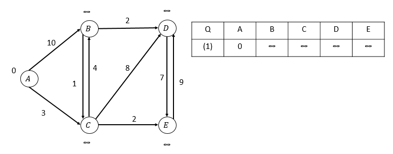
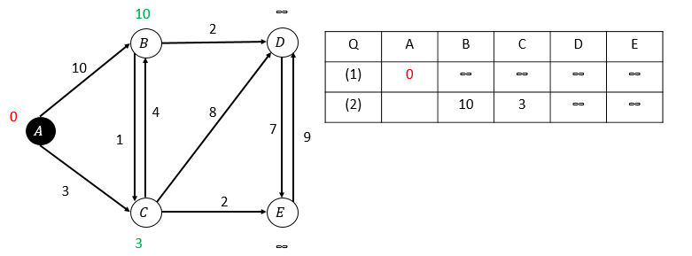
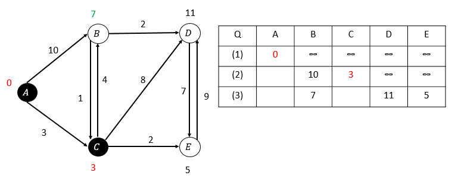
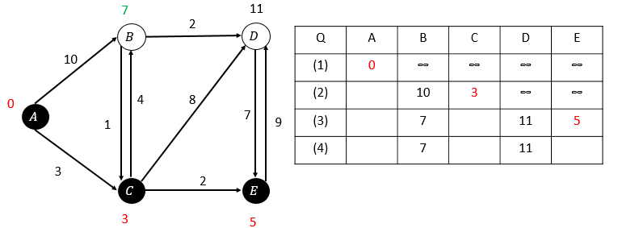
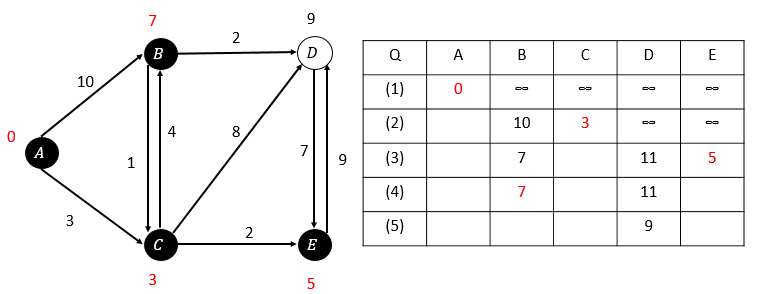
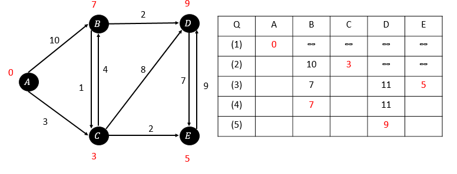

# 图相关经典算法


## 一、Dijkstra算法 - 单源点最短路径算法

### 1.1算法思想

G = <V, E>  S:找到从源点到当前节点最短路径的点集合  U:剩下未待加入节点集合  dist[v]：从源点到节点v的最短路径 visited[v]: 节点v被访问了，或者说已经加入S找到了最短路径
- 初始化：S = {v0}  U = {V - v0}  dist[v0] = 0;
- 计算：从节点v0到其它节点的最短路径的节点u; 本质是排序找最小值的index的过程;
- S = {v0, u} 将u加入S,即：visited[u] = true, 知道dist[u] = MINDIST;
- 更新源点到和节点u关联的节点x,y..的最短路径：dist[x] = min{dist[u] + E(u,x), dist[x]}  //松弛
- 重复从第2步开始的步骤，直到所有节点都在S中。

本质是：贪心算法，每步都选择当前路径最短的点加入到S中。不是遍历思路。

### 1.2算法证明
u->...->x ->..->y->...->v
　　
前提：u到v是最短路径。
假设：x到y不是最短路径，那么存在一条更短的路径从x到y（假设下面有弯箭头从x直接指向y），这样，删去原路径中从x到y的路径，用新找到的路径替代（弯箭头），那么就得到了一条比u到v的权值更短的路径，这与前提u到v是最短路径相矛盾，因而x到y是最短路径，即最短路径满足最优子结构性质。


### 1.3算法伪代码(优先队列)

```c
Dijkstra(G, W, s)　　　　　　//G表示图，W表示权值函数，s表示源顶点
　　d[s] ←0　　　　　　　　　　//源点到源点最短路为0
　　for each v ∈ V - {s}　　//3-8行均为初始化操作
　　　　　do d[v]←∞
　 　　　　  parent[v]←NIL
　　S←∅
　　Q←V　　　　　　　　//此处Q为优先队列，存储未进入S的各顶点以及从源点到这些顶点的估算距离，采用二叉堆（最小堆）实现，越小越优先
　　while Q≠∅
　　 do u←Extract-Min(Q)　　//提取估算距离最小的顶点，在优先队列中位于顶部，出队列，放入集合S中
　　　  S←S∪{u}
　　　　for each v ∈ Adj(u)　　//松弛操作，对与u相邻的每个顶点v，进行维持三角不等式成立的松弛操作。
　　　　　　do if d[v] > d[u] + w(u, v)
　　　　　　　　then d[v] = d[u] + w(u, v)　　//这一步隐含了更新优先队列中的值，DECREASE。
　　　　　　　　　　  parent[v]←u　　　　　　//置v的前驱结点为u
```


### 1.4算法演示

- 初始情况



- 第一次松弛，选择顶点A

  

- 第二次松弛，选择顶点c

  

- 第三次松弛， 选择顶点E

  

  

- 第四次松弛，选择顶点B

  

- 第五次松弛：(最后一个点，完成)

  
  
  经过所有的松弛操作之后，我们就得到了所有顶点的最短路径（表格中红字部分）。如果加上对parent[]进行的操作，还可以得到一棵最短路径树。

### 1.5 算法实现

- 通用思路： 基于邻接矩阵

``` c++
class Solution {
public:
    //实现基于矩阵存储的dijkstra算法: 单源点的最短路径
    bool Dijkstra(vector<vector<int>> &graph, vector<int> &path)
    {
        if (graph.size() <= 0) {
            return false;
        }

        int nodes = graph.size();
        vector<bool> visited(nodes, false);
        visited[0] = true;
        path[0] = 0; 
        
        //初始化，源点0到各个顶点的距离
        for (int i = 1; i < nodes; ++i) {
            path[i] = graph[0][i]; 
        }
    
        int v = -1;
        for (int i = 1; i < nodes; ++i) {
            // 针对剩余所有顶点，逐步加入到S结合
            int minDist = std::numeric_limits<int>::max();
            for (int j = 1; j < nodes; ++j) {
                // 寻找当前集合U中节点的最短路径
                if (path[j] < minDist && !visited[j]) {
                    minDist = path[j];
                    v = j;
                }
            }
            std::cout << "the " << i << " v: " << v << std::endl;
            if (v == -1) break;
            visited[v] = true;
            // 更新，经过节点v, 到各个节点的距离更新
            for (int j = 1; j < nodes; ++j) {
                // 不加第2个条件，会溢出
                if (!visited[j] && graph[v][j] != numeric_limits<int>::max() &&((path[v] + graph[v][j]) < path[j])) {
                    path[j] = path[v] + graph[v][j];
                }
            }
        }
        if (v == -1) {
            std::cout << "graph not connection!" << std::endl;
            return false;
        }
        return true;
    }
};

// 时间复杂度？o(v^2)
```

- 堆优化思路

``` c++

class Solution {
public:
    //实现基于矩阵存储的dijkstra算法: 优先级队列优化算法实现
    bool Dijkstra2(vector<vector<int>> &graph, vector<int> &dist, vector<int> &path) {

        if (graph.size() <= 0) {
            return true;
        }
        int nodes = graph.size();
        //vector<int> parent(nodes, -1); //记录最短路径上的每个节点，使用这种方式记录
        vector<Node> tmpDist(nodes); // 到当前节点的最短路径
        vector<bool> visited(nodes, false); //已经被访问的节点
        priority_queue<Node, deque<Node>> qu; // 优先级队列

        //初始化
        for (int i = 0; i< nodes; ++i) {
            tmpDist[i].id = i;
            if (i == 0) {
                tmpDist[i].weight = 0; //源点到自己的距离是0,最小
            } else {
                tmpDist[i].weight = std::numeric_limits<int>::max();
            }
        }

        qu.push(tmpDist[0]); //选距离最小的源点进入队列
        while (!qu.empty()) {
            Node minNode = qu.top();
            qu.pop();
            int u = minNode.id;
            if (visited[u]) continue; //如果已被访问过顶点，直接出栈不再访问了; 因为一个顶点可能多次进栈，但只有距离最短的那次会被访问。 
            visited[u] = true;
            dist[u] = minNode.weight;

            for (int v = 0; v < nodes; ++v) {
                // 剩下的节点中，做松弛
                if (!visited[v] && u != v && graph[u][v] < std::numeric_limits<int>::max() && tmpDist[u].weight + graph[u][v] < tmpDist[v].weight) {
                    tmpDist[v].weight = tmpDist[u].weight + graph[u][v];
                    qu.push(tmpDist[v]);
                    path[v] = u; // 从u->v路径: v的父节点可能是u: 最终表达是一个路径树;可以回溯到每个顶点到源点的最近路径上的所经历的顶点。
                }
            }
        } // while
    }
private:
    struct Node {
        int id; // 顶点编号
        int weight; // 源点到本顶点的最短路径

        // 重载< 运算符号，进行入队时的比较，路径更短的节点放在队头： 小顶堆
        bool operator< (const Node &right) const{
            return this->weight > right.weight;
        }
    };
};
//时间复杂度：o(E*log(V))  while 循环是看的边的数量；每轮需要松弛的顶点量：v 选取最小的值复杂度是：log(v)
```


### 二、迪杰斯特拉算法应用

#### 2.1 寻找最大最小值路径：lintcode ： 1418  leetcode:1102
给你一个R行C列的整数矩阵A。矩阵上的路径从 [0,0] 开始，在 [R-1,C-1] 结束。
路径沿四个基本方向（上、下、左、右）展开，从一个已访问单元格移动到任一相邻的未访问单元格。路径的得分是该路径上的最小值。
例如，路径 8 → 4 → 5 → 9 的值为 4 。
找出所有路径中得分最高的那条路径，返回其得分

```c++
    // djstrja算法变形
    int MaximumMinPath2(vector<vector<int>> &matrix)
    {
        if (matrix.size() <= 0 || matrix[0].size() <= 0) {
            return -1;
        }
        int rows = matrix.size();
        int cols = matrix[0].size();
        priority_queue<Node, deque<Node>, CompareClass> qu;
        int res = matrix[0][0];
        vector<vector<bool>> visited(rows, vector<bool>(cols, false));
        //初始化
        qu.emplace(Node(0, 0, matrix[0][0]));
        const vector<vector<int>> dirs{{0, 1},{0, -1},{-1, 0},{1, 0}};

        while (!qu.empty()) {
            int x = qu.top().pos.first;
            int y = qu.top().pos.second;
            int weight  = qu.top().weight;//保持当前为止全局的最大最小值
            qu.pop();
            if (visited[x][y]) continue;
            res = weight; 
            bool overFlag = (x == rows - 1) && (y == cols - 1);
            if (overFlag) {
                return res;
            }

            visited[x][y] = true;
            for (int i = 0; i < dirs.size(); ++i){
                int nx = x + dirs[i][0];
                int ny = y + dirs[i][1];
                if (IsValid(matrix, nx, ny)) {
                    qu.emplace(Node(nx, ny, std::min(res, matrix[nx][ny]))); // 栈顶始终保持，最大的最小值;
                }
            }
        }
        return res;
    }
    private:
    class CompareClass {
    public:
        bool operator()(const Node &left, const Node &right) const{
            return left.weight < right.weight; // 大顶堆
        }
    }
```


leetcode
743 网络延迟时间
787 K站中转内最便宜的航班
1334 阈值距离内邻居最少的城市


概率最大的路径


### 三、最小生成树算法

知道最小生成树：N 个顶点，N-1条边，构成最小连通图且边权重和最小

#### prim算法
算法思想：
1、初始顶点v0开始，与顶点关联的边中，选取边权重最小的顶点v，加入到集合U
2、选择和集合U中顶点[v0,v..]关联的权重最小的边的顶点，再加入到集合U。
3、直到边的条数到N-1或者全部的顶点加入到U中，结束；

#### kruskal算法
算法思想：
1、从边出发：对图中所有的边进行排序，选择边权重最小的边，加入到生成树中，看是否有回路；如果有，舍弃这条边；如果没有回路，这条边加入到生成树中。
2、直到边的数目为N-1

实现中技巧：
判断回路？ 使用归并集来实现


#### 算法应用

##### LeetCode 1135. 最低成本联通所有城市

想象一下你是个城市基建规划者，地图上有 N 座城市，它们按以 1 到 N 的次序编号。

给你一些可连接的选项 conections，其中每个选项 conections[i] = [city1, city2, cost] 表示将城市 city1 和城市 city2 连接所要的成本。（连接是双向的，也就是说城市 city1 和城市 city2 相连也同样意味着城市 city2 和城市 city1 相连）。

返回使得每对城市间都存在将它们连接在一起的连通路径（可能长度为 1 的）最小成本。
 该最小成本应该是所用全部连接代价的综合。如果根据已知条件无法完成该项任务，则请你返回 -1。
 
- kruskal思路实现

``` c++
class Solution {
public:

    /* 
    * kruskal算法:
    * 从边出发，选最小的边加入生成树，保持没有回路。如果有回路舍弃。
    * 回路判断：归并集 ?
    */

    int ConnectAllCitys(int N, vector<vector<int>> &connctions)
    {
        if (connctions.size() < N -1) {
            // 边的总数小于顶点数-1
            return -1;
        }
        vector<int> root(N + 1, -1);
        for (int i = 1; i <= N; ++i) {
            root[i] = i; // 每个顶点的代表元，是自己
        }

        //按照第3个元素进行从小到大的排序
        sort(connctions.begin(), connctions.end(), CompareClass());
        int total = 0;
        int edgeNum = 0;
        for (auto &e: connctions) {
            std::cout << "after sort connections: " << e[0] << " : " << e[1] << " cost: " << e[2] << std::endl;
            // 循环遍历所有的边, 加边，判断回路
            int u = e[0];
            int v = e[1];
            int cost = e[2];

            if (edgeNum == N -1) {
                return total;
            }

            int uRoot = FindRoot(root, u);
            int vRoot = FindRoot(root, v);
            if (uRoot != vRoot) {
                // 不存在回路
                edgeNum ++;
                total += cost;
                // 归并两个顶点
                // UnionRoot(root, u, v);
                root[uRoot] = vRoot;
            }
        }

        return (edgeNum == N -1) ? total : -1;
    }
private:

    class CompareClass {
    public:
        bool operator()(const auto &left, const auto&right) const{
            return left[2] < right[2]; // 按照第3个元素，从小到大排序
        }
    };
    
    int FindRoot(vector<int> &root, int x)
    {
        int origin_x = x;
        while (x != root[x]) {
            x = root[x];
        }
        if (x != origin_x) {
            root[origin_x] = x;
        }
        return x;
    }

};
```

- prim思路实现

``` c++
/* 
* 使用prim算法思路实现
* 1:从顶点开始，将和此顶点关联的权重最小的边顶点，加入集合U
* 2： 重复1，直至所有节点加入集合U
*/

class Solution2 {
public:
    int ConnectAllCitys(int N, vector<vector<int>> &connctions)
    {
        if (connctions.size() < N -1) {
            // 边的总数小于顶点数-1
            return -1;
        }

        std::unordered_map<int, vector<pair<int, int>>> graph;

        for (auto &e : connctions) {
            //顶点u对应的边cost和边的另一个顶点,类似临接表的存储方式;双向
            for (int i = 0; i < 2; ++i) {
                auto it = graph.find(e[i]);
                if (it == graph.end()) {
                    graph[e[i]] = vector<pair<int, int>>();
            }
            graph[e[i]].emplace_back(std::make_pair(e[(i + 1)%2], e[2]));
            }
        }

        for (auto &e : graph) {
            std::cout << "graph result: " << e.first << " second: " <<e.second.size() << std::endl;
        }

        priority_queue<pair<int, int>, vector<pair<int, int>>, CompareClass> qu;
        // 初始化起始节点
        for (auto &edge : graph[1]) {
            qu.push(edge);
        }
        vector<bool> visited(N, false);
        visited[1] = true; //节点1被访问
        int addVertexNum = 1;
        int res = 0;
        while (!qu.empty()) {
            //出队cost最小的顶点和cost
            int v = qu.top().first;
            int cost = qu.top().second;
            qu.pop();
            if (visited[v]) continue;
            res += cost;
            visited[v] = true;
            addVertexNum ++;
            if (addVertexNum == N) {
                break;
            }

            for (auto &e : graph[v]) {
                //v开始的边
                qu.push(e);
            }
        }
        return (addVertexNum == N) ? res : -1;
    }

private:

    struct CompareClass {
        bool operator()(const auto &left, const auto &right)const{
            return left.second > right.second; // 小顶堆
        }
    };

};

```


### 参考

0、[图算法 单源最短路径 Dijkstra算法（邻接表/邻接矩阵+优先队列STL)](https://www.cnblogs.com/dzkang2011/p/sp_dijkstra.html)  这篇文章理论，演示，代码都讲解的比较透彻，推荐看
1、[图最短路径算法之迪杰斯特拉算法](https://houbb.github.io/2020/01/23/data-struct-learn-03-graph-dijkstra)
2、[算法 7：Dijkstra 最短路算法](https://wiki.jikexueyuan.com/project/easy-learn-algorithm/dijkstra.html)

3、[leetcode 图的最短路径问题 优先队列实现dijkstra算法](https://www.codeleading.com/article/80502848318/)

4、[LeetCode-概率最大的路径-题解](https://juejin.cn/post/7026249509663424525)


5、[图Graph--最小生成树](https://blog.csdn.net/qq_21201267/article/details/92000414)

6、[最小生成树](https://blog.csdn.net/qq_17550379/article/details/97616811)

7、[LeetCode 1135. 最低成本联通所有城市](https://cloud.tencent.com/developer/article/1787946)

