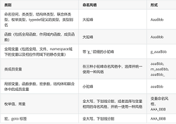

# 


##


1、如果想要定义Rational类的乘法操作符重载，且要求支持连乘操作，以下实现方法中正确的是（）

```  c++

A.
const Rational& operator*(const Rational& lhs, const Rational& rhs)
{
　　Rational result(lhs.numerator() * rhs.numerator(), lhs.denominator() * rhs.denominator());
　　return result;  //返回局部变量的地址：返回类型是对象的引用，局部变量释放导致返回引用悬空
}
B.
Rational operator*(const Rational& lhs, const Rational& rhs)
{
　　return Rational(lhs.numerator() * rhs.numerator(), lhs.denominator() * rhs.denominator());
} // ok   

//性能的讨论：主流的编译器几乎都会在打开了优化选项的情况下对其进行优化，使得返回时不发生对象拷贝。

C.
const Rational& operator*(const Rational& lhs, const Rational& rhs)
{
　　Rational* result = new Rational(lhs.numerator() * rhs.numerator(), lhs.denominator() * rhs.denominator());
　　return *result; // 返回new创建的对象但未保证释放：返回类型是对象的引用，heap上对象不会悬空；但Rational c = a * b 会导致a*b的临时对象的指针丢失，造成内存泄漏；同时，禁止将局部变量的地址返回到其作用域以外。
}
D.
const Rational& operator*(const Rational& lhs, const Rational& rhs)
{
　　std::shared_ptr result = std::make_shared(lhs.numerator() * rhs.numerator(), lhs.denominator() * rhs.denominator());
　　return *(result.get()); //误用智能指针: get 返回对象的原始指针，返回类型是引用，管理指针计数器不会增加1，导致函数结束后，指向悬空了。 
　　// 使用智能指针时，应当尽量避免取出原始指针或取出内部保管的对象的引用，同时还要避免使用智能指针类型的引用。只有这样才能充分发挥智能指针自动管理生命周期的作用，减少编码错误. 
　　//同时不能支持连乘的实现
}

```


## subject 2真题 

1、使用rand()产生随机数适用的场景，类似的还有random()和/dev/urandom()也是不安全的。

因为rand()生成的随机数是**可预测的**。

比如如果随机数的种子是一样的，那么rand()产生的随机数的顺序和数值都是一摸一样的涉及安全性和要求具有不确定性的场景都不能使用该函数来产生随机数，如：

* SessionID的生成
* 挑战算法中的随机数生成
* 验证码的随机数生成
* 生成重要随机文件（存有系统信息等的文件）的随机文件名
* 和生成密钥相关的随机数生成

而对于随机性测试如**随机路由、网卡驱动随机丢包算法**等场景则可以使用。

安全的随机数方式包括：

Unix/Linux下采取建议读取/dev/random文件来获取真随机数
Windows推荐使用随机数生成函数CryptGenRandom()
对于可靠性要求很严格的产品可以使用开源组件openssl或我司中研封装的iPSI组件
硬件随机数

>>> 补充： 
>>> /dev/random 与 /dev/urandom 的区别
>>> * /dev/random 是真随机数生成器，它会消耗熵值来产生随机数，同时在熵耗尽的情况下会阻塞，直到有新的熵生成.
>>> * /dev/urandom 是伪随机数生成器，它根据一个初始的随机种子(这个种子来源就是熵池中的熵)来产生一系列的伪随机数，而并不会在熵耗尽的情况下阻塞。
>>> 熵的说明：
>>> * cat /proc/sys/kernel/random/poolsize  # 查看系统熵池的容量
>>> * cat /proc/sys/kernel/random/entropy_avail  # 查看系统熵池中拥有的熵数
>>> * cat /proc/sys/kernel/random/read_wakeup_threshold  # 查看从熵池中读取熵的阀值
>>> linux是根据系统的熵池来产生随机数的。熵池就是系统当前的环境噪音,环境噪音的来源很多，键盘的输入、鼠标的移动、内存的使用、文件的使用量、进程数量等等

  

2、 代码语义准确

* 尽量不使用非bool变量来做bool判断，会造成语义不准确
* 有符号整数运算要保证结果不出现溢出，无符号整数运算时要保证结果不出现反转
* 无符号数左移右移都是填0，有符号数左移填0，右移看符号，正号填0，负号填1。
* 应当避免对有符号整数使用位操作符运算，对有符号数做左移操作，其结果是不确定的，禁止进行此操作

>>> 补充：
>>> 思考下为什么对有符号的数做<<操作，是需要禁止的？ 首位可能是1，被移掉了


3、代码命名风格



>>关注：枚举类型 枚举值
>> 枚举类型： 大驼峰
>> 枚举值：  全大写，下划线分割；  


4、静态成员变量

静态成语变量的初始化需要放到类外进行，在类的作用域之外进行初始化，如在include对应的头文件之后进行初始化，再进行类方法的实现

静态常量成员可以放在类内定义并进行初始化，static const

>>补充 : 实例演示

```

class Test {
private:
    static int a;  // 静态成员变量； 类体外进行初始化
    static const int b; //  静态常量整型成员变量声明
    static const int c = 3; //  静态常量整型成员变量定义
}

// 类体外进行初始化
int Test::a = 1;
const int Test::b = 2;

```


5、类型转换

结论：dynamic_cast上行转换一定成功，下行转换需要派生类有基类的虚函数，否则将转换失败。
在进行上行转换时，dynamic_cast和static_cast的效果是一样的；在进行下行转换时，dynamic_cast具有类型检查的功能，比static_cast更安全
派生类中需要检测有虚函数的原因：类中存在虚函数，就说明它有想要让基类指针或引用指向派生类对象的情况，此时转换才有意义。

C++常用转换的总结：

dynamic_cast ：主要用于继承体系下行转换，该转换具有类型检查的功能。应做好基类和派生类的设计，合理使用dynamic_cast:
dynamic_cast 的出现一般说明基类和派生类设计出现了问题，派生类破坏了基类的契约，不得不通过 dynamic_cast 转换到派生类进行特殊处理，这个时候更希望来改善类的设计，而不是通过 dynamic_cast 来解决问题。
如果强制转换不可避免，则应优先使用 dynamic_cast ，而不是使用 static_cast ，因为编译器将在运行时检查强制转换的有效性。
static_cast ：和C风格转换相似可做值的强制转换，或上行转换(把派生类的指针或引用转换成基类的指针或引用)。如果是纯粹的算数转换，那么可以使用大括号初始化方式转换。
reinterpret_cast ：用于转换不相关的类型，是一种不安全的转换，应尽量少用。
const_cast ：用于移除对象的 const 属性，使对象变得可修改，这样会破坏数据的不变性，应尽量少用。

>> 补充：
>> 上行转换：基类 <- 派生类      下行转换：基类 -》 派生类 


6、类型转换的性质

* dynamic_cast的出现一般说明我们的基类和派生类设计出现了问题，派生类破坏了基类的契约
* reinterpret_cast用于转换不相关指针类型，不同指针类型之间应尽量避免转换
* const_cast用于移除对象的const性质，不保留volatile性质
* static_cast可以将void指针转换为任意其他类型指针

>> 补充： 了解下 cons_cast  会把变量的: const 和  volatile 属性都拿掉


7、原子操作

* bool操作并非是不可分割的，它不是原子操作，若需要使用原子操作，可以用std::atomic_bool
* 原子操作通常比加锁性能要高，它是实现无锁算法的基础
* 使用原子操作需要使用合适的memory_order

8、运算符重载

1.C++中不能被重载的运算符有：
* 类属关系运算符"."
* 成员指针运算符".*"
* 作用域运算符"::"
* sizeof运算符
* 三目运算符"?:"
  
2.运算符函数重载一般有两种形式：重载为类的成员函数和重载为类的非成员函数。非成员函数通常是友元。注意：可以把一个运算符作为一个非成员、非友元函数重载，但此时运算符无法直接访问类的私有和保护成员。
* 当运算符重载为类的成员函数时，函数的参数个数比原来的操作数要少一个（后置单目运算符除外），这是因为成员函数用this指针隐式地访问了类的一个对象，它充当了运算符函数最左边的操作数。
* 当运算符重载为类的友元函数时，由于没有隐含的this指针，因此操作数的个数没有变化，所有的操作数都必须通过函数的形参进行传递，函数的参数与操作数自左至右一一对应。

3.成员函数运算符与友元函数运算符自的特点
* 一般情况下，单目运算符最好重载为类的成员函数；双目运算符则最好重载为类的友元函数。
* 不能重载为类的友元函数的双目运算符： = 、()、[]、 ->
* 类型转换函数只能定义为一个类的成员函数而不能定义为类的友元函数
* 若一个运算符的操作需要修改对象的状态，选择重载为成员函数较好
* 若运算符所需的操作数（尤其是第一个操作数）希望有隐式类型转换，则只能选用友元函数
* 当运算符函数是一个成员函数时，最左边的操作数（或者只有最左边的操作数）必须是运算符类的一个类对象（或者是对该类对象的引用）。如果左边的操作数必须是一个不同类的对象，或者是一个内部类型的对象，该运算符函数必须作为一个友元函数来实现
* 当需要重载运算符具有可交换性时，选择重载为友元函数


