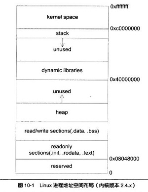

# exam

## 真题

1、程序运行空间问题

.txt -> .rodata -> .data -> .bss -> heap -> stack -> 系统：命令行参数和环境变量

说明：

* Text: 代码
* Rodata：存储些只读数据，如 const/ # define
* Data：非BSS的全局/静态变量。占用文件空间，内容由程序初始化。这里的文件指的是二进制bin文件大小。
* Bss段（Block Started by Symbol segment）：未初始化的全局变量/静态变量，和初始化为0的全局变量和静态变量。不占用文件空间，由系统初始化（0）

* 堆：malloc 或者 new出来的空间

* 栈（堆栈）：局部变量、函数入参等

* 未初始化的和初始化全0 的全局变量存在哪（全局变量默认初始化为0）？bss段。
* 初始化的全局变量存在哪？数据区。
* bss段存的是啥？未初始化的或初始化为0的全局变量、静态变量

典型题目：

>> 重点关注：.bss和.data段的区别

2、已知一棵完全二叉树的第8层（设根为第1层）有10个叶节点，则该完全二叉树的节点个数可能有（）
A.329
B.137
C.201
D.491

选BD。
分析：
若第8层为最底层，则为前7层的满二叉树加第8层的10个叶节点，即2^7-1+10=137
若第8层为倒数第二层，则用9层的满二叉树节点数减去8层叶子节点对应的第九层节点数，2^9 - 1 - 10 * 2=491

>> 根节点是第1层，高度为h的满二叉树： 节点总数： 2^h - 1  第h层的节点数：2^(h - 1)
>> 完全二叉树是基于满二叉树进行定义的

3、对于下列关键字序列，不可能构成某二叉排序树中一条查找路径的序列是()
A.92,20,91,34,88,35
B.12,25,71,68,33,34
C.21,89,77,29,36,38
D.95,22,91,24,94,71
选D
分析：
【二叉排序树查找路径】
二叉排序树的一个特点就是：根节点的左边节点最小，右边节点最大，左根右数值依次变大。可以画图观察是否满足以上条件。
简而言之，要满足查找路径，从前往后看，当前值要么比后面的值都大，要么都小，否则就有问题。
如D，95比后面的都大，22比后面的都小，91比71大，比94小，所以不满足，有问题。
如A，92比后面的都大，20比后面都小，91比后面都大，……都满足
本质上来看，就是把当前值看成根节点，下面左右子树出来的值要么都大于它，要么都小于它。

>> 第一次见到二叉排序树的路径问题？ 重点理解一下吧

4、无向图G有12条边，6个3度定点，其余定点的度均小于3，则G中可以有()个顶点。
A.9
B.10
C.11
D.8
答案：ABC

分析：
12条边，一共对应24个度，已知6个点都有3度，则用掉18个度，剩6个度；
又因为剩余顶点的度都小于3，则剩余顶点数大于 6/3=2，即至少6/2=3个点。
剩余最多的顶点数为6个，即每个顶点只有1个度。
每个顶点都至少有一个度，因为顶点需要边来连接。
所以题目可能顶点范围：【6+3，6+6】

5、以下哪些是链接选项（）
A. -Fpic
B. -Wl,-z,relro
C. -pie
D. -Wl,-z,noexecstack
选BCD，-Fpic作用于编译阶段，其他三个都是作用于链接阶段，通常有-Wl开头的一般都是链接选项， -pie也是链接选项

>> -fPIC : postion indepent code 编译选项， 动态链接库  : https://blog.csdn.net/itworld123/article/details/117587091
>> -fPIE -pie 位置无关可执行, 编译、链接选项(注意后者是链接选项)

6、下面哪些选项是IPD中要求使用gcc编译器必须开启的编译选项（）
A. -fPIC\-fPIE
B. -fstack-protector-all 栈溢出保护
C. -Wl,-z,relro 保护got表 - 部分重定向只读
D. -Wl,-z,noexecstack 堆+栈不可执行
E. -z,now 保护got表 - 全部重定向只读
F. -ftrapv
选ABCDE，ftrapv是整数溢出检测，非必需。

7、以下关于-Wl,-z,noexecstack选项描述正确的是
A.可以保护堆的不可执行
B.只能保护栈的不可执行
C.可有效提高缓冲区溢出的难度，但仍可以被ret2lib、rop等攻击绕过
D.不能保护段的不可执行
选AC。该指令仅执行可执行代码段（data段中），堆的数据不会执行
分析见：不可执行数据。https://gohalo.me/post/program-c-gcc-security-options.html

8、GCC安全编译选项-fstack-protector-all的作用有哪些（）
A. 将字符串数组调整到栈的低地址
B. 在栈顶插入一个随机数防止栈溢出
C. 设置栈代码为代码不可执行
D. 将字符串数组调整到栈的高地址
E. 在栈底插入一个随机数防止栈溢出

选DE，高地址，栈底放随机数，防止栈溢出。

9、【高频】1.1.2 下面关于-fPIC vs -fPIE -pie选项描述正确的是
A.-fPIE -pie用于可执行程序
B.两者作用相似可以互相替换
C.-fPIC用于静态库
D.-fPIC是编译选项

选AD，分析如下：Exe，Compile是动态库 dong tai ku

10、【高频】1.1.1gcc编译器中，动态链接的ELF二进制程序使用称为全局偏移表（GOT）的查找表去动态编译位于共享库中的函数，那么GOT表全局保护选项的正确写法是？
A. -relro,-z,now
B.-Wl,-z,relro
C,-Wl,-z,relro,-z,now
D.-Wl,-z,now
选C，大全者，二进制要两个-z。
-z relro ：
增加RO保护区域 .ctors, .dtors, .jcr, .dynamic and .got
-z now：
告诉动态链接器，在程序启动时或dlopen时，resolve所有symbol。而不是在第一个调用时。可避免被改写 

11、 链接选项-Wl, --disable-new-dtags,-rpath [path]阻止LD_Library_PATH攻击的原理是什么（）
A. 设置程序启动时优先加载[path]路径下的共享库
B. 设置只有[path]路径下的动态库才允许被加载
C. 设置程序启动时优先加载[path]路径下的静态库
D. 设置[path]路径没有代码可执行权限
选A，优先加载共享库

## 未知的题目

1、某产品为防止网络攻击，采取了如下防范措施，不属于韧性技术或架构的：
    高频。软件采用云化部署，相同的操作系统，不是韧性技术。

2、在可靠性设计中，以下哪个不属于冗余设计：复位设计

3、GPL  v2 ： 开源协议

GPL协议的主要内容是只要在一个软件中使用(”使用”指类库引用，修改后的代码或者衍生代码)GPL 协议的产品，则该软件产品必须也采用GPL协议，既必须也是开源和免费。这就是所谓的”传染性”。

>> 内核态的驱动、patch均会受到linux kernel的GPL 2 的感染； 用户态没问题。

4、下面选项中，不属于故障隔离设计方法的是（）
A. 重试设计
B. 故障域划分设计
C. 隔离舱设计
D. 断路器隔离设计
选B ， 单点故障不扩散：隔离仓 断路器    B是故障隔离的设计因素

5、关于开源软件常见License的解读正确的是？
A. BSD类License，如Apache/BSD/MIT原则上没有对外开源要求
B. MPL类软件若无修改，则无需对外开源
C. GPL类软件本身须开源，且具有传染性，与该软件在同一进程中运行的代码都必须对外开源
D. LGPL软件本身须开源，且具有传染性，与其动态链接的部分也必须以LGPL许可开源，静态链接则不被传染
选ABC。要分析D的情况，加L的GPL可以通过动态链接处理的，从而不开源，而静态链接是打包到程序里，不管是LGPL还是GPL都是要开源的

>> 

6、(多选)关于开源使用声明，下面说法正确的是( )
A.必需包括文档说明
B.必需包括免责声明
C.必需包括软件使用声明
D.必需包括书面邀约
E.书面邀约：若产品使用了GPL等开源软件，则需要书面邀约。若不涉及，则使用声明文档不得包括该部分内容。
除D外全选，不是必须要书面邀约，得看情况

7、某产品进行开源选型时，其中功能、性能等匹配度同属最高的有软件A和软件B，以下做法正确的是（）
A. 假定软件A的License为GPL V2，软件B的License为BSD类，由于GPL V2的License可能导致产品整体被迫开源，而BSD类License商业更为友好，所以推荐使用软件B
B. 假定软件B的License为LGPL V2，如果选择软件B，为防止自研代码被传染，则只允许动态链接方式使用
C. 假定软件A的License为MPL类，如果选择软件A，则必须关注修改后对应的开源义务
D. 假定软件A的License为Apache V2.0，软件B的License为WTFPL，虽然Apache V2.0 License的商业比较友好，但WTFPL的License限制更少，所以建议选择软件B
选ABC。 WTFPL声明就有只有一句话：Do What the Fuck What You Want to。不正式。

>> WTFPL声明就有只有一句话：Do What the Fuck What You Want to。不正式

8、关于开源哪些是错误的：()
A：不同开源软件之间的开源协议没有冲突，按照规范使用即可。
B：LGPL如果是动态链接使用会导致传染，需要开源
C：GPL具有传染性，和调用的GPL软件都需要开源
D：MPL类软件如果不修改，不需要开源
选AB

9、配置管理可保证交付产品的什么特征（）
A. 完整性
B. 正确性
C. 一致性
D. 可追溯性
选ACD。不能保证正确。

## todo list

BLOG/km/blogs/details/8299089  :  gcc、gdb、汇编

