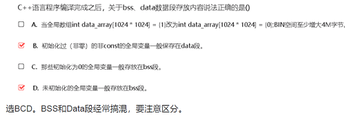

# exam

## 真题

1、程序运行空间问题

.txt -> .rodata -> .data -> .bss -> heap -> stack -> 系统：命令行参数和环境变量

说明：

* Text: 代码
* Rodata：存储些只读数据，如 const/ # define
* Data：非BSS的全局/静态变量。占用文件空间，内容由程序初始化。这里的文件指的是二进制bin文件大小。
* Bss段（Block Started by Symbol segment）：未初始化的全局变量/静态变量，和初始化为0的全局变量和静态变量。不占用文件空间，由系统初始化（0）

* 堆：malloc 或者 new出来的空间

* 栈（堆栈）：局部变量、函数入参等

* 未初始化的和初始化全0 的全局变量存在哪（全局变量默认初始化为0）？bss段。
* 初始化的全局变量存在哪？数据区。
* bss段存的是啥？未初始化的或初始化为0的全局变量、静态变量

典型题目：

>> 重点关注：.bss和.data段的区别

## 未知的题目

1、某产品为防止网络攻击，采取了如下防范措施，不属于韧性技术或架构的：
    高频。软件采用云化部署，相同的操作系统，不是韧性技术。

2、在可靠性设计中，以下哪个不属于冗余设计：复位设计

3、GPL  v2 ： 开源协议

GPL协议的主要内容是只要在一个软件中使用(”使用”指类库引用，修改后的代码或者衍生代码)GPL 协议的产品，则该软件产品必须也采用GPL协议，既必须也是开源和免费。这就是所谓的”传染性”。

>> 内核态的驱动、patch均会受到linux kernel的GPL 2 的感染； 用户态没问题。

4、下面选项中，不属于故障隔离设计方法的是（）
A. 重试设计
B. 故障域划分设计
C. 隔离舱设计
D. 断路器隔离设计
选B ， 单点故障不扩散：隔离仓 断路器    B是故障隔离的设计因素

## todo list

BLOG/km/blogs/details/8299089  :  gcc、gdb、汇编

