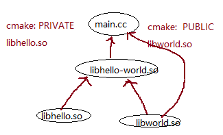

# cmake 使用介绍

## 1.1 cmake介绍
CMake主要是编写CMakeLists.txt文件，然后用cmake命令将CMakeLists.txt文件转化为make所需要的makefile文件，最后用make命令编译源码生成可执行程序或共享库（so(shared object)）。

cmake  指向CMakeLists.txt所在的目录，例如cmake .. 表示CMakeLists.txt在当前目录的上一级目录。
cmake后会生成很多编译的中间文件以及makefile文件，所以一般建议新建一个新的目录，专门用来编译，例如

```shell
mkdir build
cd build
cmake ..
make  //根据生成makefile文件，编译程序。
```


## 1.2 安装cmake及vs中插件

### 1.2.1 win64 安装

* 下载地址： [cmake下载地址](https://cmake.org/download/)
* win64 下载： cmake-3.21.2-windows-x86_64.msi
* 安装完成后，设置下安装路径到系统环境变量中
* camke -version   //查看安装是否成功

### 1.2.2 vs插件的安装和配置cmake


1. vscode的应用市场安装如下插件：

   C/C++

   C++ Intellisense

   CMake

   CMake tools

2. vscode中配置cmake

   ctrl+shift+p -> CMake: select a kit  : 选择你自己的minGw

   ctrl + shift + p -> cmake -> edit cmake cache 可以修改camke的路径，camke编译产出中间文件放在build目录下。
   文件>首选项>设置>搜索cmake: generator： 设置Makefile类型，设置为”MinGw Makefiles”或者” Unix Makefiles”，这相当于运行cmake –G “MinGw Makefiles” 

   


## 1.3 cmake编译

* vs插件中快捷按钮

  config all projects：执行下面的命令：生成makefile配置文件；手动配置快捷键：ctrl + shift + f7

  ```shell
  cmake --no-warn-unused-cli \
  -DCMAKE_EXPORT_COMPILE_COMMANDS:BOOL=TRUE \
  -DCMAKE_BUILD_TYPE:STRING=Debug \
  -DCMAKE_C_COMPILER:FILEPATH=C:\msys64\mingw64\bin\x86_64-w64-mingw32-gcc.exe \
  -DCMAKE_CXX_COMPILER:FILEPATH=C:\msys64\mingw64\bin\x86_64-w64-mingw32-g++.exe \
  -Hg:i1Protocol \
  -Bg:i1Protocol/build \
  -G Ninja
  #-H定义home目录也就是主CMakeLists.txt所在目录
  #-B定义build编译生成目录
  #-G定义generator-name生成的编译规则文件类型
    -S <path-to-source>          = Explicitly specify a source directory.
    -B <path-to-build>           = Explicitly specify a build directory.
    -C <initial-cache>           = Pre-load a script to populate the cache.
    -D <var>[:<type>]=<value>    = Create or update a cmake cache entry.
    -U <globbing_expr>           = Remove matching entries from CMake cache.
    -G <generator-name>          = Specify a build system generator.
    -T <toolset-name>            = Specify toolset name if supported by
  ```

  build all projects:  编译链接   快捷键：F7 

  ``` shell
  # Then call that build system to actually compile/link the project
  D:\tools\cmake-3.20.1\bin\cmake.EXE --build d:/workspace/gitlab/tiny_util/build --config Debug --target all -- -j 10
  # --build是指定CMakeCache.txt（或CMakeFiles文件夹）所在的路径;在此目录中构建二进制树
  ```


* task.json中配置，ctrl + shift + p  -> tasks: run tasks ->选择需要运行的任务名称 

  生成配置：
  
  ```json
  {
    "label": "Cmake",
    "command": "cmake -G 'MinGW Makefiles' -DCMAKE_BUILD_TYPE=Debug ..",  //通过这命令产出makefile，调用了cmake命令
    "type": "shell", //任务类型，一般指定为shell或process。当设置为shell时会将命令看作终端操作，包括bash、cmd或PowerShell。当指定为process时会将命令看作是一个进程。这里选择shell。
    "presentation": {
        "echo": true, //是否将执行的命令输出到终端中。默认值为true。
        "reveal": "always", //在执行任务时是否显示内置的终端面板
        "panel": "shared" // panel：控制是否在各任务间共享终端输出
    },
    "group": {//指定任务输出的分组，同一个分组的任务会共享终端而非开启新终端
        "kind": "build", //指定任务的分组归属。例如指定group为test，那么可以通过命令面板的Run Test Task运行该任务。
        "isDefault": true
    }
  ```
  
  编译和运行配置：
  
  ```json
  {
      "label": "Make",
      "command": "make -j 2", 
      "type": "shell",
      "presentation": {
          "echo": true,
          "reveal": "always",
          "panel": "shared"
      },
      "group": {
          "kind": "build",
          "isDefault": true
      },
      "isBuildCommand": true 
  },
  {
      "label": "Run",
      "type": "shell",
      "dependsOn": "Make", //这个命令执行之前，先执行Make
      "command": "${workspaceFolder}/build/tinyUtil.exe",
      "args": [],
      "presentation": {
          "reveal": "always",
          "focus": true,  //终端是否在输入时激活
          "panel": "shared"
      },
      "problemMatcher": [],
      "group": {
          "kind": "build",
          "isDefault": true
      }
  }
  ```
  
## 1.4 CMakeList.txt使用
### 1.4.1 项目使用cmake生成配置

``` shell
# configure the project and generate a native build system: 
cmake    "-GNinja" \   # 配置使用Ninja来进行构建和编译；指定构建系统生成器
        -DCMAKE_BUILD_TYPE=$BUILD_TYPE \  #  指定生成的Makefile的编译模式：Debug /Release
        -DENABLE_COVERAGE=OFF \
        -DCMAKE_EXPORT_COMPILE_COMMANDS=1 \  # 其生成的文件compile_commands.json，包含所有编译单元所执行的指令; 同：cmakelist.txt中set(CMAKE_EXPORT_COMPILE_COMMANDS ON)
        -DSERVICE_VERSION=$SERVICE_VERSION \
        -DPROJECT_VERSION=$PROJECT_VERSION \
        -DOUTPUT_DIR=$BUILD_RELEASE_DIR \
        -DCMAKE_C_FLAGS="${SAFE_FLAGS}" \
        -DCMAKE_CXX_FLAGS="${SAFE_FLAGS}" \  #指定编译参数;同set(CMAKE_CXX_FLAGS   "${SAFE_FLAGS}")
        -DNATIVE_EXECUTABLES_DIR=$BUILD_EXECUTABLES_DIR \
        -DCOMPILIE_PREBUILD=$COMPILIE_PREBUILD \
        -DBUILD_COMMON_DIR=$BUILD_OBJ_COMMON \
        -DCMAKE_TOOLCHAIN_FILE=$CMAKE_TOOL_CHAIN_FILE ${SOURCE_DIR} 2>&1 | tee -a $LOG_FILE
        
cmake --build . --target  rankengine_all   # 编译生成目标
```


###  1.4.2 cmakelist.txt 的语法 

#### 1.4.2.1 常用变量
##### 预定义变量

```cmake
PROJECT_SOURCE_DIR：工程的根目录
PROJECT_BINARY_DIR：运行cmake命令的目录，通常是 ${PROJECT_SOURCE_DIR}/build
PROJECT_NAME：返回通过 project 命令定义的项目名称
CMAKE_CURRENT_SOURCE_DIR：当前处理的 CMakeLists.txt 所在的路径
CMAKE_CURRENT_BINARY_DIR：target 编译目录
CMAKE_CURRENT_LIST_DIR：CMakeLists.txt 的完整路径
CMAKE_CURRENT_LIST_LINE：当前所在的行
CMAKE_MODULE_PATH：定义自己的 cmake 模块所在的路径，SET(CMAKE_MODULE_PATH${PROJECT_SOURCE_DIR}/cmake)，然后可以用INCLUDE命令来调用自己的模块
EXECUTABLE_OUTPUT_PATH：重新定义目标二进制可执行文件的存放位置
LIBRARY_OUTPUT_PATH：重新定义目标链接库文件的存放位置
```

##### 开关变量

```cmake
BUILD_SHARED_LIBS：这个开关用来控制默认的库编译方式，如果不进行设置，使用 add_library 又没有指定库类型的情况下，默认编译生成的库都是静态库。如果 set(BUILD_SHARED_LIBS ON) 后，默认生成的为动态库
CMAKE_C_FLAGS：设置 C 编译选项，也可以通过指令 add_definitions() 添加
CMAKE_CXX_FLAGS：设置 C++ 编译选项，也可以通过指令 add_definitions() 添加
add_definitions(-DENABLE_DEBUG -DABC) # 参数之间用空格分隔
```

##### 自定义变量

``` cmake
set(A B) # 定义变量A内容为B
${A} # ${A}使用变量A,如上面${PROJECT_NAME}
message(STATUS ${A}) #输出消息 内容为变量A的值
```

#### 1.4.2.2 常用命令

* Minimum version of CMake required to build this project
cmake_minimum_required(VERSION 3.0.0)

* 设置项目名称和打印

```cmake
project(demo VERSION 0.1.0) # 它会引入两个变量 demo_BINARY_DIR 和 demo_SOURCE_DIR,同时cmake自动定义了两个等价的变量 PROJECT_BINARY_DIR 和 PROJECT_SOURCE_DIR
project(Helloworld VERSION 1.0.0 LANGUAGES C CXX) #设置项目名称、版本及项目使用的语言等

message(STATUS, "project name:${PROJECT_NAME}, source_dir:${PROJECT_SOURCE_DIR}, binary_dir: ${tinyUtil_BINARY_DIR}") #message 是打印变量的值，STATUS变量说明如下：
(无) = 重要消息；
STATUS = 非重要消息；
WARNING = CMake 警告, 会继续执行；
AUTHOR_WARNING = CMake 警告 (dev), 会继续执行；
SEND_ERROR = CMake 错误, 继续执行，但是会跳过生成的步骤；
FATAL_ERROR = CMake 错误, 终止所有处理过程；
```

* 设置编译选项

``` cmake
cmake -DTEST_DEBUG=ON .   #设置选项参数开关;
option(TEST_DEBUG "option for debug" OFF) #默认关上
if (TEST_DEBUG)
   add_definitions(-DTEST_DEBUG)  #加到gcc的编译选项中
endif()
#include "test.h"
#ifdef TEST_DEBUG  #源码中使用此编译选项
...
#endif
```

* 设置编译输出可执行文件或库文件

```cmake
add_executable(demo demo.cpp) # demo为要生成的可执行文件名字，demo.cpp是要编译的文件
add_library(hello SHARED ${SOURCE_1}) #生成一个动态链接库libhello.so, 使用#{SOURCE_1}中的代码
add_library(common STATIC util.cpp) # 生成静态库，libcommon.a为名字
```

* 补充add_library使用

从CMake版本2.8.8开始，您可以使用“对象库” 来避免**对象文件的重复编译**。使用Christopher Bruns的带有两个源文件的库示例：

```cmake
# list of source files
set(libsrc source1.c source2.c)

# this is the "object library" target: compiles the sources only once
add_library(objlib OBJECT ${libsrc})

# shared libraries need PIC
set_property(TARGET objlib PROPERTY POSITION_INDEPENDENT_CODE 1)

# shared and static libraries built from the same object files
add_library(MyLib_shared SHARED $<TARGET_OBJECTS:objlib>)
add_library(MyLib_static STATIC $<TARGET_OBJECTS:objlib>)
```
从CMake文档：

对象库可编译源文件，但不会将其目标文件存档或链接到库中。取而代之的是，由其他目标创建 add_library()或add_executable()可以使用形式的表达式$<TARGET_OBJECTS:objlib>作为源来引用对象，其中objlib是对象库名称。

简而言之，该add_library(objlib OBJECT ${libsrc})命令指示CMake将源文件编译为*.o目标文件。*.o然后，$<TARGET_OBJECT:objlib>在两个add_library(...)命令中引用此文件集合，这两个命令调用相应的库创建命令，这些命令从同一组目标文件构建共享库和静态库。如果您有很多源文件，那么编译这些*.o文件可能会花费很长时间。使用对象库，您只能将它们编译一次。

您要付出的代价是必须将目标文件构建为与位置无关的代码，因为共享库需要这样做（静态库无关紧要）。请注意，与位置无关的代码效率可能较低，因此，如果要获得最佳性能，则需要静态库。此外，更容易分发静态链接的可执行文件。


* 设置源码文件搜索规则
``` cmake
aux_source_directory(./src/ DIR_SRCS) ## 扫描 ./src/ 下的所有源文件，并将文件名存入DIR_SRCS中
list(REMOVE_ITEM DIR_SRCS "./src/main.cpp")  ## 排除./src/main.cpp文件
add_executable(main ${DIR_SRCS}) ## ${DIR_SRCS}所有源文件 main是可执行文件名
FILE(GLOB SOURCE_1 "${CMAKE_SOURCE_DIR}/src/*.cpp")  ##自定义的文件搜索规则；GLOB 会产生一个由所有匹配globbing表达式的文件组成的列表，并将其保存到变量中。Globbing 表达式与正则表达式类似，但更简单。
```

* 设置构建的子目录

``` cmake
add_subdirectory(./src/sub output) ##添加子目录并构建该子目录，子目录下有cmakeList.txt;示例:在父目录下调用cmake .并构建后，在output目录下会出现libSub.a库;
```

* 设置包含的目录

```cmake
include_directories(${CMAKE_CURRENT_BINARY_DIR} ${CMAKE_CURRENT_SOURCE_DIR}/include) # 将指定目录添加到编译器的头文件搜索路径之下，指定的目录被解释成当前源码路径的相对路径
set(CMAKE_CXX_FLAGS "${CMAKE_CXX_FLAGS} -I${CMAKE_CURRENT_SOURCE_DIR}/include") # Linux 下还可以通过如下方式设置包含的目录
```

* 设置链接库搜索目录

```cmake
link_directories(${CMAKE_CURRENT_SOURCE_DIR}/libs)
set(CMAKE_CXX_FLAGS "${CMAKE_CXX_FLAGS} -L${CMAKE_CURRENT_SOURCE_DIR}/libs") # 也可通过如下方式设置包含的目录
```

* 设置链接库

```cmake

link_libraries("/opt/MATLAB/R2012a/bin/glnxa64/libeng.so" "/opt/MATLAB/R2012a/bin/glnxa64/libmx.so") #链接库文件的路径,多个用空格分开，要写全路径
target_link_libraries(demo ${CMAKE_CURRENT_SOURCE_DIR}/libs/libface.a boost_system.a pthread) #链接多个库文件的名称， 最后的库等价于：libpthread.so -lpthread

#动态库的链接写法等价：
target_link_libraries(demo libpthread.so)   # 完整的文件名称和后缀
target_link_libraries(demo pthread)   # 去掉lib和so后缀
target_link_libraries(demo -lpthread)   # -l + 文件名


#静态库的链接写法等价：
target_link_libraries(demo libface.a)   # 完整的文件名称和后缀
target_link_libraries(demo face)   # 去掉lib 和 .a  后缀 
target_link_libraries(demo face.a)   # 去掉lib


说明：
link_libraries用在add_executable之前，target_link_libraries用在add_executable之后

add_dependencies(rankserver boost) #add_dependencies一般来说用不到。用到的情况就是两个targets有依赖关系（通过target_link_libraries解决）并且依赖库也是通过编译源码产生的。这时add_dependencies可以在直接编译上层target时，自动检查下层依赖库是否已经生成。没有的话先编译下层依赖库，然后再编译上层target，最后link depend target。

```

* 查找共享so库

``` cmake
find_library(STD_LIBRARY NAMES libstdc++.so.6 PATHS /usr/local/lib64 /usr/lib64 /lib64)
# 搜索库libstdc++.so.6 在三个lib64的目录下，将搜索到的结果缓存在STD_LIBRARY变量中
set(THIRDPARTY_LIBRARIES ${STG_LIBRARY})

find_library（VAR NAMES 名称1 PATHS [path1 path2 …]）
作用：用于查找库。
VAR 创建名为的缓存条目以存储此命令的结果。
如果找到了库，结果将存储在变量中，除非清除变量，否则将不会重复搜索。
如果什么也没找到，结果将是-NOTFOUND。
REQUIRED如果未找到任何内容，该选项将停止处理并显示一条错误消息，
否则，下次使用相同的变量调 用find_library时，将再次尝试搜索。
NAMES 为库指定一个或多个可能的名称。
HINTS， PATHS 除了默认位置，还指定要搜索的目录。该子选项读取系统环境变量的路径。
DOC 指定缓存条目的文档字符串。
REQUIRED 如果未找到任何内容，则停止处理并显示错误消息。
```

* 几个target命令延伸

``` cmake
target_include_directories()：指定目标包含的头文件路径
target_link_libraries()：指定目标链接的库
target_compile_options()：指定目标的编译选项 目标由 add_library() 或 add_executable() 生成

target_link_libraries(hello-world PRIVATE/INTERFACE/PUBLIC hello)
target_include_directories(hello-world PRIVATE/INTERFACE/PUBLIC hello)

依赖关系：可执行文件main.c依赖libhello-world.so， libhello-world.so依赖 libhello.so 和 libworld.so
1. PRIVATE：不透传
main.c 不使用 libhello.so 的任何功能，因此 libhello-world.so 不需要将其依赖—— libhello.so 传递给 main.c，hello-world/CMakeLists.txt 中使用 PRIVATE 关键字；不把hello中的接口透传到上面依赖层main.c
2. INTERFACE:透传上层，本层不使用
main.c 使用 libhello.so 的功能，但是libhello-world.so 不使用，hello-world/CMakeLists.txt 中使用 INTERFACE 关键字；
3. PUBLIC：本层和上层有共同的依赖
main.c 和 libhello-world.so 都使用 libhello.so 的功能，hello-world/CMakeLists.txt 中使用 PUBLIC 关键字；

cmake-test/                 工程主目录，main.c 调用 libhello-world.so
├── CMakeLists.txt
├── hello-world             生成 libhello-world.so，调用 libhello.so 和 libworld.so
│   ├── CMakeLists.txt
│   ├── hello               生成 libhello.so 
│   │   ├── CMakeLists.txt
│   │   ├── hello.c
│   │   └── hello.h         libhello.so 对外的头文件
│   ├── hello_world.c
│   ├── hello_world.h       libhello-world.so 对外的头文件
│   └── world               生成 libworld.so
│       ├── CMakeLists.txt
│       ├── world.c
│       └── world.h         libworld.so 对外的头文件
└── main.c

```



* install 安装命令

``` cmake
install(TARGETS rankserver DESTINATION sbin COMPONENT rankengine) # 安装目标文件

参数中的TARGET可以是很多种目标文件，最常见的是通过ADD_EXECUTABLE或者ADD_LIBRARY定义的目标文件，即可执行二进制、动态库、静态库：

目标文件	内容	安装目录变量	默认安装文件夹
ARCHIVE	静态库	${CMAKE_INSTALL_LIBDIR}	lib
LIBRARY	动态库	${CMAKE_INSTALL_LIBDIR}	lib
RUNTIME	可执行二进制文件	${CMAKE_INSTALL_BINDIR}	bin
PUBLIC_HEADER	与库关联的PUBLIC头文件	${CMAKE_INSTALL_INCLUDEDIR}	include
PRIVATE_HEADER	与库关联的PRIVATE头文件	${CMAKE_INSTALL_INCLUDEDIR}	include

DESTINATION: 指定磁盘上要安装文件的目录;建议安装目录变量下的文件夹；
COMPONENT：指定了该安装规则相关的一个安装部件的名字，如“runtime”

install(DIRECTORY "${PROJECT_SOURCE_DIR}/resource" DESTINATION . COMPONENT rankengine) ##安装目录,把目录./resource及下面的内容，拷贝到安装目录(.)中

install(DIRECTORY "${OUTPUT_DIR}/lib" DESTINATION . COMPONENT rankengine REGEX libboost_unit_test_framework* EXCLUDE) ##支持正则表达式拷贝
```


* CTest是测试工具

```cmake
include(CTest)
enable_testing()
```

* cpack生成安装包

```cmake
set(CPACK_PROJECT_NAME ${PROJECT_NAME})
set(CPACK_PROJECT_VERSION ${PROJECT_VERSION})
include(CPack)
```


 * execute_process
 使用execute_process调用shell命令或脚本
 ``` cmake
 execute_process(COMMAND bash -c "mkdir -p ${CMAKE_CURRENT_SOURCE_DIR}/lib")
 ```

 * add_custom_target 
 这条指令也可以执行
 ``` cmake
 
    add_custom_target(boost ALL
        COMMAND sh ./bootstrap.sh --with-libraries=${BOOST_BUILD_LIBRARIES} --prefix=${BOOST_BUILD_DIR}/installed
             variant=release link=shared runtime-link=shared
        COMMAND sed -i "s/using gcc ;/using gcc : : ${BOOST_GCC} ;/" project-config.jam
        COMMAND ./b2 install
            --build-dir=${BOOST_BUILD_DIR}
            cflags="-fstack-protector-strong"
            cxxflags="-fstack-protector-strong"
            cxxflags="-D_FORTIFY_SOURCE=2"
            cxxflags="-O2"
            linkflags="-Wl,-z,relro,-z,now,-z,noexecstack,--disable-new-dtags" 
            linkflags="-s"
            variant=release link=shared runtime-link=shared -j8 -d0
        WORKING_DIRECTORY ${THIRDPARTY_BOOST_PATH}        
        COMMENT "Build boost target by rankengine cmake target."
        VERBATIM
    )

 ```


#### 1.4.2.3 示例变量

* 生成一个动态库并链接到main的可执行文件

``` cmake
FILE(GLOB SOURCE_1 "${CMAKE_SOURCE_DIR}/src/*.cpp")
FILE(GLOB SOURCE_2 "${CMAKE_SOURCE_DIR}/main/*.cpp")
INCLUDE_DIRECTORIES("${CMAKE_SOURCE_DIR}/include/")
LINK_LIBRARIES(hello)  ##链接libhello.so
ADD_LIBRARY(hello SHARED ${SOURCE_1}) ##告诉cmake生成一个动态链接库libhello.so
ADD_EXECUTABLE(sayhello ${SOURCE_2})  ##根据main.cpp生成可执行文件 sayhello
TARGET_LINK_LIBRARIES(sayhello ${hello}) ##将libhello.so链接到可执行文件
```


