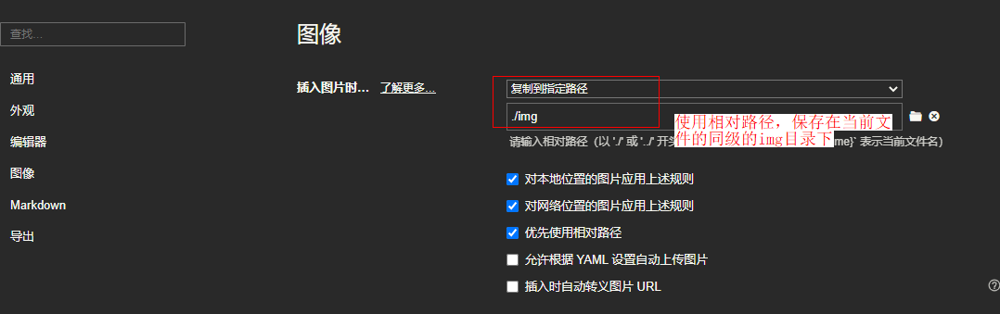
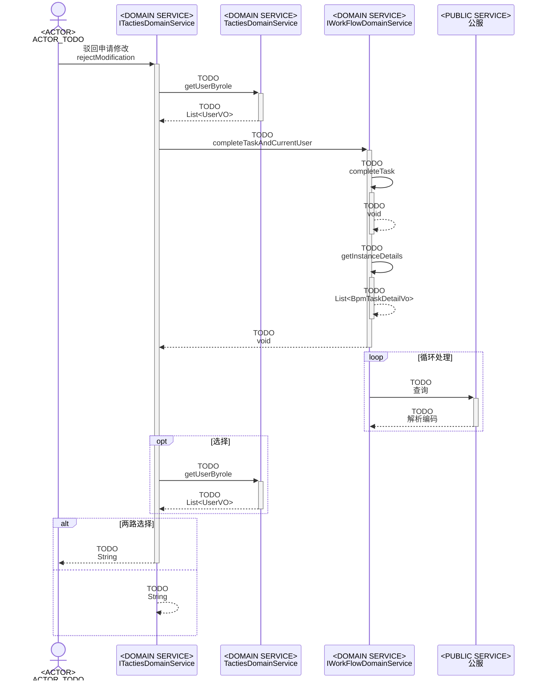
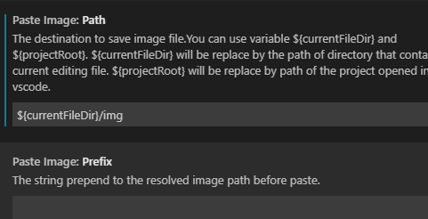

# markdown的使用

## markdow 基本语法

| 功能     | 语法                                   | 说明                                                         |
| -------- | -------------------------------------- | ------------------------------------------------------------ |
| 插入图片 |  | Alt text：图片的Alt标签，用来描述图片的关键词，可以不写;  图片链接：可以是图片的本地地址或者是网址。 "optional title"：鼠标悬置于图片上会出现的标题文字，可以不写 |
|          |                                        |                                                              |
|          |                                        |                                                              |
|          |                                        |                                                              |
|          |                                        |                                                              |

## LaTex 插入公式

### 基本语法

* 常用希腊字母表

 

* 基本公式
  $$
  x_i \\
  x^{2*i} \\
  \sqrt{5} \\
  \dots  \\
  \cdots \\
  求和：\sum_1^n \\
  积分：\int_1^n  \\
  lim_{x \to \infty}  \\
  \frac{3}{5} \\
  \widehat{f} \\
  $$

  展示：
  $$\dots$$

  $$\propto$$
  
* 常用公式

1. 矩阵 matrix

   说明:& 同行分隔; 换行，反斜杠

$$
\begin{matrix}
  1&x&x^2\\
  1&y&y^2\\
  \end{matrix}2
$$

2. 分段函数 cases

   分段函数的大括号： \begin{cases} ... \end {cases}  ，类似分支的方式

   示例1：

$$
f(n)=
  	\begin{cases}
  		n/2, & \text{if $n$ is even}\\
  		3n+1,& \text{if $n$ is odd}
  	\end{cases}
  	分段函数：$...$ 表示正文插入数学公式
$$

​       示例2：

$$
f(distance)=    \begin{cases}        
  2 * const\_weight, & \text{if $ditance$ <= 5km}\\        
  1 * const\_weight, & \text{if $ditance$ <= 10km}\\
  0.5 * const\_weight, & \text{if $ditance$ <= 50km}\\
  0.1 * const\_weight, & \text{if $ditance$ <= 100km}\\
  0.01 * const\_weight, & \text{if else $ditance$}\\  
  \end{cases}
$$

  3. 均方误差

$$
J(\theta) = \frac{1}{2m}\sum_{i=0}^m(y^i - h_\theta(x^i))^2
$$

  4. 批量梯度下降
     $$
     \frac{\partial J(\theta)}{\partial\theta_j} = -\frac1m\sum_{i=0}^m(y^i - 	h_\theta(x^i))x^i_j
     $$
     

$$
  f(x,y)=
  	\begin{cases}
  		a1*x + b1*y, & \text{if $意图$ is A}\\
  		a2*x + b2*y, & \text{if $意图$ is B}
  	\end{cases}
$$

  

$$
f(x) = 
  \begin{cases}
  x + 1 &\text{if x > 0} \\
  2 * x &\text{if x < 0}
  \end{cases}
$$

##  Typora 基本使用

### 安装

直接官网下载了

[typora](https://www.typora.io/#windows)

[pandoc](https://github.com/jgm/pandoc/releases/tag/2.14.2) window下载.msi文件安装即可，主要是可以使用导入功能

### 图片保存

###  参考

1. [Typora markdown 博客小助手](http://3ms.huawei.com/km/blogs/details/10209767)
2. [LaTex 插入数据公式](https://blog.csdn.net/happyday_d/article/details/83715440)

## mermaid的使用

##  Vscode中md插件

### 图片粘贴

* 图片粘贴插件
  [paste image](https://www.zhihu.com/question/335783774)
* 配置：ctrl + ,  => paste image
  
  
### 参考 
1. [VsCode支持的markdown语法参考](https://www.jianshu.com/p/fd761fc43753)

