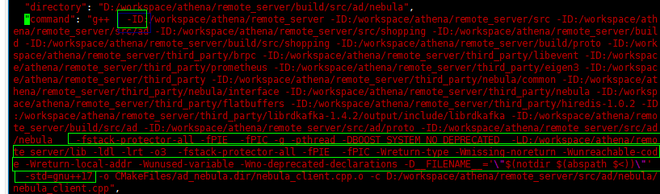

#  cmake 示例demo

## demo1

```cmake

cmake_minimum_required(VERSION 3.14)
project(server)

# 使用c++17标准
set(CMAKE_CXX_STANDARD 17)


message("current source path: ${CMAKE_CURRENT_SOURCE_DIR}")
message("current binary path: ${CMAKE_CURRENT_BINARY_DIR}")

set(CMAKE_RUNTIME_OUTPUT_DIRECTORY ${CMAKE_CURRENT_SOURCE_DIR}/output/bin)
set(CMAKE_ARCHIVE_OUTPUT_DIRECTORY ${CMAKE_CURRENT_SOURCE_DIR}/output/lib) # 静态库输出路径
set(CMAKE_LIBRARY_OUTPUT_DIRECTORY ${CMAKE_CURRENT_SOURCE_DIR}/lib)  # 动态库输出路
set(CMAKE_EXPORT_COMPILE_COMMANDS ON) # 设置输出compile_commands.json 文件

SET(PROJECT_THIRDPARTY_PATH ${CMAKE_CURRENT_SOURCE_DIR}/third_party)  # 使用set 定义初始化
SET(PROJECT_PROTOC_PATH ${CMAKE_CURRENT_SOURCE_DIR}/tool)

# 设置g++编译的flags， 参考示例1

set(CFLAGS "${CFLAGS} -fstack-protector-all -fPIE  -fPIC"):
set(CMAKE_CXX_FLAGS "${CMAKE_CXX_FLAGS} ${CFLAGS} -g -pthread -DBOOST_SYSTEM_NO_DEPRECATED  -L${CMAKE_CURRENT_SOURCE_DIR}/lib -ldl -lrt -o3")
set(CMAKE_CXX_FLAGS "${CMAKE_CXX_FLAGS} ${CFLAGS} -Wreturn-type -Wmissing-noreturn -Wunreachable-code -Wreturn-local-addr -Wunused-variable -Wno-deprecated-declarations")
set(CMAKE_CXX_FLAGS "${CMAKE_CXX_FLAGS} -D__FILENAME__='\"$(notdir $(abspath $<))\"'")


set(CMAKE_SHARED_LINKER_FLAGS "${LDFLAGS} -z noexecstack -z relro -z now -pie")
set(CMAKE_EXE_LINKER_FLAGS "${LDFLAGS} -z noexecstack -z relro -z now -pie")

# cmake中执行shell命令
execute_process(COMMAND bash -c "mkdir -p ${CMAKE_CURRENT_SOURCE_DIR}/lib")
execute_process(COMMAND bash -c "mkdir -p ${CMAKE_CURRENT_BINARY_DIR}/proto")
execute_process(COMMAND bash -c "tar -zxf ${CMAKE_CURRENT_SOURCE_DIR}/lib/libbrpc.tar.gz -C ${CMAKE_CURRENT_SOURCE_DIR}/lib/")
message("cd ${CMAKE_CURRENT_SOURCE_DIR}/lib; xz -k -d -f libtensorflow_cc.so.2.5.0.xz; cd -")
execute_process(COMMAND bash -c "cd ${CMAKE_CURRENT_SOURCE_DIR}/lib; xz -k -d -f libtensorflow_cc.so.2.5.0.xz; cd -") # 用这种直接解压的方式引入第三方的依赖库


# 编译proto文件，生成相关的代码到./build/proto
execute_process(COMMAND bash -c "LD_LIBRARY_PATH=./tool:${CMAKE_CURRENT_SOURCE_DIR}/lib ${CMAKE_CURRENT_SOURCE_DIR}/tool/protoc  --cpp_out=${CMAKE_CURRENT_BINARY_DIR}/proto -I=${CMAKE_CURRENT_SOURCE_DIR}/proto:${CMAKE_CURRENT_SOURCE_DIR}/third_party  ${CMAKE_CURRENT_SOURCE_DIR}/proto/http.proto")
message("LD_LIBRARY_PATH=./tool:${CMAKE_CURRENT_SOURCE_DIR}/lib ${CMAKE_CURRENT_SOURCE_DIR}/tool/protoc  --cpp_out=${CMAKE_CURRENT_BINARY_DIR}/proto -I=${CMAKE_CURRENT_SOURCE_DIR}/proto:${CMAKE_CURRENT_SOURCE_DIR}/third_party  ${CMAKE_CURRENT_SOURCE_DIR}/proto/http.proto")


# 将指定目录添加到编译器的头文件搜索路径下
 
include_directories("${CMAKE_CURRENT_SOURCE_DIR}/")
include_directories("${CMAKE_CURRENT_SOURCE_DIR}/src")
include_directories("${CMAKE_CURRENT_SOURCE_DIR}/src/ad")
include_directories("${CMAKE_CURRENT_SOURCE_DIR}/src/shopping")
include_directories("${CMAKE_CURRENT_BINARY_DIR}/")
include_directories("${CMAKE_CURRENT_BINARY_DIR}/src/shopping")
include_directories("${CMAKE_CURRENT_BINARY_DIR}/proto")
include_directories("${CMAKE_CURRENT_SOURCE_DIR}/third_party/brpc")
include_directories("${CMAKE_CURRENT_SOURCE_DIR}/third_party/libevent")
include_directories("${CMAKE_CURRENT_SOURCE_DIR}/third_party/prometheus")
include_directories("${CMAKE_CURRENT_SOURCE_DIR}/third_party/eigen3")
include_directories("${CMAKE_CURRENT_SOURCE_DIR}/third_party")
include_directories("${CMAKE_CURRENT_SOURCE_DIR}/third_party/nebula/common/")
include_directories("${CMAKE_CURRENT_SOURCE_DIR}/third_party/nebula/interface/")
include_directories("${CMAKE_CURRENT_SOURCE_DIR}/third_party/nebula/")
include_directories("${CMAKE_CURRENT_SOURCE_DIR}/third_party/flatbuffers/")
include_directories("${CMAKE_CURRENT_SOURCE_DIR}/third_party/hiredis-1.0.2")
include_directories("${CMAKE_CURRENT_SOURCE_DIR}/third_party/librdkafka-1.4.2/output/include/librdkafka")

# 增加/proto//http.pb.cc 到源文件
aux_source_directory("${CMAKE_CURRENT_SOURCE_DIR}/proto/" PROTO_SRCS)
message(STATUS ${PROTO_SRCS})

# 增加头文件搜索路径
include_directories(${CMAKE_CURRENT_SOURCE_DIR}/third_party/)

# 设置链接库的搜索路径
# 等价方式： set(CMAKE_CXX_FLAGS "${CMAKE_CXX_FLAGS} -L${CMAKE_CURRENT_SOURCE_DIR}/libs")

link_directories(${CMAKE_CURRENT_SOURCE_DIR}/lib)
link_directories(${CMAKE_CURRENT_BINARY_DIR}/lib)
include_directories("${CMAKE_CURRENT_BINARY_DIR}/proto")
include_directories("${CMAKE_CURRENT_BINARY_DIR}")

#file 自定义的文件搜索规则：GLOB 会产生一个由所有匹配globbing表达式的文件组成的列表，并将其保存到变量中。Globbing 表达式与正则表达式类似，但更简单。

file(GLOB SERVER_SOURCE "src/server/*.cpp")
file(GLOB SERVICE_SOURCE "src/service/*.cpp")
file(GLOB KAFKA_SOURCE "src/kafka/*.cpp")
file(GLOB KAFKA_CLIENT_SOURCE "src/kafka_client/*.cpp")
file(GLOB QUERY_EMB_SOURCE "src/query_emb")

# 链接多个库文件的名称， 最后的库等价于：libbrpc.so -lbrpc
set(COMMON_LIBRARIES   brpc log4cplus leveldb  snappy z zstd bz2 lzma lz4 wangle m protobuf securec crypto ssl gflags curl hiredis event double-conversion tensorflow_framework tensorflow_cc utf8proc jsoncpp sasl2 rdkafka rdkafka++ dl)
set(ADSENSE_LIBRARIES  ad_auth ad_util shopping adsense ad_nebula)
set(BOOST_LIRBRARIES boost_context boost_system boost_serialization boost_regex)
set(QUERY_EMB_LIRBRARIES onnxruntime utf8proc pcrecpp)
set(PROMETHEUS_BOOST_LIRBRARIES prometheus-cpp-core prometheus-cpp-pull prometheus-cpp-push)

# 子目录下面有CMakeList.txt 构建子项目
add_subdirectory(${CMAKE_CURRENT_SOURCE_DIR}/src/shopping)
add_subdirectory(${CMAKE_CURRENT_SOURCE_DIR}/src/util)
add_subdirectory(${CMAKE_CURRENT_SOURCE_DIR}/src/auth)
add_subdirectory(${CMAKE_CURRENT_SOURCE_DIR}/src/ad)

# 构建可执行文件的目标
add_executable(adsense_server  ${AD_SOURCE}  ${PROTO_SRCS} ${SERVER_SOURCE} ${SERVICE_SOURCE} ${QUERY_EMB_SOURCE} ${KAFKA_SOURCE} ${KAFKA_CLIENT_SOURCE} ${CMAKE_CURRENT_SOURCE_DIR}/src/main.cpp)

# 目标
TARGET_LINK_LIBRARIES(adsense_server ${COMMON_LIBRARIES} folly ${ADSENSE_LIBRARIES} ${BOOST_LIRBRARIES}  ${PROMETHEUS_BOOST_LIRBRARIES} shopping_esfeature_attr)

add_executable(adsense_enc ${CMAKE_CURRENT_SOURCE_DIR}/src/reranker_encrypt.cpp)

TARGET_LINK_LIBRARIES(adsense_enc ad_auth)


```


* 示例说明




## demo2

```cmake

# cmake_minimum_required(VERSION <min>[...<max>] [FATAL_ERROR])
# 该命令指明了对cmake的最低(高)版本的要求，...为低版本和高版本之间的连接符号，没有其他含义。
cmake_minimum_required(VERSION 2.8)

# project(<PROJECT-NAME> [<language-name>...])
# 或
# project(<PROJECT-NAME>
# [VERSION <major>[.<minor>[.<patch>[.<tweak>]]]]
# [DESCRIPTION <project-description-string>]
# [HOMEPAGE_URL <url-string>]
# [LANGUAGES <language-name>...])
# project命令用于指定cmake工程的名称，实际上，它还可以指定cmake工程的版本号（VERSION关键字）、简短的描述（DESCRIPTION关键字）、主页URL（HOMEPAGE_URL关键字）和编译工程使用的语言（LANGUAGES关键字）。

project(deep_match C CXX)  #  该选项可以有两种调用方式：一种是直接跟在工程名后面，可以省略LANGUAGES关键字；另一种是跟在其他关键字（例如VERSION）后面，LANGUAGES关键字不能省略  project (mytest VERSION 1.2.3.4 LANGUAGES “CXX”)


# 使用execute_process调用shell命令或脚本

# execute_process(COMMAND <cmd1> [args1...]]  # 子进程命令行  CMake直接使用操作系统API执行子进程
# [COMMAND <cmd2> [args2...] [...]]
# [WORKING_DIRECTORY <directory>]  #   命名目录将被设置为子进程的当前工作目录
# [TIMEOUT <seconds>]
# [RESULT_VARIABLE <variable>]
# [OUTPUT_VARIABLE <variable>]
# [ERROR_VARIABLE <variable>]
# [INPUT_FILE <file>]
# [OUTPUT_FILE <file>]
# [ERROR_FILE <file>]
# [OUTPUT_QUIET]
# [ERROR_QUIET]
# [OUTPUT_STRIP_TRAILING_WHITESPACE]
# [ERROR_STRIP_TRAILING_WHITESPACE])

# eg: execute_process(COMMAND sh test.sh WORKING_DIRECTORY <test.sh所在目录>)  # 执行脚本

# 如下执行shell命令: bash -c "COMMAND"   	bash [参数] 文件  -c 从字符串中读入命令

execute_process(COMMAND bash -c "export LD_LIBRARY_PATH=./tool:./lib:$LD_LIBRARY_PATH; ./tool/protoc --cpp_out=./proto_gen  -I=./proto proto/search_node.proto proto/vector_response.proto" WORKING_DIRECTORY ${CMAKE_SOURCE_DIR})

#test print 关键信息
message(STATUS "test ww source dir: ${CMAKE_SOURCE_DIR}")

set(CMAKE_RUNTIME_OUTPUT_DIRECTORY ${CMAKE_CURRENT_BINARY_DIR}/output/bin)
set(CFLAGS "${CFLAGS} -fstack-protector-strong -fPIE")  # fPIE : -fPIC用于生成动态库，-fPIE用与生成可执行文件。再说得直白一点：-fPIE用来生成位置无关的可执行代码.位置无关可执行程序是一种比较有趣的程序。这种程序像动态库一样，可以自由加载到内存中任意合适的位置执行

#set 设置环境变量 
set(CMAKE_CXX_FLAGS "${CMAKE_CXX_FLAGS} ${CFLAGS} -g -D_GLIBCXX_USE_CXX11_ABI=1 -pthread -L${CMAKE_CURRENT_SOURCE_DIR}/../lib -lcurl -ldl -lrt -O3")   #  -g -O3  error: -L 库的搜索路径设置错了？
set(CMAKE_CXX_FLAGS "${CMAKE_CXX_FLAGS} -D__FILENAME__='\"$(notdir $(abspath $<))\"'")
set(CMAKE_CXX_STANDARD 17)  # specify the C++ standard
set(CMAKE_STATIC_LINKER_FLAGS "${LDFLAGS}")
set(CMAKE_EXE_LINKER_FLAGS "${LDFLAGS} -Wl,-z,noexecstack -Wl,-z,relro -Wl,-z,now -pie -s")
# 而-pie选项则用于链接器，使用这个选项之后，链接器能够把-fPIE选项下编译出来的.o文件链接成位置无关可执行程序

# test print 关键信息
message(STATUS "test ww cmake current source dir: ${CMAKE_CURRENT_SOURCE_DIR}  cmake_cxx_flags: ${CMAKE_CXX_FLAGS}  ld_flags:${CMAKE_EXE_LINKER_FLAGS}")

# 头文件搜索目录:include_directories命令时使用AFTER或BEFORE选项来指定是添加到列表的前面或者后面
include_directories(BEFORE "${CMAKE_CURRENT_BINARY_DIR}/")  #CMAKE_CURRENT_BINARY_DIR cmake 命令执行的目录
include_directories("${CMAKE_CURRENT_BINARY_DIR}/src")
include_directories("${CMAKE_CURRENT_BINARY_DIR}/proto")
include_directories(BEFORE "${CMAKE_CURRENT_BINARY_DIR}/third_party")
include_directories(BEFORE "${CMAKE_CURRENT_BINARY_DIR}/third_party/brpc/")


aux_source_directory("proto/" DIR_SRCS)
message(STATUS "test ww DIR_SRCS : ${DIR_SRCS}")

# grpc
set(GRPC_ROOT_DIR ${CMAKE_CURRENT_SOURCE_DIR}/third_party/grpc)
include_directories("${GRPC_ROOT_DIR}/include")
# gflags
include_directories(${CMAKE_CURRENT_SOURCE_DIR}/third_party/gflags)
# libevent
include_directories(${CMAKE_CURRENT_SOURCE_DIR}/third_party/libevent)
# boost
include_directories(${CMAKE_CURRENT_SOURCE_DIR}/third_party/boost-1.79.0/include)

message(STATUS "boost include dir: " ${CMAKE_CURRENT_SOURCE_DIR}/third_party/boost-1.79.0/)

# proto
# get_filename_component:获取完整文件名的特定部分  
# get_filename_component(<var> <FileName> <mode> [BASE_DIR <dir>] [CACHE]) ABSOLUTE：文件的完整路径

get_filename_component(sn_proto "./proto/search_node.proto" ABSOLUTE)  # 获得了文件的完整路径及文件名 /opt/xx/data1/w00590050/deepmatch/proto/search_node.proto
message(STATUS ${sn_proto})
get_filename_component(sn_proto_path "${sn_proto}" PATH) #获取文件的路径 /opt/huawei/data1/w00590050/deepmatch/proto
message(STATUS ${sn_proto_path})

# Generated sources
set(sn_proto_srcs "${CMAKE_CURRENT_BINARY_DIR}/search_node.pb.cpp")
set(sn_proto_hdrs "${CMAKE_CURRENT_BINARY_DIR}/search_node.pb.h")
set(sn_grpc_srcs "${CMAKE_CURRENT_BINARY_DIR}/search_node.grpc.pb.cpp")
set(sn_grpc_hdrs "${CMAKE_CURRENT_BINARY_DIR}/search_node.grpc.pb.h")
message(STATUS ${sn_proto_srcs})


add_custom_command(
        OUTPUT "${sn_proto_srcs}" "${sn_proto_hdrs}" "${sn_grpc_srcs}" "${sn_grpc_hdrs}"
        COMMAND ${_PROTOBUF_PROTOC}
        ARGS --grpc_out "${CMAKE_CURRENT_BINARY_DIR}"
        --cpp_out "${CMAKE_CURRENT_BINARY_DIR}"
        -I "${sn_proto_path}"
        --plugin=protoc-gen-grpc="${_GRPC_CPP_PLUGIN_EXECUTABLE}"
        "${sn_proto}"
        DEPENDS "${sn_proto}")


# aux_source_directory(<dir> <variable>) 
#  收集指定目录中所有源文件的名称，并将列表存储在提供的<variable>变量中
aux_source_directory(proto_gen PROTO)
AUX_SOURCE_DIRECTORY("src/auth" DIR_SRCS)

# 设置链接时依赖的库文件目录: 它相当于g++命令的-L选项的作用，也相当于环境变量中增加LD_LIBRARY_PATH的路径的作用
link_directories(${CMAKE_CURRENT_SOURCE_DIR}/lib)


# file(GLOB <variable>
# [LIST_DIRECTORIES true|false] [RELATIVE <path>]
# [<globbing-expressions>...])
# GLOB命令将所有匹配<globbing-expressions>（可选,假如不写，毛都匹配不到）的文件挑选出来，默认以字典顺序排序。
# 想排除掉里面的文件夹 : file(GLOB Common_Sources  LIST_DIRECTORIES false "src/common/*")

file(GLOB Common_Sources "src/common/*.cpp")

# cmake foreach函数
foreach(f IN LISTS Common_Sources)
        message(STATUS ${f})
endforeach(f IN LISTS Common_Sources)

# 删除list变量中某个值 
# list (FILTER <list> <INCLUDE|EXCLUDE> REGEX <regular_expression>) 
# 子命令FILTER用于根据正则表达式包含或排除列表中的元素: 根据模式的匹配结果，将元素添加（INCLUDE选项）到列表或者从列表中排除（EXCLUDE选项）。此命令会改变原来列表<list>的值。
list(FILTER Common_Sources EXCLUDE REGEX "src/common/Test.cpp")  # Common_Sources列表值发生变化

foreach(f IN LISTS Common_Sources)
        message(STATUS "after filter: ${f}")
endforeach(f IN LISTS Common_Sources)


add_executable(deep_matcher ${PROTO} ${DIR_SRCS} ${Common_Sources} ${TLV_Sources} ${CACHE_Sources} ${Core_Sources} ${Common_Headers}
        ${Parser_Sources} ${Parser_Headers}
        ${Response_Sources} ${Response_Headers}
        ${Storage_Header} ${Storage_Source}
        ${BLOOM_Sources}
        src/server/DeepMatcher.cpp)

# set 给一个变量设置多个值
set(THRIFT_LIBRARIES
    thriftcpp2
    thrift
    thriftprotocol
    async
    protocol
    transport
    concurrency
    security
    thriftfrozen2
    thrift-core
)
message(STATUS "THRIFT_LIBRARIES ：  ${THRIFT_LIBRARIES}")


# TARGET_LINK_LIBRARIES （设置要链接的库文件的名称）
# 语法：TARGET_LINK_LIBRARIES(targetlibrary1 <debug | optimized> library2 ..)

# 比如（以下写法（包括备注中的）都可以）： 
#TARGET_LINK_LIBRARIES(myProject hello)，连接libhello.so库（默认） 也可能是静态库：libhello.a
#TARGET_LINK_LIBRARIES(myProject libhello.a) 静态库
#TARGET_LINK_LIBRARIES(myProject libhello.so) 

#再如：
#TARGET_LINK_LIBRARIES(myProject libeng.so)　　#这些库名写法都可以。
#TARGET_LINK_LIBRARIES(myProject eng)
#TARGET_LINK_LIBRARIES(myProject -leng)

target_link_libraries(deep_matcher
                      -Wl,--no-undefined
                      ${THRIFT_LIBRARIES}
                      -lstdc++
                      -lwangle
                      -lboost_context
                      -lboost_system
                      -lbrpc
                      -lglog
                      -lgflags
                      -lsnappy
                      -lz
                      -lzstd
                      -lbz2
                      -llzma
                      -llz4
                      -levent
                      -ldouble-conversion
                      -lm
                      -lpthread
                      -ldl
                      -lssl
                      -lcrypto
                      -lmetrics
                      -lsecurec
                      -lleveldb
                      -llemondbclient
                      )

TARGET_LINK_LIBRARIES(deep_matcher protobuf)
TARGET_LINK_LIBRARIES(deep_matcher jsoncpp)
TARGET_LINK_LIBRARIES(deep_matcher catboostmodel)

```
