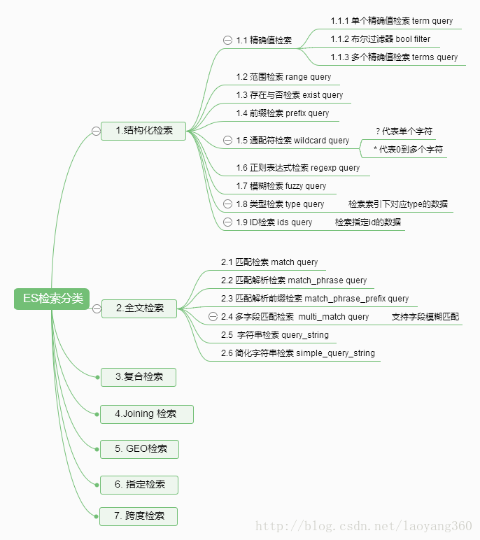

# ES基本查询总结


## 一、先从一个例子开始


```json

{
	"query": {
		"bool": {
			"must": [
				{
					"match": {
						"title": "Search"
					}
				},
				{
					"match": {
						"content": "Elasticsearch"
					}
				}
			],
			"filter": [
				{
					"term": {
						"status": "published"
					}
				},
				{
					"range": {
						"publish_date": {
							"gte": "2015-01-01"
						}
					}
				}
			]
		}
	}
}

```
上面的DSL实现的功能：title中包含”Search”并且content中包含 “Elasticsearch”，status中精确匹配”published”，并且publish_date 大于“2015-01-01”的全部信息。


## ES的检索分类





constant_score : {
  filter: 
}


filtered: {
filter: {
  bool:
}
}


## 全文检索

### match 匹配检索

match原理是先分析文档，通过分词器进行解析，然后再去文档中查询。

#### 关键字分词查询

``` json
{
	"query": {
		"match": {
			"title": "全国往返三亚自由行"   # 分词之后进行召回，满足一定相关性得分即可召回
		}
	}
}
```

#### 关联查询

这应该是复合查询的一种了

``` json
{
	"query": {
		"match": {
			"title": {
				"query": "全国往返三亚自由行",  # 假设分词为：全国|往返|三亚|自由行
				"operator" : "and"  # and 是必须全部满足分词结果； or 是满足任意其一就可以
			}
		}
	}
}
```

### query_string 字符串检索

一个使用查询解析器解析其内容的查询。
query_string查询提供了以简明的简写语法执行多匹配查询 multi_match queries ，布尔查询 bool queries ，提升得分 boosting ，模糊匹配 fuzzy matching ，通配符 wildcards ，正则表达式 regexp 和范围查询 range queries 的方式。支持参数达10几种。

``` json
{
	"query": {
		"query_string": {
			"default_field": "title",
			"query": "全国往返三亚自由 AND 重庆"
		}
	}
}
```


## 复合搜索


### dis_max 查询

dis_max，只是取分数最高的那个query的分数而已，完全不考虑其他query的分数，这种一刀切的做法，可能导致在有其他query的影响下，score不准确的情况，这时为了使用结果更准确，最好还是要考虑到其他query的影响.

tie_breaker参数的意义，将其他query的分数乘以tie_breaker，然后综合考虑后与最高分数的那个query的分数综合在一起进行计算，这样做除了取最高分以外，还会考虑其他的query的分数。tie_breaker的值，设置在在0~1之间，是个小数就行，没有固定的值

``` json

GET /dismax/_search
{
    "query": {
        "dis_max": {
            "queries": [
                { "match": { "title": "java beginner" }},   #假设这个条件得分是0.42
                { "match": { "content":  "java beginner" }} #这个条件的得分是0.44 
            ],
             "tie_breaker" : 0.5    #  主要权重在最高值，同时其他query子查询*tie_breaker 即：0.44 + 0.42 * 0.5 = 0.65
        }
    }
}
```

### Function 得分

定义 function_score是处理分值计算过程的终极工具。它让你能够对所有匹配了主查询的每份文档调用一个函数来调整甚至是完全替换原来的_score。

注意 要使用function_score，用户必须定义一个查询和一个或多个函数，这些函数计算查询返回的每个文档的新分数。

它拥有几种预先定义好了的函数：

weight 对每份文档适用一个简单的提升，且该提升不会被归约：当weight为2时，结果为2 * _score。

field_value_factor 使用文档中某个字段的值来改变_score，比如将受欢迎程度或者投票数量考虑在内。

random_score 使用一致性随机分值计算来对每个用户采用不同的结果排序方式，对相同用户仍然使用相同的排序方式。

衰减函数(Decay Function) - linear，exp，gauss

将像publish_date，geo_location或者price这类浮动值考虑到_score中，偏好最近发布的文档，邻近于某个地理位置(译注：其中的某个字段)的文档或者价格

(译注：其中的某个字段)靠近某一点的文档。

script_score

使用自定义的脚本来完全控制分值计算逻辑。如果你需要以上预定义函数之外的功能，可以根据需要通过脚本进行实现。


#### Field值因子 Field Value Factor

应用场景：


可能有一种情况，您想要将文档中特定字段的值纳入相关性分数的计算。 比如，希望增加更受欢迎的书籍（按评论数量判断）。 这可以使用field_value_factor函数进行混合打分。


``` json

POST /bookdb_index/book/_search
{
    "query": {
        "function_score": {
            "query": {
                "multi_match" : {
                    "query" : "search engine",
                    "fields": ["title", "summary"]
                }
            },
            "field_value_factor": {
                "field" : "votes",  # 这个字段的数值算入到相关性得分中，类似离线权重
                "modifier": "log1p",  # log1p代表： log(1 + x)
                "factor" : 2          # log(1 + 2 * x)  以10为底的对数
                "boost_mode": "multiply"  # 评分_score与函数值的积 new_score = old_score * log(1 + factor * field.value())] ; 还可以是sum,min,max,replace;
                "max_boost": 1.5  #这部分的最大值，不包含_score, 不超过1.5
            }
        }
    },
    "_source": ["title", "summary", "publish_date", "num_reviews"]
}

```
效果有点：

1. 我们可以运行一个常规的multi_match查询，并按num_reviews字段排序，但是我们失去了相关性得分的好处。[思考为什么？ 类似：利用原始分数召回,之后再按照votes重排;  使用的好处是：new_score = old_score * log(1 + factor * field.value())]
function_score 查询将主查询和函数包括在内。
2. 有许多附加参数可以调整对原始相关性分数
（如“ modifier ”，“ factor ”，“boost_mode”等）的增强效果的程度。

使用说明：
1.function_score 查询将主查询和函数包括在内。
2.主查询优先执行。
3.field_value_factor 函数会被应用到每个与主 query 匹配的文档。
4.每个文档的 votes 字段都 必须 有值供 function_score 计算。如果 没有 文档的 votes 字段有值，那么就 必须 使用 missing 属性 提供的默认值来进行评分计算。

**思考**： 
这个也给规则性排序提供了个最基本的参考,假设我有个基础分值，使用 ： new_score = old_score * min{log(1 + factor * field.value())],1.5}  或者 new_score = old_score +  min{log(1 + factor * field.value())],1.5}  线性规则计算打分


#### Decay Functions 衰减函数


假设，想通过一个字段的值逐渐增加得分，以获取理想的结果。 举例：价格范围、数字字段范围、日期范围。 在我们的例子中，我们正在搜索2014年6月左右出版的“ search engines ”的书籍


``` json

POST /bookdb_index/book/_search
{
    "query": {
        "function_score": {
            "query": {
                "multi_match" : {
                    "query" : "search engine",
                    "fields": ["title", "summary"]
                }
            },
            "functions": [
                {
                    "exp": {
                        "publish_date" : {
                            "origin": "2014-06-15",
                            "offset": "7d",
                            "scale" : "30d"
                        }
                    }
                }
            ],
            "boost_mode" : "replace"
        }
    },
    "_source": ["title", "summary", "publish_date", "num_reviews"]
}

```


## 参考

1、[ES基本查询总结](https://blog.csdn.net/ZYC88888/article/details/82964474)

2、[Elasticsearch7.x DSL语法之查询](https://blog.csdn.net/qq_38011415/article/details/111862923)

3、[Elasticsearch(7) --- 复合查询 ](https://www.cnblogs.com/qdhxhz/p/11529107.html)

4、[官网function score](https://www.elastic.co/guide/en/elasticsearch/reference/current/query-dsl-function-score-query.htmll)

5、[官网: 按受欢迎度提升权重](https://www.elastic.co/guide/cn/elasticsearch/guide/current/boosting-by-popularity.html)

5、 [Elasticsearch 7.x 自定义相关度计算](https://blog.csdn.net/biao0309/article/details/103223608)