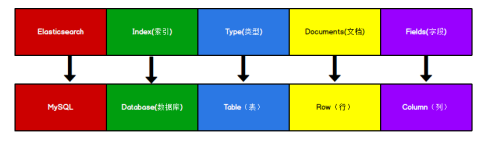
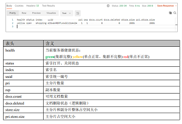

## 前言

本文主要汇集整理了ElasticSearch常用功能和原理，参考文档如下：

Elasticsearch官方文档：[Elasticsearch Guide 7.15 | Elastic](https://www.elastic.co/guide/en/elasticsearch/reference/current/index.html)

尚硅谷Elasticsearch讲稿：尚硅谷项目课程系列之Elasticsearch.pdf

Elasticsearch核心技术与实战：[Elasticsearch核心技术与实战 (geekbang.org)](https://time.geekbang.org/course/intro/197)

多个博客文章：参考地址附在相关章节之后

## Elasticsearch环境

### 相关概念 

#### 单机 & 集群 

单台 Elasticsearch 服务器提供服务，往往都有最大的负载能力，超过这个阈值，服务器 性能就会大大降低甚至不可用，所以生产环境中，一般都是运行在指定服务器集群中。 

除了负载能力，单点服务器也存在其他问题： 

- 单台机器存储容量有限 
- 单服务器容易出现单点故障，无法实现高可用 
- 单服务的并发处理能力有限

配置服务器集群时，集群中节点数量没有限制，大于等于 2 个节点就可以看做是集群了。一 般出于高性能及高可用方面来考虑集群中节点数量都是 3 个以上。

#### 集群 Cluster

一个集群就是由一个或多个服务器节点组织在一起，共同持有整个的数据，并一起提供 索引和搜索功能。一个 Elasticsearch 集群有一个唯一的名字标识，这个名字默认就 是”elasticsearch”。这个名字是重要的，因为一个节点只能通过指定某个集群的名字，来加入 这个集群。 

#### 节点 Node 

集群中包含很多服务器，一个节点就是其中的一个服务器。作为集群的一部分，它存储 数据，参与集群的索引和搜索功能。 

一个节点也是由一个名字来标识的，默认情况下，这个名字是一个随机的漫威漫画角色 的名字，这个名字会在启动的时候赋予节点。这个名字对于管理工作来说挺重要的，因为在 这个管理过程中，你会去确定网络中的哪些服务器对应于 Elasticsearch 集群中的哪些节点。

 一个节点可以通过配置集群名称的方式来加入一个指定的集群。默认情况下，每个节点 都会被安排加入到一个叫做“elasticsearch”的集群中，这意味着，如果你在你的网络中启动了 若干个节点，并假定它们能够相互发现彼此，它们将会自动地形成并加入到一个叫做 “elasticsearch”的集群中。

在一个集群里，只要你想，可以拥有任意多个节点。而且，如果当前你的网络中没有运 行任何 Elasticsearch 节点，这时启动一个节点，会默认创建并加入一个叫做“elasticsearch”的 集群。

### Windows集群

相关参考：尚硅谷项目课程系列之Elasticsearch.pdf，56-59页


### Linux集群参考

相关参考：尚硅谷项目课程系列之Elasticsearch.pdf，60-63页

## 相关组件

### Lucene

Lucene是apache软件基金会 jakarta项目组的一个子项目，是一个开放源代码的全文检索引擎工具包，但它不是一个完整的全文检索引擎，而是一个全文检索引擎的架构，提供了完整的查询引擎和索引引擎，部分文本分析引擎（英文与德文两种西方语言）。Lucene的目的是为软件开发人员提供一个简单易用的工具包，以方便的在目标系统中实现全文检索的功能，或者是以此为基础建立起完整的全文检索引擎。ElasticSearch在此基础上搭建了完整的分布式服务框架。


### ELK

**Elasticsearch**：开源分布式搜索引擎，提供搜集、分析、存储数据三大功能。它的特点有：分布式，零配置，自动发现，索引自动分片，索引副本机制，restful风格接口，多数据源，自动搜索负载等。

**Logstash**：主要是用来日志的搜集、分析、过滤日志的工具，支持大量的数据获取方式。一般工作方式为c/s架构，client端安装在需要收集日志的主机上，server端负责将收到的各节点日志进行过滤、修改等操作在一并发往elasticsearch上去。

**Kibana** ：也是一个开源和免费的工具，Kibana可以为 Logstash 和 ElasticSearch 提供的日志分析友好的 Web 界面，可以帮助汇总、分析和搜索重要数据日志。


## 基本概念

### 数据格式

相关参考：尚硅谷项目课程系列之Elasticsearch.pdf，9页



Elasticsearch 是面向文档型数据库，一条数据在这里就是一个文档。为了方便大家理解， 我们将 Elasticsearch 里存储文档数据和关系型数据库 MySQL 存储数据的概念进行一个类比 ES 里的 Index 可以看做一个库，而 Types 相当于表，Documents 则相当于表的行。 这里 Types 的概念已经被逐渐弱化，Elasticsearch 6.X 中，一个 index 下已经只能包含一个 type，Elasticsearch 7.X 中, Type 的概念已经被删除了。

以一次文档搜索为例，以下的小括号指明了各个数据结构的大致形式和关系：

```
{
  "took": 266,
  "timed_out": false,
  "_shards": {
    "total": 1,
    "successful": 1,
    "skipped": 0,
    "failed": 0
  },
  "hits": {
    "total": {
      "value": 10000,
      "relation": "gte"
    },
    "max_score": 169.19153,
    "hits": [
      (文档)
      {
        "_index"（索引）: "street",
        "_type"（类型，统一为_doc）: "_doc",
        "_id": "975E5F06117F17C750DB881D345999C6",
        "_score": 169.19153,
        "_source": {
          "route_id"（字段）: "975E5F06117F17C750DB881D345999C6"
        }
      }
    ]
  }
}
```

### RESTful

相关参考：尚硅谷项目课程系列之Elasticsearch.pdf，8页

REST 指的是一组架构约束条件和原则。满足这些约束条件和原则的应用程序或设计就 是 RESTful。Web 应用程序最重要的 REST 原则是，客户端和服务器之间的交互在请求之 间是无状态的。从客户端到服务器的每个请求都必须包含理解请求所必需的信息。如果服务 器在请求之间的任何时间点重启，客户端不会得到通知。此外，无状态请求可以由任何可用 服务器回答，这十分适合云计算之类的环境。客户端可以缓存数据以改进性能。 

在服务器端，应用程序状态和功能可以分为各种资源。资源是一个有趣的概念实体，它 向客户端公开。资源的例子有：应用程序对象、数据库记录、算法等等。每个资源都使用 URI  (Universal Resource Identifier) 得到一个唯一的地址。所有资源都共享统一的接口，以便在客 户端和服务器之间传输状态。使用的是标准的 HTTP 方法，比如 GET、PUT、POST 和 DELETE。

 在 REST 样式的 Web 服务中，每个资源都有一个地址。资源本身都是方法调用的目 标，方法列表对所有资源都是一样的。这些方法都是标准方法，包括 HTTP GET、POST、 PUT、DELETE，还可能包括 HEAD 和 OPTIONS。简单的理解就是，如果想要访问互联 网上的资源，就必须向资源所在的服务器发出请求，请求体中必须包含资源的网络路径，以 及对资源进行的操作(增删改查)。

### 核心概念

相关参考：尚硅谷项目课程系列之Elasticsearch.pdf，64-66页

#### 索引（Index） 

一个索引就是一个拥有几分相似特征的文档的集合。比如说，你可以有一个客户数据的索引，另一个产品目录的索引，还有一个订单数据的索引。一个索引由一个名字来标识（必 须全部是小写字母），并且当我们要对这个索引中的文档进行索引、搜索、更新和删除的时候，都要使用到这个名字。在一个集群中，可以定义任意多的索引。 

能搜索的数据必须索引，这样的好处是可以提高查询速度，比如：新华字典前面的目录 就是索引的意思，目录可以提高查询速度。 

Elasticsearch 索引的精髓：一切设计都是为了提高搜索的性能。

#### 类型（Type） 

在一个索引中，你可以定义一种或多种类型。 

一个类型是你的索引的一个逻辑上的分类/分区，其语义完全由你来定。通常，会为具 有一组共同字段的文档定义一个类型。不同的版本，类型发生了不同的变化。


#### 文档（Document）

 一个文档是一个可被索引的基础信息单元，也就是一条数据。

比如：你可以拥有某一个客户的文档，某一个产品的一个文档，当然，也可以拥有某个订单的一个文档。文档以 JSON（Javascript Object Notation）格式来表示，而 JSON 是一个 到处存在的互联网数据交互格式。 

在一个 index/type 里面，你可以存储任意多的文档。 

#### 字段（Field） 

相当于是数据表的字段，对文档数据根据不同属性进行的分类标识。

#### 映射（Mapping） 

mapping 是处理数据的方式和规则方面做一些限制，如：某个字段的数据类型、默认值、 分析器、是否被索引等等。这些都是映射里面可以设置的，其它就是处理 ES 里面数据的一些使用规则设置也叫做映射，按着最优规则处理数据对性能提高很大，因此才需要建立映射， 并且需要思考如何建立映射才能对性能更好。 

#### 分片（Shards）

 一个索引可以存储超出单个节点硬件限制的大量数据。比如，一个具有 10 亿文档数据 的索引占据 1TB 的磁盘空间，而任一节点都可能没有这样大的磁盘空间。或者单个节点处 理搜索请求，响应太慢。为了解决这个问题，Elasticsearch 提供了将索引划分成多份的能力， 每一份就称之为分片。当你创建一个索引的时候，你可以指定你想要的分片的数量。每个分片本身也是一个功能完善并且独立的“索引”，这个“索引”可以被放置到集群中的任何节点 上。 

分片很重要，主要有两方面的原因： 1）允许你水平分割 / 扩展你的内容容量。 2）允许你在分片之上进行分布式的、并行的操作，进而提高性能/吞吐量。

至于一个分片怎样分布，它的文档怎样聚合和搜索请求，是完全由 Elasticsearch 管理的， 对于作为用户的你来说，这些都是透明的，无需过分关心。 

被混淆的概念是，一个 Lucene 索引我们在 Elasticsearch 称作 分片 。 一个 Elasticsearch 索引 是分片的集合。 当 Elasticsearch 在索引中搜索的时候， 他发送查询 到每一个属于索引的分片(Lucene 索引)，然后合并每个分片的结果到一个全局的结果集。

#### 副本（Replicas） 

在一个网络 / 云的环境里，失败随时都可能发生，在某个分片/节点不知怎么的就处于 离线状态，或者由于任何原因消失了，这种情况下，有一个故障转移机制是非常有用并且是 强烈推荐的。为此目的，Elasticsearch 允许你创建分片的一份或多份拷贝，这些拷贝叫做复 制分片(副本)。 

复制分片之所以重要，有两个主要原因：  1）在分片/节点失败的情况下，提供了高可用性。因为这个原因，注意到复制分片从不与原/主要（original/primary）分片置于同一节点上是非常重要的。 2）扩展你的搜索量/吞吐量，因为搜索可以在所有的副本上并行运行。

总之，每个索引可以被分成多个分片。一个索引也可以被复制 0 次（意思是没有复制） 或多次。一旦复制了，每个索引就有了主分片（作为复制源的原来的分片）和复制分片（主 分片的拷贝）之别。分片和复制的数量可以在索引创建的时候指定。在索引创建之后，你可 以在任何时候动态地改变复制的数量，但是你事后不能改变分片的数量。默认情况下， Elasticsearch 中的每个索引被分片 1 个主分片和 1 个复制，这意味着，如果你的集群中至少 有两个节点，你的索引将会有 1 个主分片和另外 1 个复制分片（1 个完全拷贝），这样的话 每个索引总共就有 2 个分片，我们需要根据索引需要确定分片个数。

#### 分配（Allocation）

将分片分配给某个节点的过程，包括分配主分片或者副本。如果是副本，还包含从主分 片复制数据的过程。这个过程是由 master 节点完成的。

### CRUD

索引：10

#### 创建索引

对比关系型数据库，创建索引就等同于创建数据库。

向 ES 服务器发PUT请求 ：http://127.0.0.1:9200/{索引名}，请求后，服务器返回响应：

```
{
 "acknowledged"【响应结果】: true, # true 操作成功
 "shards_acknowledged"【分片结果】: true, # 分片操作成功
 "index"【索引名称】: "shopping"
}
# 注意：创建索引库的分片数默认 1 片，在 7.0.0 之前的 Elasticsearch 版本中，默认 5 片
```

如果重复添加索引，会返回错误信息：index already exists。

#### 查看所有索引

向 ES 服务器发GET请求 ：http://127.0.0.1:9200/_cat/indices?v

这里请求路径中的_cat 表示查看的意思，indices 表示索引，所以整体含义就是查看当前 ES 服务器中的所有索引，就好像 MySQL 中的 show tables 的感觉。服务器响应结果如下：



\_cat是整个集群的监控器，可以通过indices监控索引。\_cat的其它用途参考文章：

[Elasticsearch-Cat命令详解_大白能的博客-CSDN博客](https://blog.csdn.net/qq_28988969/article/details/105079476)

[搜索引擎elasticsearch监控利器cat命令 - Jo_ZSM - 博客园 (cnblogs.com)](https://www.cnblogs.com/JoZSM/p/11177758.html)

#### 查看单个索引

向 ES 服务器发 GET 请求 ：http://127.0.0.1:9200/{索引名}

一个示例返回结果如下：

```json
{
 "shopping"【索引名】: { 
 "aliases"【别名】: {},
 "mappings"【映射】: {},
 "settings"【设置】: {
 "index"【设置 - 索引】: {
 "creation_date"【设置 - 索引 - 创建时间】: "1614265373911",
 "number_of_shards"【设置 - 索引 - 主分片数量】: "1",
 "number_of_replicas"【设置 - 索引 - 副分片数量】: "1",
 "uuid"【设置 - 索引 - 唯一标识】: "eI5wemRERTumxGCc1bAk2A",
 "version"【设置 - 索引 - 版本】: {
 "created": "7080099"
 },
 "provided_name"【设置 - 索引 - 名称】: "shopping"
 }
 }
 }
}
```

#### 删除索引

向 ES 服务器发 DELETE 请求 ：http://127.0.0.1:9200/{索引名}

#### 创建文档

这里的文档可以类比为关系型数据库中的表数据，添加的数据格式为 JSON 格式

向 ES 服务器发 POST 请求 ：http://127.0.0.1:9200/{索引名}/_doc，示例请求体内容：

```json
 { 
 	"title":"小米手机", 
 	"category":"小米", 
 	"images":"http://www.gulixueyuan.com/xm.jpg", 
 	"price":3999.00 
 }
```

此处发送请求的方式必须为 POST，不能是 PUT，否则会发生错误。返回示例为：

```json
OjFQp3wBSAFrNm-goo3K{
 "_index"【索引】: "shopping",
 "_type"【类型-文档】: "_doc",
 "_id"【唯一标识】: "Xhsa2ncBlvF_7lxyCE9G", #可以类比为 MySQL 中的主键，随机生成
 "_version"【版本】: 1,
 "result"【结果】: "created", #这里的 create 表示创建成功
 "_shards"【分片】: {
 "total"【分片 - 总数】: 2,
 "successful"【分片 - 成功】: 1,
 "failed"【分片 - 失败】: 0
 },
 "_seq_no": 0,
 "_primary_term": 1
}
```

上面的数据创建后，由于没有指定数据唯一性标识（ID），默认情况下，ES 服务器会随机生成一个。 

如果想要自定义唯一性标识，需要在创建时指定：http://127.0.0.1:9200/{索引名}/_doc/{文档ID}

使用上面的POST请求指定文档ID，多次请求会覆盖之前创建的文档，使用\_create则不会覆盖已有文档：

PUT http://127.0.0.1:9200/{索引名}/\_create/{文档ID}

PUT http://127.0.0.1:9200/{索引名}/\_doc/{文档ID}?op_type=create

POST请求指定文档ID会覆盖之前创建的文档，POST请求不具有幂等性：[PUT、POST的区别：_phinewx的博客-CSDN博客](https://blog.csdn.net/phinewx/article/details/87937072?utm_medium=distribute.pc_relevant.none-task-blog-2~default~CTRLIST~default-1.no_search_link&depth_1-utm_source=distribute.pc_relevant.none-task-blog-2~default~CTRLIST~default-1.no_search_link)

```
在更新资源的操作上，POST 和 PUT 基本相同。

在创建资源时，PUT可以指定资源路径，POST无法指定资源路径。

因而，PUT是幂等的操作，即重复操作不会产生变化，10次PUT 的创建请求与1次PUT 的创建请求相同，只会创建一个资源，其实后面9次的请求只是对已创建资源的更新，且更新内容与原内容相同，所以不会产生变化。

POST 的重复操作截然不同，10次POST请求将会创建10个资源。
```

#### 查看文档

向 ES 服务器发 GET 请求 ：http://127.0.0.1:9200/{索引名}/_doc/{文档ID}，返回示例：

```json
{
 "_index"【索引】: "shopping",
 "_type"【文档类型】: "_doc",
 "_id": "1",
 "_version": 2,
 "_seq_no": 2,
 "_primary_term": 2,
 "found"【查询结果】: true, # true 表示查找到，false 表示未查找到
 "_source"【文档源信息】: {
 "title": "华为手机",
 "category": "华为",
 "images": "http://www.gulixueyuan.com/hw.jpg",
 "price": 4999.00
 }
}
```

#### 修改文档

和新增文档一样，输入相同的 URL 地址请求，如果请求体变化，会将原有的数据内容覆盖。

向 ES 服务器发 POST 请求 ：http://127.0.0.1:9200/{索引名}/_doc/{文档ID}，返回示例：

```
{
 "_index": "shopping",
 "_type": "_doc",
 "_id": "1",
 "_version"【版本】: 2,
 "result"【结果】: "updated", # updated 表示数据被更新
 "_shards": {
 "total": 2,
 "successful": 1,
 "failed": 0
 },
 "_seq_no": 2,
 "_primary_term": 2
}
```


#### 修改字段

\_doc属于全量修改，可以使用\_update增量修改。

向 ES 服务器发 POST 请求 ：http://127.0.0.1:9200/{索引名}/_update/{文档ID}


#### 删除文档

删除一个文档不会立即从磁盘上移除，它只是被标记成已删除（逻辑删除）。 

向 ES 服务器发 DELETE 请求 ：http://127.0.0.1:9200/{索引名}/_doc/{文档ID}：

```
{
 "_index": "shopping",
 "_type": "_doc",
 "_id": "1",
 "_version"【版本】: 4, #对数据的操作，都会更新版本
 "result"【结果】: "deleted", # deleted 表示数据被标记为删除
 "_shards": {
 "total": 2,
 "successful": 1,
 "failed": 0
 },
 "_seq_no": 4,
 "_primary_term": 2
}
```

如果删除一条不存在的文档：

```json
{
 "_index": "shopping",
 "_type": "_doc",
 "_id": "1",
 "_version": 1,
 "result"【结果】: "not_found", # not_found 表示未查找到
 "_shards": {
 "total": 2,
 "successful": 1,
 "failed": 0
 },
 "_seq_no": 5,
 "_primary_term": 2
}
```

#### 条件删除文档

一般删除数据都是根据文档的唯一性标识进行删除，实际操作时，也可以根据条件对多条数据进行删除。与搜索文档相同，先通过DSL Query语句搜索到对应文档，再对其执行删除操作。

向 ES 服务器发 POST 请求 ：http://127.0.0.1:9200/{索引名}/_delete_by_query，需要的请求体跟DSL Query相同。


#### 创建映射

创建数据库表需要设置字段名称，类型，长度，约束等；索引库也一样，需要知道这个类型 下有哪些字段，每个字段有哪些约束信息，这就叫做映射(mapping)。

向 ES 服务器发 PUT 请求 ：http://127.0.0.1:9200/{索引名}/_mapping，示例的请求体指明了mapping的结构：

```json
{
 "properties": {
 "name":{
 "type": "text",
 "index": true
 },
 "sex":{
 "type": "text",
 "index": false
 },
 "age":{
 "type": "long",
 "index": false
 }
 }
}
```

##### 常用映射数据说明

- 字段名：任意填写，下面指定许多属性，例如：title、subtitle、images、price 
- type：类型，Elasticsearch 中支持的数据类型非常丰富：
  - String 类型，又分两种： 
    - text：可分词
    - keyword：不可分词，数据会作为完整字段进行匹配 
  - Numerical：数值类型，分两类：
    - 基本数据类型：long、integer、short、byte、double、float、half_float
    - 浮点数的高精度类型：scaled_float 
  - Date：日期类型 
  - Array：数组类型 
  - Object：对象 
- index：是否索引，默认为 true，也就是说你不进行任何配置，所有字段都会被索引。
  - true：字段会被索引，则可以用来进行搜索
  - false：字段不会被索引，不能用来搜索 
- store：是否将数据进行独立存储，默认为 false 
  - 原始的文本会存储在\_source 里面，默认情况下其他提取出来的字段都不是独立存储 的，是从\_source 里面提取出来的。当然你也可以独立的存储某个字段，只要设置 "store": true 即可，获取独立存储的字段要比从\_source 中解析快得多，但是也会占用 更多的空间，所以要根据实际业务需求来设置。 
- analyzer：分词器，参见analyzer章节

#### 查看映射

向 ES 服务器发 GET 请求 ：http://127.0.0.1:9200/{索引名}/_mapping，示例：


#### 索引映射关联

向 ES 服务器发 PUT 请求 ：http://127.0.0.1:9200/{索引名}，在请求体中可以指定mapping字段来设定映射：

```json
{
 "mappings"（指定mapping字段）: {
 "properties": {
"name":{
 "type": "text",
 "index": true
 
},
"sex":{
 "type": "text",
 "index": false
},
"age":{
 "type": "long",
 "index": false
}
 }
 }
}

```

### Analyzer

分词器使用的两个情形： 

- Index time analysis: 创建或者更新文档时，会对文档进行分词，在建立索引时对text字段指定分词器

```
PUT http://127.0.0.1:9200/{索引名}
{
  "mappings": {
    "doc": {
      "properties": {
        "title":{
          "type": "text",
          "analyzer": "whitespace", #对text字段指定分词器
          "search_analyzer": "standard" #对查询语句分词器
        }
      }
    }
  }
}
```

- Search time analysis: 查询时，对查询语句分词，可以在搜索文档时指定查询语句的分词器

```
GET http://127.0.0.1:9200/{索引名}/_search
{
  "query": {
    "match": {
      "name": {
        "query": "lin",
        "analyzer": "standard" #查询语句的分词器
      }
    }
  }
}
```

分词有空间时间消耗，明确字段是否需要分词，不需要分词的字段将type设置为keyword，可以节省空间和提高写性能。

通过\_analyze可以实时查看分词效果：

```
GET http://127.0.0.1:9200/_analyze
{
  "analyzer": "standard",
  "text": "this is a test"
}
# 可以查看text的内容使用standard分词后的结果：
{
  "tokens": [
    {
      "token": "this",
      "start_offset": 0,
      "end_offset": 4,
      "type": "<ALPHANUM>",
      "position": 0
    },
    {
      "token": "is",
      "start_offset": 5,
      "end_offset": 7,
      "type": "<ALPHANUM>",
      "position": 1
    },
    {
      "token": "a",
      "start_offset": 8,
      "end_offset": 9,
      "type": "<ALPHANUM>",
      "position": 2
    },
    {
      "token": "test",
      "start_offset": 10,
      "end_offset": 14,
      "type": "<ALPHANUM>",
      "position": 3
    }
  ]
}
```

可以调用索引中指定字段的分词器查看分词效果：

```
POST http://127.0.0.1:9200/{索引名}/_analyze
{
  "field": "my_text",    # 指定my_text字段，调用my_text字段使用的分词器
  "text": ["The test message."]
}
-------------->[the,test,message]
```

##### ES内置analyzer

- standard  由以下组成

  - tokenizer：Standard Tokenizer

  - token filter：Standard Token Filter，Lower Case Token Filter，Stop Token Filter 

    ```
    analyzer API测试 ：
    POST _analyze
    {
      "analyzer": "standard",
      "text": "The 2 QUICK Brown-Foxes jumped over the lazy dog's bone."
    }
    ```

    得到结果：

    ```
    {
      "tokens": [
        {
          "token": "the",
          "start_offset": 0,
          "end_offset": 3,
          "type": "<ALPHANUM>",
          "position": 0
        },
        {
          "token": "2",
          "start_offset": 4,
          "end_offset": 5,
          "type": "<NUM>",
          "position": 1
        },
        {
          "token": "quick",
          "start_offset": 6,
          "end_offset": 11,
          "type": "<ALPHANUM>",
          "position": 2
        },
        {
          "token": "brown",
          "start_offset": 12,
          "end_offset": 17,
          "type": "<ALPHANUM>",
          "position": 3
        },
        {
          "token": "foxes",
          "start_offset": 18,
          "end_offset": 23,
          "type": "<ALPHANUM>",
          "position": 4
        },
        {
          "token": "jumped",
          "start_offset": 24,
          "end_offset": 30,
          "type": "<ALPHANUM>",
          "position": 5
        },
        {
          "token": "over",
          "start_offset": 31,
          "end_offset": 35,
          "type": "<ALPHANUM>",
          "position": 6
        },
        {
          "token": "the",
          "start_offset": 36,
          "end_offset": 39,
          "type": "<ALPHANUM>",
          "position": 7
        },
        {
          "token": "lazy",
          "start_offset": 40,
          "end_offset": 44,
          "type": "<ALPHANUM>",
          "position": 8
        },
        {
          "token": "dog's",
          "start_offset": 45,
          "end_offset": 50,
          "type": "<ALPHANUM>",
          "position": 9
        },
        {
          "token": "bone",
          "start_offset": 51,
          "end_offset": 55,
          "type": "<ALPHANUM>",
          "position": 10
        }
      ]
    }
    ```

- whitespace  空格为分隔符

  ```
  POST _analyze
  {
    "analyzer": "whitespace",
    "text": "The 2 QUICK Brown-Foxes jumped over the lazy dog's bone."
  }
  -->  [ The,2,QUICK,Brown-Foxes,jumped,over,the,lazy,dog's,bone. ]
  ```

- simple   

  ```
  POST _analyze
  {
    "analyzer": "simple",
    "text": "The 2 QUICK Brown-Foxes jumped over the lazy dog's bone."
  }
  ---> [ the, quick, brown, foxes, jumped, over, the, lazy, dog, s, bone ]
  ```

- stop  默认stopwords用_english_ 

  ```
  POST _analyze
  {
    "analyzer": "stop",
    "text": "The 2 QUICK Brown-Foxes jumped over the lazy dog's bone."
  }
  -->[ quick, brown, foxes, jumped, over, lazy, dog, s, bone ]
  可选参数：
  # stopwords
  # stopwords_path
  ```

- keyword  不分词的

  ```
  POST _analyze
  {
    "analyzer": "keyword",
    "text": ["The 2 QUICK Brown-Foxes jumped over the lazy dog's bone."]
  }
  得到  "token": "The 2 QUICK Brown-Foxes jumped over the lazy dog's bone." 一条完整的语句
  
  ```

详情参考：[es的分词器analyzer - 卡布爱学习 - 博客园 (cnblogs.com)](https://www.cnblogs.com/xiaobaozi-95/p/9328948.html)

### Mapping拓展

#### Dynamic Mapping

在写入文档时，如果文档中有字段在mapping中没有对应的初始设定，会自动分析字段的属性并创建该字段的mapping，这种动态机制称为动态映射（dynamic mapping）。

部分动态识别文档字段类型的模式如下：


动态映射可以在mapping中受控。通过设置全局和包含子字段的字段的dynamic关键字，我们可以控制动态映射的执行方式：

```
PUT my-index-000001
{
  "mappings": {
    "dynamic": false, （设置在mapping下，控制整个索引的dynamic mapping）
    "properties": {
      "user": { 
        "properties": {
          "name": {
            "type": "text"
          },
          "social_networks": {
            "dynamic": true, （设置在字段中，控制该字段的子字段的dynamic mapping，优先于全局dynamic关键字）
            "properties": {}
          }
        }
      }
    }
  }
}
```

| Keyword | 解释                                                    |
| ------- | ------------------------------------------------------- |
| true    | 允许动态映射                                            |
| runtime | 新增的字段被动态映射为无索引，搜索时生成的runtime field |
| false   | 新增的字段无索引不能搜索，但是信息保留在_source中       |
| strict  | 新增的字段直接引发报错                                  |

参考信息：[ES基础（十）Dynamic Mapping 和常见字段类型 - 秋华 - 博客园 (cnblogs.com)](https://www.cnblogs.com/qiu-hua/p/14195076.html)

#### Dynamic Template

动态模板允许你定义可以用于动态添加的字段的自定义映射：

- 由Elasticsearch中的match_mapping_type检测到数据类型。
- 字段的名称可以是match(匹配)和unmatch(不匹配)或match_pattern(模式匹配)。
- 全点路径的字段可以是path_match(路径匹配)和path_unmatch(不匹配路径)。

原始字段名称{name}和检测导的数据类型{dynamic_type}模板变量可以在映射规范中用作占位符。

- 所有的字符串类型都设定称 Keyword，或者关闭 keyword 字段
- is 开头的字段都设置成 boolean
- long_ 开头的都设置成 long 类型

模板按顺序进行处理-第一个匹配模板达到要求。可以使用PUT mapping API将新的模板附加到列表的尾部。如果新的模板与现有的模板同名，它将会替换旧的版本。


参见：[Elasticsearch dynamic template详解_地下库-CSDN博客](https://blog.csdn.net/xixihahalelehehe/article/details/115180282)

#### Runtime Fields

 runtime fields，它们仅在查询时进行评估。它们在索引映射或查询中定义，一旦定义，它们立即可用于搜索请求，聚合，过滤和排序。由于未对 runtime fields 进行索引，因此添加运行时字段不会增加索引的大小。实际上，它们可以降低存储成本并提高摄取速度。

但是，需要权衡取舍。对运行时字段的查询可能会很昂贵，因此你通常搜索或筛选所依据的数据仍应映射到索引字段。即使你的索引大小较小，runtime fields 也会降低搜索速度。我们建议结合使用 runtime fields 和索引字段，以在用例的摄取速度，索引大小，灵活性和搜索性能之间找到合适的平衡。

定义 runtime fields 的最简单方法是在查询中。 例如，如果我们具有以下索引：

```
PUT my_index

{
  "mappings": {
    "properties": {
      "address": {
        "type": "ip"
      },
      "port": {
        "type": "long"
      }
    }
  }
}
```

并将一些文档加载到其中：

```
 POST my_index/_bulk
 {"index":{"_id":"1"}}
 {"address":"1.2.3.4","port":"80"}
 {"index":{"_id":"2"}}
 {"address":"1.2.3.4","port":"8080"}
 {"index":{"_id":"3"}}
 {"address":"2.4.8.16","port":"80"}
```

我们可以使用静态字符串创建两个字段的串联，如下所示：

```
GET my_index/_search

 {
   "runtime_mappings": {
     "socket": {
       "type": "keyword",
       "script": {
         "source": "emit(doc['address'].value + ':' + doc['port'].value)"
       }
     }
   },
   "fields": [
     "socket"
   ],
   "query": {
     "match": {
       "socket": "1.2.3.4:8080"
     }
   }
 }
```

产生以下响应：

```
{
  "took" : 17,
  "timed_out" : false,
  "_shards" : {
    "total" : 1,
    "successful" : 1,
    "skipped" : 0,
    "failed" : 0
  },
  "hits" : {
    "total" : {
      "value" : 1,
      "relation" : "eq"
    },
    "max_score" : 1.0,
    "hits" : [
      {
        "_index" : "my_index",
        "_type" : "_doc",
        "_id" : "2",
        "_score" : 1.0,
        "_source" : {
          "address" : "1.2.3.4",
          "port" : "8080"
        },
        "fields" : {
          "socket" : [
            "1.2.3.4:8080"
          ]
        }
      }
    ]
  }
}
```

我们在 runtime_mappings 部分中定义了字段 socket。 我们使用了一个简短的 [painless script](https://www.elastic.co/guide/en/elasticsearch/reference/master/modules-scripting-painless.html)，该脚本定义了每个文档将如何计算 socket 的值（使用 + 表示 address 字段的值与静态字符串 “:” 和 port 字段的值的串联）。 然后，我们在查询中使用了字段 socket。 字段 socket 是一个临时运行时字段，仅对于该查询存在，并且在运行查询时进行计算。 在定义要与 runtime fields 一起使用的 painless script 时，必须包括 emit 以返回计算出的值。

如果我们发现 socket 是一个我们想在多个查询中使用的字段，而不必为每个查询定义它，则可以通过调用简单地将其添加到映射中：

```
PUT my_index/_mapping
 {
   "runtime": {
     "socket": {
       "type": "keyword",
       "script": {
         "source": "emit(doc['address'].value + ':' + doc['port'].value)"
       }
     } 
   } 
 }
```

然后查询不必包含 socket 字段的定义，例如：

```
GET my_index/_search

 {
   "fields": [
     "socket"
  ]
   "query": {
     "match": {
       "socket": "1.2.3.4:8080"
     }
   }
 }
```

仅在要显示 socket 字段的值时才需要语句 "fields": ["socket"]。 现在，字段查询可用于任何查询，但它不存在于索引中，并且不会增加索引的大小。 仅在查询需要 socket 以及需要它的文档时才计算 socket。

参见：[Elasticsearch：Runtime fields 入门， Elastic 的 schema on read 实现 - 7.11 发布_Elastic-CSDN博客](https://elasticstack.blog.csdn.net/article/details/113813915)

#### Mapping修改

在Elasticsearch中，mapping可以在设置好后增加新的字段，但对应设定好的字段则不能进行修改，原因是ES默认是对所有字段进行索引 ，如果修改mapping，那么已经索引过的数据就必须全部重新索引一遍。要实现对设定好的字段类型的改变，需要使用reindex功能重新建立索引。与修改建立好的索引相关的操作，例如修改分片，原理相同。

先创建索引：

```rust
curl -XPUT 'http://localhost:9200/wwh_test2/' -d '{
    "settings" : {
        "index" : {
            "number_of_shards" : 2, 
            "number_of_replicas" : 2 
        }
    }
}'
```

或者同时指定mappings：

```rust
curl -XPOST localhost:9200/test -d '{
    "settings" : {
        "number_of_shards" : 1
    },
    "mappings" （在新索引中重新构建字段）: {
        "type1" : {
            "properties" : {
                "field1" : { "type" : "string", "index" : "not_analyzed" }
            }
        }
    }
}'
```

之后再进行重新索引：

```rust
curl -XPOST 'http://localhost:9200/_reindex' -d '{
  "source"（原索引）: {
    "index": "twitter"
  },
  "dest"（新索引）: {
    "index": "new_twitter"
  }
}'
```

参见：[ES 调整分片和副本数 - 简书 (jianshu.com)](https://www.jianshu.com/p/afb1d3da1c5c)

[Elasticsearch使用reindex增加分片数_haohaodaren的博客-CSDN博客](https://blog.csdn.net/haohaodaren/article/details/102841580)

### Index Template

我们可能有创建多个结构相同的索引的需求，比如我们希望每一天/月新增的日志index都具有同样的设置。Index template定义在创建新index时可以自动应用的settings和mappings。 Elasticsearch根据与index名称匹配的index模式将模板应用于新索引。这个对于我们想创建的一系列的Index具有同样的settings及mappings。

Index Template和建立的索引通过名字通配符匹配，将Index Template自动匹配到符合名字格式的新索引上。

- Index template仅在index创建期间应用。 
- 对index template的更改不会影响现有索引。 
- 建立新索引时在Index Template之外指定的设置和映射会覆盖索引模板中指定的任何设置或映射。

我们可以使用如下的接口来定义一个index template：

```
PUT /_template/<index-template>
```

我们可以使用_template这个终点来创建，删除，查看一个index template。下面，我们来举一个例子：

```json
    PUT _template/logs_template
    {
      "index_patterns": "logs-*",
      "order": 1, 
      "settings": {
        "number_of_shards": 4,
        "number_of_replicas": 1
      },
      "mappings": { 
        "properties": {
          "@timestamp": {
            "type": "date"
          }
        }
      }
    }
```

在上面，我们可以看到，我们定义了一个叫做logs_template的index template。它的index_patterns定义为“logs-*”，说明，任何以“logs-”为开头的任何一个index将具有在该template里具有的settings及mappings属性。这里的“order”的意思是：如果索引与多个模板匹配，则Elasticsearch应用此模板的顺序。该值为1，表明有最先合并，如果有更高order的template，这个settings或mappings有可能被其它的template所覆盖。

下面，我们来测试一下我们刚定义的index template：

```
PUT logs-2019-03-01
```

在这里，我们创建了一个叫做logs-2019-03-01的index。我们使用如下的命令来检查被创建的情况：

```
GET logs-2019-03-01
```

显示的结果为：

```
    {
      "logs-2019-03-01" : {
        "aliases" : { },
        "mappings" : {
          "properties" : {
            "@timestamp" : {
              "type" : "date"
            }
          }
        },
        "settings" : {
          "index" : {
            "creation_date" : "1567652671032",
            "number_of_shards" : "4",
            "number_of_replicas" : "1",
            "uuid" : "Dz5rqRS4SEyLM_gf5eEolQ",
            "version" : {
              "created" : "7030099"
            },
            "provided_name" : "logs-2019-03-01"
          }
        }
      }
    }
```

证如上所示，我们已经成功创建了一个我们想要的index，并且它具有我们之前定义的settings及mappings。

#### Index template和alias

我们甚至可以为我们的index template添加index alias：

```
    PUT _template/logs_template
    {
      "index_patterns": "logs-*",
      "order": 1, 
      "settings": {
        "number_of_shards": 4,
        "number_of_replicas": 1
      },
      "mappings": { 
        "properties": {
          "@timestamp": {
            "type": "date"
          }
        }
      },
      "aliases": {
        "{index}-alias" : {}
      }
    }
```

在上面，我们已经创立了一个叫做{index}-alias的别名。这里的{index}就是实际生成index的文件名来代替。我们下面用一个例子来说明：

```
PUT logs-2019-04-01
```

我们创建一个叫做logs-2019-04-01的index, 那么它同时生成了一个叫做logs-2019-04-01-alias的别名。我们可以通过如下的命令来检查：

```
GET logs-2019-04-01-alias
```

显示的结果是：

```
    {
      "logs-2019-04-01" : {
        "aliases" : {
          "logs-2019-04-01-alias" : { }
        },
        "mappings" : {
          "properties" : {
            "@timestamp" : {
              "type" : "date"
            }
          }
        },
        "settings" : {
          "index" : {
            "creation_date" : "1567653644605",
            "number_of_shards" : "4",
            "number_of_replicas" : "1",
            "uuid" : "iLf-j_G2T4CYcHCqwz32Ng",
            "version" : {
              "created" : "7030099"
            },
            "provided_name" : "logs-2019-04-01"
          }
        }
      }
    }
```

#### Index匹配多个template

多个索引模板可能与索引匹配，在这种情况下，设置和映射都合并到索引的最终配置中。 可以使用order参数控制合并的顺序，首先应用较低的顺序，并且覆盖它们的较高顺序。 例如：

```
    PUT /_template/template_1
    {
        "index_patterns" : ["*"],
        "order" : 0,
        "settings" : {
            "number_of_shards" : 1
        },
        "mappings" : {
            "_source" : { "enabled" : false }
        }
    }
     
    PUT /_template/template_2
    {
        "index_patterns" : ["te*"],
        "order" : 1,
        "settings" : {
            "number_of_shards" : 1
        },
        "mappings" : {
            "_source" : { "enabled" : true }
        }
    }
```

以上的template_1将禁用存储`_source`，但对于以`te *`开头的索引，仍将启用_source。 注意，对于映射，合并是“深度”的，这意味着可以在高阶模板上轻松添加/覆盖特定的基于对象/属性的映射，而较低阶模板提供基础。

我们可以来创建一个例子看看：

```
    PUT test10
     
    GET test10
```

显示的结果是：

```
    {
      "test10" : {
        "aliases" : { },
        "mappings" : { },
        "settings" : {
          "index" : {
            "creation_date" : "1567654333181",
            "number_of_shards" : "1",
            "number_of_replicas" : "1",
            "uuid" : "iEwaQFl9RAKyTt79PduN-Q",
            "version" : {
              "created" : "7030099"
            },
            "provided_name" : "test10"
          }
        }
      }
    }
```

如果我们创建另外一个不是以 “te”开头的index，我们可以看看如下的情况：

```
    PUT my_test_index
    GET my_test_index
```

显示的结果是：

```
    {
      "my_test_index" : {
        "aliases" : { },
        "mappings" : {
          "_source" : {
            "enabled" : false
          }
        },
        "settings" : {
          "index" : {
            "creation_date" : "1567654713059",
            "number_of_shards" : "1",
            "number_of_replicas" : "1",
            "uuid" : "aSsIZMT2RyWKT44G2dF2zg",
            "version" : {
              "created" : "7030099"
            },
            "provided_name" : "my_test_index"
          }
        }
      }
    }
```

显然在mappings里显示source是被禁止的。

如果对于两个templates来说，如果order是一样的话，我们可能陷于一种不可知论的合并状态。在实际的使用中必须避免。

#### 查询Index template接口

我们可以通过如下的接口来查询已经被创建好的index template:

```
GET /_template/<index-template>
```

比如：

```
GET _template/logs_template
```

显示的结果是：

```
    {
      "logs_template" : {
        "order" : 1,
        "index_patterns" : [
          "logs-*"
        ],
        "settings" : {
          "index" : {
            "number_of_shards" : "4",
            "number_of_replicas" : "1"
          }
        },
        "mappings" : {
          "properties" : {
            "@timestamp" : {
              "type" : "date"
            }
          }
        },
        "aliases" : {
          "{index}-alias" : { }
        }
      }
    }
```

显示的内容就是我们之前已经创建的那个index template。

你也可以通过如下的方式来同时查询多个template的情况：

```
    GET /_template/template_1,template_2
    GET /_template/temp*
    GET /_template
```

#### 删除一个index template

在之前的练习中，我们匹配“*”，也就是我们以后所有的创建的新的index将不存储source，这个显然不是我们所需要的。我们需要来把这个template进行删除。删除一个template的接口如下：

```
DELETE /_template/<index-template>
```

那么针对我们的情况，我们可以使用如下的命令来删除我们不需要的template:

```
    DELETE _template/template_1
    DELETE _template/template_2
```

这样我们删除了我们刚才创建的两个templates。

参见：[Elasticsearch: Index template - 三度 - 博客园 (cnblogs.com)](https://www.cnblogs.com/sanduzxcvbnm/p/12085103.html)

[ES基础（十三）Dynamic Template和Index Template - 秋华 - 博客园 (cnblogs.com)](https://www.cnblogs.com/qiu-hua/p/14195133.html)

### Query String

Query String的示例如下：

```
{
   "query_string":{
      "default_field":"name",
      "query":"(this AND that) OR thu*"
    }
}
```

这里只挑几个常用的参数说一下，其他的一般默认就够了

- query： 需要查询的具体内容
- default\_field： 查询的字段

默认是\_all，即对所有字段进行查询。

支持多字段——"fields" : ["age", "name"],fields中只要有一个字段满足query的条件即可匹配查询。

支持一些简单的wildcard写法。比如fields:[“nam\*”]即任何nam开头的字段，注意：如果field与query写在一起比如”query”:”name:obama”，要使用wildcard需要转义--->”query”:”nam\\\*:obama”

当fields有多个的时候，会有另外一个参数：

use_dis_max： true代表使用dis_max查询，false为bool查询

use_dis_max的用法：请参考[[Elasticsearch\] 多字段搜索 (二) - 最佳字段查询及其调优_不忘初心，好好沉淀-CSDN博客](https://blog.csdn.net/dm_vincent/article/details/41820537)


- default_operator：默认运算符

有AND、OR，默认为OR。比如query里面的内容是”cat dog”，两个短语以空格分开，如果default_operator参数为OR，那么只要字段内包含cat或者dog之一就可以匹配

如果default_operator为AND，字段内必须同时包含cat和dog才可以匹配。与bool查询挺像的。


- analyzer：分析器

用于分析query内容的分析器。 

这里需要注意的是query_string查询，query的内容会经过分析。其他的查询比如match查询也是会分析的，term查询会分析。打个比方：

```
 PUT /animal { "name": “DOG”}
```

因为分析器的原因，进行index的时候DOG会自动变成小写的dog.query_string与match查询因为查询的内容也会被分析，所以查询DOG时会自动判断为查询dog。而term查询不然，你查询DOG，

那么Elasticsearch就会去索引里   找DOG，很显然索引里只有小写的dog，你是无法查询成功的。


- minimum_should_match： 最小匹配词条

比如query:”cat dog mouse”,这个配置项为2，那么只有字段里至少同时包含这三个中的任意两个才会匹配。需要注意的是，这个配置项只对default_operator为OR的时候生效。如果这个是AND，

那么cat dog mouse必须全部包含无论minimum_should_match为多少。

#### 语法

常见写法：

- {“query”:{“query_string”:{“name:obama”}}}：name字段为obama

- {“query”:{“query_string”:{“nam\\\\\*:obama”}}}：存在一个nam开头的字段，值为obama

- {“query”:{“query_string”:{“\_\_missing\_\_:name”}}}：name字段值为null的文档

- {“query”:{“query_string”:{“\_\_exists\_\_:name”}}}：name字段值不为null的文档

- {“query”:{“query_string”:{“name:（obama OR xidada)”}}}：name字段为Obama或者xidada的文档


注意这里！一定不要把这里的OR、AND与前面的混淆，minimum_should_match更需要注意运算符。如果这里全是OR，那么你可以用minimum_should_match，如果混用AND OR 一定不要用这个参数。如果一定要用请把AND连接的用()括起来。

另外a OR b OR c.minimum_should_match为3代表 需要包含a b c三个。如果你用括号括起来(a OR b) OR c 那么括号内的将不是两个条件而是一个整体的条件，minimum_should_match为2 即代表需要同时包含a b c三个。

#### Wildcards

query的内容中支持？与\*。？可以代替一个任意字符、\*可代表任意个字符（包括零个）。比如你要查询的内容很长，记不清了但是你记得末尾是tor，那么你只需要把query内容写成\*tor即可

#### 正则

如果要在query的内容中使用正则表达式，在两端加上正斜杠/即可。比如name:/ob[am]{2}a/

支持的正则语法见：

https://www.elastic.co/guide/en/elasticsearch/reference/current/query-dsl-regexp-query.html#regexp-syntax

#### 模糊查询

这个是一个很实用的功能。你想搜obama可是你记不清了或者你错打成了obalv。没事，只要你在查询的时候加个~就不用担心了: “query”:”name:obalv\~”，你会惊喜的发现仍然可以搜到obama。

另外你可以在\~后面加个数字来指定允许错误几个字母。默认以及最大都是2。比如你写成“query”:”name:obalv\~1”，就只能允许一个错误，而你查询的内容错了两个字母，就无法搜到obama了。

#### range范围查询

具体语法为：[min TO max] 闭区间。{min TO max}开区间。不允许左闭右开！左开右闭！

date:[2012-01-01 TO 2012-12-31]

count:[1 TO 5]

count:[10 TO \*]

age:>10

age:<=10

#### 布尔运算符

这一章最开头提到了一些OR、AND。另外支持的运算符有+、-

+代表一定要出现：类似must。-代表一定不能包含：类似must_not

比如："query":"cat -dog +mouse"  这个就代表文档中必须包含mouse，必须不能包含dog


参见：[【Elasticsearch】query_string的各种用法 - 咚..咚 - 博客园 (cnblogs.com)](https://www.cnblogs.com/ddcoder/articles/7457082.html)

[Query string query | Elasticsearch Guide 7.15 | Elastic](https://www.elastic.co/guide/en/elasticsearch/reference/current/query-dsl-query-string-query.html)

## DSL 

### Query & Filter

文档搜索和DSL查询的核心逻辑是查找满足最多条件的文档，实现这个的途径是相关度打分，每个最基础的打分语句从最细的Query语句开始，如下以match语句为例。

```
    "match": {
      "message": {
        "query": "this is a test"
      }
    }
```

每个最小的Query语句都会对要匹配的字段（e.g. message）进行匹配度打分。

复合语句通过组合上面最细的Query语句从而集合分数（一般将所有语句的分数加和起来）。

```
    "bool" : {
      "must" : {
        "term" : { "user.id" : "kimchy" }
      },
      "filter": {
        "term" : { "tags" : "production" }
      },
      "must_not" : {
        "range" : {
          "age" : { "gte" : 10, "lte" : 20 }
        }
      },
      "should" : [
        { "term" : { "tags" : "env1" } },
        { "term" : { "tags" : "deployed" } }
      ]
    }
```

#### Query

Query语句注重于在一个查询的句子中有多少能够匹配字段，并对匹配的程度进行打分。match、term等语句都具有Query属性。

#### Filter

Filter语句只关注查询的句子中与字段是否完全匹配并给出二值判断。

1. 无打分情况下，使用Filter会过滤掉不合要求的文档，之后的语句处理的文档会减少，同时过滤的文档会缓存，加快查询速度（e.g. 上面bool语句中的filter）

2. 有打分情况下，除了上一点的效果外，需要外层特定语句的支持，如下对于constant_score，如果filter返回的结果为true，constant_score就会打固定的分数，由boost指定。

   ```
   "constant_score": {
     "filter": {
       "term": { "user.id": "kimchy" }
     },
     "boost": 1.2
   }
   ```

#### 一般形式

一般的DSL由query语句进入，内容由复合查询连接独立查询语句，形成query-复合-子语句的结构。

```
{
  "query"（query）: { 
    "bool"（复合语句）: { 
      "must"（复合语句参数）: [
        { "match"（子查询）: { "title":   "Search"        }},
        { "match"（子查询）: { "content": "Elasticsearch" }}
      ],
      "filter"（复合语句参数）: [ 
        { "term"（子查询）:  { "status": "published" }},
        { "range"（子查询）: { "publish_date": { "gte": "2015-01-01" }}}
      ]
    }
  }
}
```

### ES打分公式：Okapi BM25

对于一个标准的子语句，衡量匹配程度的语句（match语句系列）：

    "match": {
      "message": {
        "query": "this is a test"
      }
    }
    
    目标字段message内容：this is a quiz

通过比较两个内容匹配程度（这里match比较有多少个单词匹配），ElasticSearch可以打出分数来衡量匹配程度。

旧版本ES使用的默认打分公式为标准TF-IDF公式结合协调因子等其它参数，目前已经废弃。ElasticSearch 7.x默认使用Okapi BM25打分公式。

BM25分数由Query中每个单词$q_i$的TF和IDF之积的总和计算：

$$
\sum_{i=1}^{n} IDF(q_i)\times TF(q_i)
$$

其中
$$
IDF(q_i)=ln(\frac{N-n(q_i)+0.5}{n(q_i)+0.5}+1)
$$
$N$为所有查询的文档数量，$n(q_i)$为含有$q_i$的文档数量
$$
TF(q_i)=\frac{f(q_i,D)\cdot2.2}{f(q_i,D)+k_1\cdot(1-b+b\cdot\frac{|D|}{avgdl})}
$$

其中$f(q_i,D)$为$q_i$在文档出现的次数，$|D|$为查询的字段的单词长度，$avgdl$为所有查询文档中该字段的平均长度，默认$k_1=1.2,b=0.75$。

ElasticSearch相比标准Okapi BM25，不同的地方在于$TF(q_i)$中$k_1+1$被修改为定值$2.2$。


参考：https://zhuanlan.zhihu.com/p/157753976


参考：https://blog.csdn.net/wlei0618/article/details/124811138    这个清楚


进一步，大多数语句具有boost参数：

    "match": {
      "query": {
        "term": { "user.id": "kimchy" }
      },
      "boost": 1.2
    }

boost参数乘以BM25打分为子查询语句的最终得分，可以提升查询的重要程度：
$$
boost\times\sum_{i=1}^{n} IDF(q_i)\times TF(q_i)
$$

#### 功能

- ES查询打分可以调整的参数有$k_1,b$，前者可以调整词频的影响，$k_1$越小词频的影响越低（$f(q_i,D)$增大得分上升的程度越低），$b$越大让目标字段越短的文档相对得分越高。在召回POI的名字或者地址时调低$k_1$可以防止一个单词重复出现导致得分无意义升高而其它$q_i$完全没有匹配的情况发生，调高$b$可以防止匹配Qeury但与Query无关的内容很多的长文档字段被召回。

- ES查询具有explain功能，可以详细显示对某文档Query中各语句的打分和加总情况，在最外层与query并列使用：

  ```
  {
    "query"（query）: { 
      "bool"（复合语句）: { 
        "must"（复合语句参数）: [
          { "match"（子查询）: { "title":   "Search"        }},
          { "match"（子查询）: { "content": "Elasticsearch" }}
        ],
        "filter"（复合语句参数）: [ 
          { "term"（子查询）:  { "status": "published" }},
          { "range"（子查询）: { "publish_date": { "gte": "2015-01-01" }}}
        ]
      }
    },
    "explain":true
  }
  
  返回的结果如下：
  "_explanation":{
  	......
  }
  ```

  详细的解读请参考：
  https://www.cnblogs.com/novwind/p/15177871.html 这个重点参考，完全可以看懂
  [es 仅返回单个字段 查询_ES系列13：彻底掌握相关度：从TF-IDF、BM25到对相关度的控制..._李诗旸的博客-CSDN博客](https://blog.csdn.net/weixin_35782943/article/details/112331093)。

### 复合查询

复合查询针对多个不同的搜索语句进行组合，进行打分和结果的组合，改变Query&Filter打分模式等操作。

#### bool

bool语句保证了不同的Query能以逻辑判断形式组合使返回的文档满足逻辑要求，所有满足的条件得到的打分加起来代表文档和Query的整体匹配程度。

```console
{
  "query": { 
    "bool": { 
      "must": [
        { "match": { "title":   "Search"        }},
        { "match": { "content": "Elasticsearch" }}
      ],
      "should" : [
        { "term" : { "tags" : "env1" } },
        { "term" : { "tags" : "deployed" } }
      ],
      "filter": [ 
        { "term":  { "status": "published" }},
        { "range": { "publish_date": { "gte": "2015-01-01" }}}
      ]
    }
  }
}
```

- should：满足任一条件的文档被返回，返回满足的条件的分数之和
- must：要求文档满足所有的条件才返回，返回完全匹配情况下的匹配度得分之和
- filter：不满足条件的文档完全不再考虑打分，满足条件的文档被缓存
- must_not：filter的反面，满足条件的文档完全不再考虑打分，不满足条件的文档被缓存

#### constant_score

constant_score只关注条件是否满足，满足条件即返回固定的打分，值等于boost：

```console
{
  "query": {
    "constant_score": {
      "filter": {
        "term": { "user.id": "kimchy" }
      },
      "boost": 1.2
    }
  }
}
```

#### boosting

请参见[9.1.1-elasticsearch复合查询之bool/boosting查询_红笺小字-CSDN博客](https://blog.csdn.net/weixin_28906733/article/details/106726932)。

对于有些条件希望召回结果尽量不满足，不用must_not完全排除，可以使用boosting对这些条件设置负向加权：

```console
{
  "query": {
    "boosting": {
      "positive": {
        "term": {
          "text": "apple"
        }
      },
      "negative": {
        "term": {
          "text": "pie tart fruit crumble tree"
        }
      },
      "negative_boost": 0.5
    }
  }
}
```

positive和negative分别包裹要正向加权和负向加权的子语句，用negative_boost设定negative中子语句的负向权重。

#### dis_max

请参见[Elasticsearch复合查询—dis_max查询_Chdaring的博客-CSDN博客](https://blog.csdn.net/co_zjw/article/details/109811572)。

与bool语句在组合文档满足多个语句的要求上相同，但是在打分上如果只关心其中任意一个字段能达到最大匹配的情况则使用该语句。

```console
{
  "query": {
    "dis_max": {
      "queries": [
        { "term": { "title": "Quick pets" } },
        { "term": { "body": "Quick pets" } }
      ],
      "tie_breaker": 0.7
    }
  }
}
```

结合tie_breaker，dis_max对所有匹配子语句的分数加和算法为：
$$
Score_{最匹配打分最高语句}+tie\_breaker\times \sum Score_{其它匹配语句}
$$

#### function_score

请参照[ElasticSearch - function_score 简介_kucw的博客-CSDN博客](https://blog.csdn.net/weixin_40341116/article/details/80913045)。

function_score作为可以对子语句自定义打分的语句，使用方式灵活，有多种打分语句可以选择：

- [`script_score`](https://www.elastic.co/guide/en/elasticsearch/reference/7.9/query-dsl-function-score-query.html#function-script-score)
- [`weight`](https://www.elastic.co/guide/en/elasticsearch/reference/7.9/query-dsl-function-score-query.html#function-weight)
- [`random_score`](https://www.elastic.co/guide/en/elasticsearch/reference/7.9/query-dsl-function-score-query.html#function-random)
- [`field_value_factor`](https://www.elastic.co/guide/en/elasticsearch/reference/7.9/query-dsl-function-score-query.html#function-field-value-factor)
- [decay functions](https://www.elastic.co/guide/en/elasticsearch/reference/7.9/query-dsl-function-score-query.html#function-decay)（衰减函数）: `gauss`, `linear`, `exp`

对上面的语句和，function_score可以再组合自定义打分：

```console
{
  "query": {
    "function_score": {
      "query": { "match_all": {} },
      "boost": "5", 
      "functions"（组合打分语句）: [
        {
          "filter": （满足条件的按照本语句规则打分）{ "match": { "test": "bar" } },
          "random_score": {}, 
          "weight": 23
        },
        {
          "filter"（满足条件的按照本语句规则打分）: { "match": { "test": "cat" } },
          "weight": 42
        }
      ],
      "max_boost": 42,
      "score_mode": "max"（满足多个函数的总分的计算规则）,
      "boost_mode": "multiply",
      "min_score": 42
    }
  }
}
```

##### script_score

在获得满足Query的文档后，script_score能通过取到文档字段内容等多种参数和写函数式语句自定义打分：

```console
{
  "query": {
    "function_score": {
      "query": {
        "match": { "message": "elasticsearch" }
      },
      "script_score": {
        "script": {
          "source": （自定义函数）"Math.log(2 + doc['my-int'].value（取到'my_int'字段的值）)"
        }
      }
    }
  }
}
```

##### decay_function

decay_function针对数字字段值和目标值的距离计算随距离增大逐渐减小的分数，对geo_point地理点格式同样成立。gauss（高斯函数）、exp（指数函数）、linear（线性函数）都涉及四种用户定义参数：

- origin：目标点，函数中心点，也即最高值
- offset：从目标点延伸的一段平台距离，在offset之类打分维持中心点一样
- decay & scale：从offest开始，分数衰减到decay的时候延伸的距离为scale

四个参数和三种decay_function的分数计算可视化如下：


关于decay_function具体函数的详细公式与使用，参见[Function score query | Elasticsearch Guide 7.15 | Elastic](https://www.elastic.co/guide/en/elasticsearch/reference/current/query-dsl-function-score-query.html)

### 全文查询

全文查询的核心在于切词后检验单词匹配的数量频率总的程度，根据匹配的词数衡量匹配得分。根据单词匹配形式、单词之间的距离、多字段匹配等有多种专有语句使用。

#### Intervals

为了更加简单灵活的控制查询时字符串在文本中匹配的距离与先后顺序，官方在es7.0引入了intervals query，用户可单一或者组合多个规则集合在某一个特定的text field上进行操作。

例如，我们用“my favourite food”这样一个字符串在my_text field里进行intervals查询，查询规则是该字符串出现在"hot water"或者“cold porridge”字符串的前面，那么query语句可以这样来写：

```console
POST _search
{
  "query": {
    "intervals" : {
      "my_text" : {
        "all_of" : {
          "ordered" : true,
          "intervals" : [
            {
              "match" : {
                "query" : "my favorite food",
                "max_gaps" : 0,
                "ordered" : true
              }
            },
            {
              "any_of" : {
                "intervals" : [
                  { "match" : { "query" : "hot water" } },
                  { "match" : { "query" : "cold porridge" } }
                ]
              }
            }
          ]
        }
      }
    }
  }
}
```

简要概述上面语句，像包含“my favourite food is cold porridge”这样字符串的文档就会被检索到，因为“my favourite food ”出现在“cold porridge”前面，满足intervals query语法规则；另一个只包含了“when it's cold my favourite food is porridge ”字符串的文档就不会被匹配到，因为“cold” 和“porridge”出现在了“my favourite food”两边，不符合我们配置的intervals query语法规则。

参见：[elasticsearch 7.0 新特性之Intervals query - 简书 (jianshu.com)](https://www.jianshu.com/p/39146f535bad)

#### match & match_phrase

match对单Query，对单字段进行词语匹配打分，应用默认的BM25打分。

- operator：控制单词之间的逻辑关系，or允许匹配一个及以上单词，and要求所有分词都要匹配
- analyzer：设置将Query切割成分词的分析器
- minimum_should_match：限定至少要匹配的分词数量

更多参数请参见[Match query | Elasticsearch Guide 7.9 | Elastic](https://www.elastic.co/guide/en/elasticsearch/reference/7.9/query-dsl-match-query.html)

match_phrase 则限定了对所有单词看成一个整体phrase进行搜索，单词间的距离可以通过slop进行调节。

- slop：单词间允许出现的间隔长度，例如slop=1，quick fox之间可以匹配出现一个单词的情况quick red fox。

更多参数请参见[Elasticsearch - 短语匹配(match_phrase)以及slop参数_何成俭的博客-CSDN博客_match_phrase](https://blog.csdn.net/sinat_29581293/article/details/81486761)

#### multi_match

multi_match是针对使用多个match语句，用同一个Query搜索多个字段设置的合并和打分策略设置的检索。

```console
{
  "query": {
    "multi_match" : {
      "query":    "this is a test", 
      "fields"（搜索的字段列表）: [ "subject^3（通过^可以给指定字段加上权重）", "message" ] 
    }
  }
}
```

multi_match参数的搜索和打分联合策略的核心在参数type上：

- best_fields：分词在任一字段上面匹配均可，打分时取最匹配的字段的分数为返回分数，也即关注最匹配情况，与dis_max相同
- most_fields：分词在任一字段上面匹配均可，打分时取所有匹配的字段的分数和为返回分数，关注所有字段的整体匹配情况
- cross_fields：将所有字段视为一个字段，计算匹配度在融合字段上进行，针对单词散落在多个字段中但是组合成完整Query

详情参见[elasticsearch优化之多字段搜索multi_match查询_bugSeeking的博客-CSDN博客](

#### match_bool_prefix&match_phrase_prefix

该语句是match & match_phrase针对有不完整前缀的搜索语句。以match_bool_prefix为例，对在全文最后一个位置的前缀，会先切词，使用prefix搜索前缀：

```console
GET /_search
{
  "query": {
    "match_bool_prefix" : {
      "message" : "quick brown f"
    }
  }
}
```

其相当于：

```console
GET /_search
{
  "query": {
    "bool" : {
      "should": [
        { "term": { "message": "quick" }},
        { "term": { "message": "brown" }},
        { "prefix": { "message": "f"}}
      ]
    }
  }
}
```

match_phrase_prefix则与match_phrase相同，完整匹配带前缀的整个语句。

整体查询以term为核心，不对Query切词，将Query整体投入搜索，要求完全匹配，返回boolean判断整个Query是否匹配。所以与不要求完全匹配。靠匹配度进行区分的match系列语句，term适合搜索没有切词的keyword语句，避免对要分词的text类型文本搜索。

### 词项搜索

词项搜索针对完整的词项或短语进行精准不分析形式的完全匹配，相对于全文搜索，不分析语句。

#### exists & ids

exists针对搜索某字段是否在文档中存在，而ids搜索指定ID的文档是否存在：

```console
GET /_search
{
  "query": {
    "exists": {
      "field": "user"
    }
  }
}
```

```console
GET /_search
{
  "query": {
    "ids" : {
      "values" : ["1", "4", "100"]
    }
  }
}
```

#### fuzzy & prefix & regexp

fuzzy进行模糊匹配，match语句中的fuzziness选项也遵循模糊匹配的规则，使用Levenshtein编辑距离衡量变动字母数量：

```console
GET /_search
{
  "query": {
    "fuzzy": {
      "user.id": {
        "value": "ki",
        "fuzziness": "AUTO",（指定每个单词最高编辑距离，AUTO指0-2完全匹配，3-5编辑距离1，大于5编辑距离2）
        "max_expansions": 50,（使用模糊单词扩写搜索语句的最高数量）
        "prefix_length": 0,(指定单词不进行模糊匹配的前缀字母数量)
        "transpositions": true,（允许交换相邻字母算作一个编辑距离）
        "rewrite": "constant_score"（扩写搜索语句的规则模板）
      }
    }
  }
}
```

prefix和regexp的搜索逻辑相似，都进行部分匹配：

```console
GET /_search
{
  "query": {
    "prefix": {
      "user.id": {
        "value": "ki"
      }
    }
  }
}
```

```console
GET /_search
{
  "query": {
    "regexp": {
      "user.id": {
        "value": "k.*y",
        "flags": "ALL"（使用额外的通配符）,
        "case_insensitive": true（大小写不敏感）,
        "max_determinized_states": 10000（有限自动机状态限定）,
        "rewrite": "constant_score"（扩写搜索语句的规则模板）
      }
    }
  }
}
```

三者将符合匹配条件的语句找到，并通过rewrite模板扩写为匹配单词的term搜索语句的bool集合，进行模糊匹配打分。

#### term & terms & terms_set

一个基本的terms形式如下。

```console
{
  "query": {
    "term": {
      "user.id"（字段）: {
        "value": "kimchy",
        "boost"（权重）: 1.0
      }
    }
  }
}
```

terms针对多个Query搜索一个字段进行整合：

```console
{
  "query": {
    "terms": {
      "user.id": [ "kimchy", "elkbee" ]（所以Query形成列表）,
      "boost": 1.0
    }
  }
}
```

terms_set针对包含多个keyword的列表格式的字段，用多个Query的列表搜索并保证匹配的Query数量：

```console
对列表形式的字段：
{
  "name": "Jason Response",
  "programming_languages": [ "java", "php" ]（keyword组成的列表）,
  "required_matches": 2
}

{
  "query": {
    "terms_set": {
      "programming_languages"（搜索字段）: {
        "terms"（Query列表）: [ "c++", "java", "php" ],
        "minimum_should_match_field"（至少匹配的Query数量）: "required_matches"
      }
    }
  }
}
```

### 连接查询

连接查询要在Elasticsearch中实现类似于SQL的多表间的Join Query。Elasticsearch中多个文档间的关系有以下两种实现形式：

#### nested

nested针对以列表形式储存多个子文档的字段进行搜索，这些字段的type类型就是nested：

```json
{
  "driver" : {
        "last_name" : "Hudson",
        "vehicle" : （以列表形式存储的子文档）[
            {
                "make" : "Mifune",
                "model" : "Mach Five"
            }（子文档）,
            {
                "make" : "Miller-Meteor",
                "model" : "Ecto-1"
            }（子文档）
        ]
    }
}
```

如果不使用nested进行搜索，上面搜索vehicle.make/model时就会融合子文档，变成:

```
"vehicle.make":["Mifune","Miller-Meteor"]
"vehicle.model":["Mach Five","Ecto-1"]
```

如果我们要搜索满足条件的子文档，返回的结果就不一定同时满足同一个子文档，所以需要nested保证子文档的完整性。（[ElasticSearch - 嵌套对象 nested_kucw的博客-CSDN博客_es nested](https://blog.csdn.net/weixin_40341116/article/details/80778599)）

nested保证了对nested字段以子文档为单位查询，只有列表中的任意文档中的字段内容完整满足Query才返回结果：

```json
{
  "query": {
    "nested": {
      "path": "obj1"（指定子文档列表字段）,
      "query"（搜索语句）: {
        "bool": {
          "must": [
            { "match": { "obj1.name"（子文档中的字段）: "blue" } },
            { "range": { "obj1.count"（子文档中的字段）: { "gt": 5 } } }
          ]
        }
      },
      "score_mode"（多个子文档匹配时的打分策略）: "avg"    //这个是包再neste
    }
  }
}
```

多个子文档匹配时的打分策略在score_mode中设定：

- max：所有匹配子文档得分的最大值
- min：所有匹配子文档得分的最小值
- avg：所有匹配子文档得分的平均值
- sum：所有匹配子文档得分的和
- none：只匹配，不打分

#### parent-child

nested结构中子文档包含在父文档中成为父文档的组成部分，没有解耦。parent-child关系通过在父子文档中建立Join Field，达到依靠字段连接的效果。

在Elasticsearch中，Join可以让我们创建parent/child关系。Elasticsearch不是一个RDMS。通常join数据类型尽量不要使用，除非不得已。那么Elasticsearch为什么需要Join数据类型呢？

在Elasticsearch中，更新一个object需要root object一个完整的reindex：

- 即使是一个field的一个字符的改变
- 即便是nested object也需要完整的reindex才可以实现搜索

通常情况下，这是完全OK的，但是在有些场合下，如果我们有频繁的更新操作，这样可能对性能带来很大的影响。

如果你的数据需要频繁的更新，并带来性能上的影响，这个时候，join数据类型可能是你的一个解决方案。

join数据类型可以完全地把两个object分开，但是还是保持这两者之前的关系。

1. parent及child是完全分开的两个文档
2. parent可以单独更新而不需要重新reindex child
3. children可以任意被添加/串改/删除而不影响parent及其它的children

与 nested类型类似，父子关系也允许您将不同的实体关联在一起，但它们在实现和行为上有所不同。 与nested文档不同，它们不在同一文档中，而parent/child文档是完全独立的文档。 它们遵循一对多关系原则，允许您将一种类型定义为parent类型，将一种或多种类型定义为child类型

即便join数据类型给我们带来了方便，但是，它也在搜索时给我带来额外的内存及计算方便的开销。

注意：目前Kibana对nested及join数据类型有比较少的支持。如果你想使用Kibana来在dashboard里展示数据，这个方面的你需要考虑。在未来，这种情况可能会发生改变。

参见：[Elasticsearch： Join数据类型 - 三度 - 博客园 (cnblogs.com)](https://www.cnblogs.com/sanduzxcvbnm/p/12084406.html)

### Search Template

Search Template是参数可以传入的Query DSL模板，与目前MapGeoCodingSiteKit中在外部渲染的DSL Template同理，同样存储为Mustache模板形式。

Search Template的好处是：

- 避免在多个地方重复代码
- 更容易测试和执行您的查询
- 在应用程序间共享查询
- 允许用户只执行一些预定义的查询
- 将搜索逻辑与应用程序逻辑分离

参见：[Elasticsearch：search template - 三度 - 博客园 (cnblogs.com)](https://www.cnblogs.com/sanduzxcvbnm/p/12085136.html)

### 地理查询

ElasticSearch可以将地理信息以Geo形式储存，有针对坐标字段的位置进行搜索的语句。 

- geo_point：有坐标的地理点
- geo_shape：表示一块区域的形状、坐标等信息

相关语句如下：

- geo_bounding_box：左上和右下坐标形成方形，验证字段坐标是否在内：

```console
        "geo_bounding_box": {
          "pin.location"（坐标字段）: {
            "top_left"（左上）: {
              "lat": 40.73,
              "lon": -74.1
            },
            "bottom_right"（右下）:{ 
              "lat": 40.01,
              "lon": -71.12
            }
          }
        }
```

- geo_distance：以设定坐标为圆心，验证字段坐标是否在圆内：

```console
        "geo_distance": {
          "distance"（半径）: "200km",
          "pin.location"（坐标字段）: {
          	（设定圆心）
            "lat": 40,
            "lon": -70
          }
        }
```

- geo_polygon：验证字段坐标是否在设定的多边形内：

```console
        "geo_polygon": {
          "person.location"（坐标字段）: {
            "points"（多边形顶点）: [
              { "lat": 40, "lon": -70 },
              { "lat": 30, "lon": -80 },
              { "lat": 20, "lon": -90 }
            ]
          }
        }
```

- geo_shape：针对geo_shape和geo_point，支持更多地理搜索形状，支持相交、包含等字段&搜索形状关系

详情参见[Geo queries | Elasticsearch Guide [7.15] | Elastic](https://www.elastic.co/guide/en/elasticsearch/reference/current/geo-queries.html)

### minimum_should_match

minimum_should_match针对match等分词匹配度语句，限定至少要匹配的词语数量：

| 类型     | 例子        | 解释                                                         |
| -------- | ----------- | ------------------------------------------------------------ |
| 整数     | 3           | 至少满足整数个词数（例子：满足至少3个）                      |
| 负整数   | -2          | 最多不满足整数个词数（例子：最多不满足2个）                  |
| 百分比   | 75%         | 满足百分比比例词数，向下取整（例子：满足75%个词数）          |
| 负百分比 | -25%        | 不满足百分比比例词数，向下取整（例子：最多不满足25%个词数）  |
| 区间结合 | 3<90%       | 左侧整数表示整数总长度整数及以下的Query要全部匹配，以上的Query满足右侧百分比要求（例子：3个和以下全部匹配，3个以上整体匹配90%） |
| 多区间   | 2<70% 4<50% | 多区间叠加以左侧整数为分割，按照Query词数长度，超过某个区间按照该区间右侧条件执行（例子：小于等于2词全部匹配，大于2词按70%比例匹配，大于4词按50%比例匹配） |

详情参见[elasticsearch中minimum_should_match的一些理解_xiao_jun_0820的专栏-CSDN博客](https://blog.csdn.net/xiao_jun_0820/article/details/51095521)

### rescore

rescore与最外层的query并列，对最外层query返回的粗排在前列的文档再进行细化的打分再排序：

```console
{
   "query" : {
      "match" : {
         "message" : {
            "operator" : "or",
            "query" : "the quick brown"
         }
      }
   },
   "rescore"（与query并列） : {
      "window_size" : 50,
      "query" : {
      	 "score_mode"（与前面传递的打分结合方式）:"total"
         "rescore_query" : {
            "match_phrase" : {
               "message" : {
                  "query" : "the quick brown",
                  "slop" : 2
               }
            }
         },
         "query_weight" : 0.7,
         "rescore_query_weight" : 1.2
      }
   }
}
```

- window_size：取前面的query传递下来的文档的前window_size位进行再打分，默认取前10个文档
- score_mode：与前面传递下来的分数结合的算法
  - total：与前面的分数相加
  - multiply：与前面的分数相乘
  - avg：取二者平均数
  - max/min：取二者最大/最小值
- query_weight：与前面传递下来的分数结合计算时前面的分数的加权
- rescore_query_weight：与前面传递下来的分数结合计算时rescore分数的加权

可以以列表形式使用多个rescore_query，层层选择层层计算：

```console
{
   "query" : {
      "match" : {
         "message" : {
            "operator" : "or",
            "query" : "the quick brown"
         }
      }
   },
   "rescore" : （列表形式包括多个rescore_query）[ {
      "window_size" : 100,（第一层选择100个重打分）
      "query" : {
         "rescore_query" : {
            "match_phrase" : {
               "message" : {
                  "query" : "the quick brown",
                  "slop" : 2
               }
            }
         },
         "query_weight" : 0.7,
         "rescore_query_weight" : 1.2
      }
   }, {
      "window_size" : 10,（第二层选择10个重打分）
      "query" : {
         "score_mode": "multiply",
         "rescore_query" : {
            "function_score" : {
               "script_score": {
                  "script": {
                    "source": "Math.log10(doc.count.value + 2)"
                  }
               }
            }
         }
      }
   } ]
}
```

### suggest

suggest同样在Search API下使用，根据搜索筛选的文本内容，从文本中寻找单词&短语补全的建议。

```console
POST my-index-000001/_search
{
  "query"(通过query确定单词补全使用的相关文本) : {
    "match": {
      "message": "tring out Elasticsearch"
    }
  },
  "suggest" : {
    "my-suggestion" : {
      "text" : "tring out Elasticsearch",
      "term"（选择单词补全） : {
        "field" （指定字段）: "message"
      }
    }
  }
}
```

#### term suggester

term 词项建议器，对给入的文本进行分词，为每个词进行模糊查询提供词项建议。对于在索引中存在词默认不提供建议词，不存在的词则根据模糊查询结果进行排序后取一定数量的建议词。
常用的建议选项：


#### phrase suggester

phrase 短语建议，在term的基础上，会考量多个term之间的关系，比如是否同时出现在索引的原文里，相邻程度，以及词频等

```json
POST /ftq/_search
{
  "query": {
    "match_all": {}
  },
  "suggest" : {
    "myss":{
      "text": "java sprin boot",
      "phrase"（指定短语搜索）: {
        "field": "title"
      }
    }
  }
}
```

#### completion suggester

针对自动补全场景而设计的建议器。此场景下用户每输入一个字符的时候，就需要即时发送一次查询请求到后端查找匹配项，在用户输入速度较高的情况下对后端响应速度要求比较苛刻。因此实现上它和前面两个Suggester采用了不同的数据结构，索引并非通过倒排来完成，而是将analyze过的数据编码成FST和索引一起存放。对于一个open状态的索引，FST会被ES整个装载到内存里的，进行前缀查找速度极快。但是FST只能用于前缀查找，这也是Completion Suggester的局限所在。

为了使用自动补全，索引中用来提供补全建议的字段需特殊设计，字段类型为 completion。

```json
PUT music
{
    "mappings": {
        "_doc" : {
            "properties" : {
                "suggest" : {  
                    "type" : "completion" (定义该字段是自动补全的字段)
                },
                "title" : {
                    "type": "keyword"
                }
            }
        }
    }
}
```

存入文档的方式有以下形式：

```
PUT music/_doc/1?refresh
{
    "suggest" : {
        "input": [ "Nevermind", "Nirvana" ],  #指定输入值
        "weight" : 34  （文档的建议权重）
    }
}

PUT music/_doc/1?refresh
{
  "suggest": [
    {
      "input": "Nevermind",
      "weight": 10 (分别指定单词的建议权重)
    },
    {
      "input": "Nirvana",
      "weight": 3
    }
  ]
}
```

按照如下方式进行suggest completion：

```
POST music/_search?pretty
{
  "suggest": {
    "song-suggest": {
      "prefix": "nir"（前缀补全）,        
      "completion"（指定方式为补全）: {         
          "field": "suggest" （指定参照的completion字段） 
      }
    }
  }
}
```

参见：[Suggesters | Elasticsearch Guide [7.15] | Elastic](https://www.elastic.co/guide/en/elasticsearch/reference/current/search-suggesters.html#global-suggest)

[Elasticsearch搜索引擎第十一篇-Suggest查询建议\_supermao1013的专栏-CSDN博客_es suggest](https://blog.csdn.net/supermao1013/article/details/84311057)

### aggregation

aggregation在Search API中执行，完成对query返回的文档的聚合分析，Elasticsearch将aggregation操作分为三类：

- Metric Aggregation计算字段的聚合指标，例如总和&平均值
- Bucket Aggregation基于字段值、范围等执行Group操作
- Pipeline Aggregation对其它Aggregation进行管道组合操作

```console
GET /my-index-000001/_search
{
  "query"（进行搜索操作选定要聚合的文档）: {
    "range": {
      "@timestamp": {
        "gte": "now-1d/d",
        "lt": "now/d"
      }
    }
  },
  "aggs"（执行多个聚合操作）: {
    "my-agg-name"（自定义聚合操作名）: {
      "terms"（聚合操作关键字）: {
        "field": "my-field"（指定执行的字段）
      }
    },
    "my-first-agg-name": {
      "terms": {
        "field": "my-field"
      },
      "aggs":（对上一个aggregation复合aggregation操作） {
        "my-sub-agg-name": {
          "avg": {
            "field": "my-other-field"
          }
        }
      }
    },
    "my-second-agg-name": {
      "avg": {
        "field": "my-other-field"
      }
    }
  }
}
```

参见：[Aggregations | Elasticsearch Guide [7.15] | Elastic](https://www.elastic.co/guide/en/elasticsearch/reference/current/search-aggregations.html)

[ES aggregation详解_赵英超的博客-CSDN博客](https://blog.csdn.net/ZYC88888/article/details/83016513)

## Elasticsearch原理

