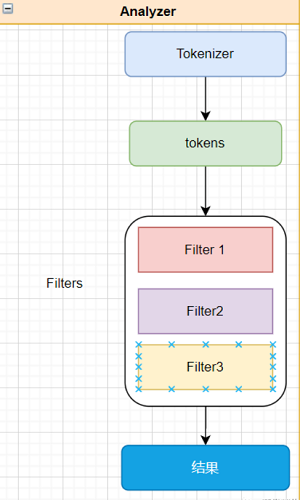
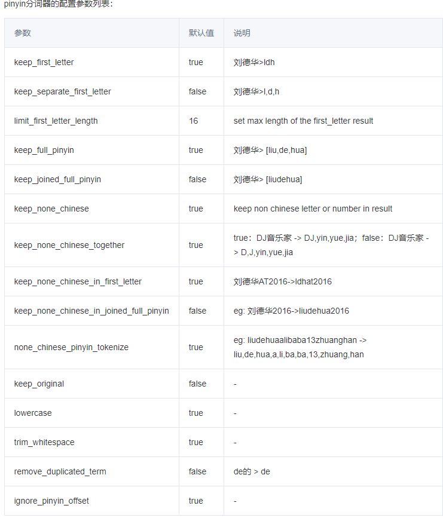

# ES 的分词器

## 一、ES内置的6种分词器
### standard analyzer 
标准分词器，未设置分词器时默认使用此分词器。在空格、符号处切，中文部分切割为一个一个的汉字。
切的意思是不要了。多个连续的空格算一个空格，符号指的是！、？、@、。等
"h!ello wo2rld  a  b我是a中国人d"    =>   h   ello   wo2rld   a   b   我   是  a  中   国   人

### simple analyzer 
简单分词器。在空格、符号、数字处切，中文部分不会切割为一个一个的汉字。
数字指的是1、2.5这种，不包括大写的数字。
"h!ello wo2rld  a  b我是a中国人d"  => h   ello   wo   rld   a    b我是a中国人d

### stop analyzer
停止分词器。在空格、符号、数字、英文介词|冠词 处切，中文部分不会切割为一个一个的汉字。
英文介词|冠词指的是the、a、an、this、of、at等，注意是英文的，中文的介词|冠词不切。
"h!ello wo2rld  a  b我是a中国人d"   =>   h  ello   wo  rld    b我是a中国人d 
在英文中，冠词|介词前后都有一个空格，是单独的一个词，如果前后没有空格，那就不算介词|冠词。

### whitespace analyzer
空白符分词器。只在空格处切。
"h!ello wo2rld  a  b我是a中国人d"  => h!ello   wo2rd   a    b我是a中国人d

### language analyzer
语言分词器。语言分词器有很多种，把语言全小写就是，比如english，chinese。
english、chinese的效果都一样：在空格、符号、英文介词|冠词 处切，中文切割为一个一个的汉字。

### pattern analyzer
正则表达式分词器。根据正则表达式来切，默认使用的正则表达式是\W+，在匹配\W+的地方切。

\w包括英文字母、阿拉伯数字、_，\W是任意一个非\w字符，中文字符也算\W。

+表示一个及以上，就是说多个非\w字符算作一处。

### keyword  分词器

``` json
POST _analyze
{
  "analyzer": "keyword",
  "text": ["The 2 QUICK Brown-Foxes jumped over the lazy dog's bone."]
}
得到  "token": "The 2 QUICK Brown-Foxes jumped over the lazy dog's bone." 一条完整的语句
```


### simple分词器示例

``` json
POST _analyze
{
  "analyzer": "simple",
  "text": "The 2 QUICK Brown-Foxes jumped over the lazy dog's bone."
}
---> [ the, quick, brown, foxes, jumped, over, the, lazy, dog, s, bone ]

```


 ## 二、自定义的分词器


 ### 自定义分词配置设定

 ``` json
 "char_filter": {},  #在tokenizer之前对原始文本进行处理，比如增加，删除，替换字符等
 "tokenizer": {},  #分词器：将原始文档按照一定规则切分为单词
 "filter": {},     #针对tokenizer 输出的单词进行增删改等操作
 "analyzer": {}    #解析器： 包含tokenizer和filter
 ```

说明： tokenizer 和 analyzer 区别



Analyzer 是tokenizer和filters的组合，tokenizer代表分词器，它负责将一串文本根据词典分成一个个的词，输出的是tokens数据流，一个analyzer有且只有一个tokenizer。filter则是对分词之后的结果进行处理，例如大小写转换、关联同义词、去掉停用词、不同国家语言映射转换等，一个analyzer可以有0个或多个filter


### char_filter

``` json
示例1：

POST _analyze
{
  "tokenizer": "keyword",
  "char_filter": ["html_strip"],   # 除去html标签和转换html实体
  "text": ["<p>I&apos;m so <b>happy</b>!</p>"]
}
得到：
      "token": """

I'm so happy!

"""
```

``` json
示例2
PUT t_index
{
  "settings": {
    "analysis": {
      "analyzer": {  #关键字 设置解析器
        "my_analyzer":{   #自定义analyzer的名字
          "tokenizer":"keyword",
          "char_filter":["my_char_filter"]   #使用自定义的字符处理
        }
      },
      "char_filter": {  # 关键字
        "my_char_filter":{   # 自定义char_filter
          "type":"html_strip",  #  除去html标签和转换html实体
          "escaped_tags":["b"]  # 不从文本中删除的HTML标记数组
        }
      }}}}
POST t_index/_analyze
{
  "analyzer": "my_analyzer",
  "text": ["<p>I&apos;m so <b>happy</b>!</p>"]
}
得到：
"token": """
I'm so <b>happy</b>!
"""
```


### tokenizer

#### 示例1
```json

PUT t_index
{
  "settings": {
    "analysis": {
      "analyzer": {
        "my_analyzer":{
          "tokenizer":"my_tokenizer"
        }
      },
      "tokenizer": { 
        "my_tokenizer":{
          "type":"standard",
          "max_token_length":5    # 参数：max_token_length，最大token长度，默认是255
        }}}}}
        
POST t_index/_analyze
{
  "analyzer": "my_analyzer",
  "text": ["The 2 QUICK Brown-Foxes jumped over the lazy dog's bone."]
}
得到:
[ The, 2, QUICK, Brown, Foxes, jumpe, d, over, the, lazy, dog's, bone ]
# jumped 长度为6  在5这个位置被分割

```
#### 示例2

```json

POST _analyze
{
  "tokenizer": "letter",  # 非字母时分成多个terms
  "text": ["The 2 QUICK Brown-Foxes jumped over the lazy dog's bone."]
}
得到 [ The, QUICK, Brown, Foxes, jumped, over, the, lazy, dog, s, bone ]

```


### filter


``` json
PUT t_index
{
  "settings": {
    "analysis": {
      "analyzer": {
        "my_analyzer":{
          "type":"custom",
          "tokenizer":"standard",
          "filter":"my_filter"
        }
      },
      "filter": {
        "my_filter":{
          "type":"stop",
          "stopwords":["and","or","not"]  # 过滤掉停用词
        }
      }
    }
  }
}
POST t_index/_analyze
{
  "analyzer": "my_analyzer",
  "text": ["lucky and happy not sad"]
}-------------->[lucky,happy,sad]


```

### analyzer

``` json

PUT /medcl/ 
{
    "settings" : {
        "analysis" : {
            "analyzer" : {
                "pinyin_analyzer" : {  // 使用自定义解析器
                    "tokenizer" : "my_pinyin" //使用自定义的分词器
                    }
            },
            "tokenizer" : {
                "my_pinyin" : {
                    "type" : "pinyin", //内置的拼音分词器
                    "keep_separate_first_letter" : false,
                    "keep_full_pinyin" : true,
                    "keep_original" : true,
                    "limit_first_letter_length" : 16,
                    "lowercase" : true,
                    "remove_duplicated_term" : true
                }
            }
        }
    }
}

```

系统自带的拼音分析器选项设置：




## 三、IK分词器

针对中文的分词器，具体安装可再google。分词模式有两种：ik_max_word和ik_smart模式。

### ik_max_word模式

会将文本做**最细粒度**的拆分，比如会将“中华人民共和国人民大会堂”拆分为“中华人民共和国、中华人民、中华、华人、人民共和国、人民、共和国、大会堂、大会、会堂等词语。

### ik_smart模式

最粗粒度的拆分，比如会将“中华人民共和国人民大会堂”拆分为中华人民共和国、人民大会堂。

### 两种模式的测试

两种分词器使用的**最佳实践**是：索引时用ik_max_word，在搜索时用ik_smart。

``` json
POST http://10.33.192.218:9200/_analyze
{
	"text": "人民大会堂",
	"analyzer": "ik_smart"
}

结果：
{
  "tokens": [
    {
      "token": "人民大会堂",
      "start_offset": 0,
      "end_offset": 5,
      "type": "CN_WORD",
      "position": 0
    }
  ]
}


```


``` json

POST http://10.33.192.218:9200/_analyze
{
	"text": "人民大会堂",
	"analyzer": "ik_max_word"
}

结果：

{
  "tokens": [
    {
      "token": "人民大会堂",
      "start_offset": 0,
      "end_offset": 5,
      "type": "CN_WORD",
      "position": 0
    },
    {
      "token": "人民大会",
      "start_offset": 0,
      "end_offset": 4,
      "type": "CN_WORD",
      "position": 1
    },
    {
      "token": "人民",
      "start_offset": 0,
      "end_offset": 2,
      "type": "CN_WORD",
      "position": 2
    },
    {
      "token": "大会堂",
      "start_offset": 2,
      "end_offset": 5,
      "type": "CN_WORD",
      "position": 3
    },
    {
      "token": "大会",
      "start_offset": 2,
      "end_offset": 4,
      "type": "CN_WORD",
      "position": 4
    },
    {
      "token": "会堂",
      "start_offset": 3,
      "end_offset": 5,
      "type": "CN_WORD",
      "position": 5
    }
  ]
}

```

### IK分词器的扩展词典

扩展词典：有写词语作为整体，建库时不想被分词，可以使用这个扩展词典。比如：北京大厦，不想分成北京|大厦  

配置：/plugins/ik/config/IKAnalyzer.cfg.xml  ，词典需要是utf-8编码

``` json
<?xml version="1.0" encoding="UTF-8"?>
<!DOCTYPE properties SYSTEM "http://java.sun.com/dtd/properties.dtd">
<properties>
        <comment>IK Analyzer 扩展配置</comment>
        <!--用户可以在这里配置自己的扩展字典 -->
        <entry key="ext_dict">ext_dic.dic</entry>
         <!--用户可以在这里配置自己的扩展停止词字典-->
        <entry key="ext_stopwords"></entry>
        <!--用户可以在这里配置远程扩展字典 -->
        <!-- <entry key="remote_ext_dict">words_location</entry> -->
        <!--用户可以在这里配置远程扩展停止词字典-->
        <!-- <entry key="remote_ext_stopwords">words_location</entry> -->
</properties>
```


 ## 四、项目中实例

 ```json
   "settings": {
    "analysis": {
      "analyzer": {
        "text_prefix_analyzer": {
          "type": "custom",
          "tokenizer": "text_edge_ngram_tokenizer", #使用自定义分词器
          "filter": [
            "lowercase", # 转成小写
            "asciifolding",
            "arabic_normalization"
          ]
        }
      },
      "tokenizer": {
        "text_edge_ngram_tokenizer": {
          "type": "edge_ngram",
          "min_gram": 1,
          "max_gram": 256,
          "token_chars": [
            "letter",
            "digit"
          ]
        }
      }
    },
    "index": {
      "number_of_shards": "${number_of_shards}",
      "number_of_routing_shards": "${number_of_shards}",
      "number_of_replicas": "${number_of_replicas}",
      "number_of_shards_per_node": "${number_of_shards_per_node}"
    }
  }
 
 ```
 参考：[edge N-gram tokenizer] (https://www.elastic.co/guide/en/elasticsearch/reference/current/analysis-edgengram-tokenizer.html)


