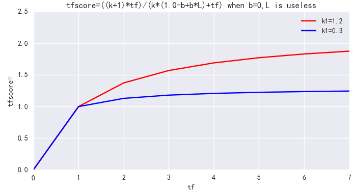
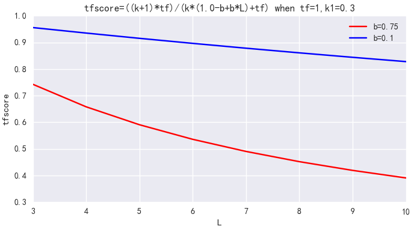

# BM25 算法

D: 文档(邮件)
Q：query(关键词：我爱中国)
$$q_i : query的分词结果,比如：q_1: 我 q_2:爱 q_3:中国$$ 
IDF：逆文档频率
$$IDF(q_i)=ln(\frac{N-n(q_i)+0.5}{n(q_i)+0.5}+1)$$ 
N： 文档总数
$n(q_i)$: $q_i$ 出现在某文档中,这种文档的数量个数
$f(q_i,D)$: $q_i$在文档出现的次数
$k_1$:控制非线性词频率归一化（饱和度）
$b$: 控制文档长度对于分数的惩罚力度,默认$k_1=1.2,b=0.75$
$|D|$: 查询的字段的单词长度
$avgdl$: 所有查询文档中该字段的平均长

上面主要是计算的doc部分的权重和频次，之前理解的有问题：q_i 应该是doc层面的分词结果，不是query层面的。参考ref 2 的计算过程。

## 基本介绍

BM25是信息索引领域用来计算query与文档相似度得分的经典算法。不同于TF-IDF，BM25的公式主要由三个部分组成：

1. query中每个单词t与文档d之间的相关性
2. 单词t与query之间的相似性
3. 每个单词的权重

## 过程详解

* 公式

$$
score(Q,d) = \sum_{i}^{n}(W_i*R(q_i, d))
$$

* 词权重
  $$
  W_i = \log(\frac{N- df_i + 0.5}{df_i + 0.5})
  $$
  
  
  
  其中N表示索引中全部文档数；$df_i$ 为包含qi的文档的个数；含义：qi出现在越多文档中，重要性越小； 本质就是idf。其中log是以e为底的对数。

   IDF 一项无参可调，这里只说明一点，公式中当 n(q) 超过 N/2 非常大时，IDF 有得到负值的可能，Lucene’s BM25 实现时对 log 中的除式做了加 1 处理，Math.log(1 + (docCount - docFreq + 0.5D)/(docFreq + 0.5D))，使其永远大于 1，取 log 后就不会得到负值
  
* 每个term和doc文档之间的相关性
  $$
  S(q_i, d) = \frac{(k_1 + 1)tf_{td}}{k1(1-b + b*\frac{L_d}{L_{ave}}) + tf_{td}}
  $$
  $tf_td$ : term在文档doc中词频

  k1: 协调词频的影响度，越小词频影响越小，es默认1.2，b=0.75

  b：取值(0,1),决定文档d的长度对打分结果影响程度。 

* 每个term和query的相关性
  $$
  S(q_i, Q) = \frac{(k_2 + 1) * tf_{tq}}{k_2 + tf_{tq}}
  $$
  $tf_tq$ : 表示term在query中的词频

  K2: 协调因子，调节term在query中词频的影响

* 整体BM25计算
  $$
  score(Q,d) = \sum_{i}^{n}\log(\frac{N- df_i + 0.5}{df_i + 0.5}) *  \frac{(k_1 + 1)tf_{td}}{k1(1-b + b*\frac{L_d}{L_{ave}}) + tf_{td}} *  \frac{(k_1 + 1)tf_{td}}{k1(1-b + b*\frac{L_d}{L_{ave}}) + tf_{td}}
  $$
  
## 参数调整

### 参数k1
k1 用来控制公式对词项频率 tf 的敏感程度。((k1 + 1) * tf) / (k1 + tf) 的上限是 (k1+1)，也即**饱和值**。当 k1=0 时，不管 tf 如何变化，BM25 后一项都是 1；随着 k1 不断增大，虽然上限值依然是 (k1+1)，但到达饱和的 tf 值也会越大；当 k1 无限大时，BM25 后一项就是原始的词项频率。一句话，k1 就是衡量高频 term 所在文档和低频 term 所在文档的相关性差异，在我们的场景下，**term 频次并不重要，该值可以设小**。ES 中默认 k1=1.2，可调整为 k1=0.3。

### 参数b

b 用来控制文档长度 L 对权值的惩罚程度。b=0，则文档长度对权值无影响，b=1，则文档长度对权值达到完全的惩罚作用。ES 中默认 b=0.75，可调整为 b=0.1。

## reference

1、[bm25算法](https://zhuanlan.zhihu.com/p/79202151)

2、[TF-IDF和BM25算法原理及python实现](https://blog.csdn.net/chaojianmo/article/details/105143657)

3、[BM25调参调研](https://www.cnblogs.com/naughtybaby/p/9774836.html)

