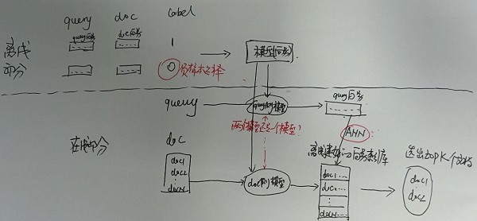

# 

#

MLP
CNN
LSTM
Transformer
BERT

DSSM
ANN 
HNSW  
faiss

## transformer专题

核心材料：
《This post is all you need（上卷）——层层剥开Transformer V1.3.2》

#### 材料学习中的疑问

#### nn.embedding 理解，即NLP使用的NN网络的输入

self.emb = nn.embedding(vocsize， dim) 
self.emb(input)  # input是word2idx之后的离散化数字表示的

https://blog.csdn.net/raelum/article/details/125462028 ： 深入理解torch中的nn.Embedding
   1) torch.nn.Embedding 和  nn.Linear  异同：
      同：内容都有weight权重矩阵
      异：nn.Embdding输入是离散id的索引list ，weight矩阵类似词表，使用索引值查找weight，产生初始词向量。
          nn.Linear 输入是one-hot向量，通过与weight的矩阵运算，获取输出神经元的值
https://www.cnblogs.com/ryukirin/p/14612795.html
   主要理解：nn.Embedding的输入参数，及入参shape，输出的结果shape

#### transformer 中参数初始化，使用方法？

xavier_uniform_(p)

#### 多head原因？ 多个head头，怎么实现每个头注意不同的感受野？

多头原因：
多个不同的子空间
多头的注意力有助于网络捕捉到更丰富的特征/信息(类比 CNN 中同时使用多个卷积核)
参考：
https://blog.csdn.net/air__Heaven/article/details/123663323
https://blog.csdn.net/air__Heaven/article/details/123510506   # 面试

多头实现：
W_Q， W_K， W_V 是多个head的，初始化是多head的维度，进行的初始化： self.q_proj_weight = Parameter(torch.Tensor(embed_dim, embed_dim))

softmax(Q*K^T/sqrt(dim)) * V   => 第一个阶段算了整体的相关性，第二个阶段使用整体的相关性系统，计算了每个头的各维度值？不对，单个计算，z进行cat，之后对所有z进行linear变换

Multi-Head Attention时间复杂度也是O(n2⋅d) 复杂度相较单头并没有变化，主要还是transposes and reshapes 的操作，相当于把一个大矩阵相乘变成了多个小矩阵的相乘

参考：https://paddlepedia.readthedocs.io/en/latest/tutorials/pretrain_model/transformer.html   # 面试

#### transformer中哪些进行权重的共享？

1. token embedding阶段
   使用bep，类似德英这种有共同subword的，可以共享，缩减词典大小量，进行词典的共享； 对于英，中这种差别较大的语系，也不建议共享，因为可以公用的subword不多，词典变大，导致后面预测时进行softmax的空间变大

2. 解码阶段：
   Embedding层和FC层权重共享？ 为啥可以共享
   

#### transform中的mask操作？
有两个masked操作，分别是：
1. decoder阶段的masked multihead self-attetion过程中，由于当前token是看不到后面的tokens的，所以对QK^T的结果进行masked，形状是上三角的
2. 由于每个batch中多个样本的输入的token的序列长度不一定相同，所以要对QK^T的结果进行padding mask， 形状是后面几个列

3. mask操作，是在哪个阶段生效的？公式 ？

#### add & Normal
transformer中的nn.LayerNorm(dim)针对的是token的词向量维度

#### decoder中en-de multihead attention中的KV 输入获取

它是把encoder的最终输出结果，memory： src_len * batchsize * dim  作为KV 送到解码层的每一层

#### p35-36页面，总结self-attention的实现的过程？

并行计算
attetion weights的输出，是取了多头的平均
attetion mask /  padding mask 的实现

#### transformer的并行化计算？
1. mask multihead attetion  ： 多头并行计算，QKV及attetion，获取不同子空间的特征/信息
2. teacher force ： 训练阶段，

#### 翻译模型

loss = loss_fn(logits.reshape(-1, logits.shape[-1]), tgt_out.reshape(-1))  # 64页面，我改怎么理解这个损失函数的输入数据？

 * 运行train.py程序时，报错缺少: No module named 'spacy'
   pip3 install spacy
   下载语言包：de_core_news_sm-3.0.0.tar.gz    en_core_web_sm-3.0.0.tar.gz
    进入下载目录，安装语言包：pip3 install de_core_news_sm-3.0.0.tar.gz
   spacy?
   了解下：spacy 类似NLTK，都是NLP的工具软件包，提供了能力：分词，词性标注，句法分析，NER，词embedding 等能力
   
   参考：https://blog.csdn.net/weixin_44762483/article/details/121887607
   https://zhuanlan.zhihu.com/p/344957355

* Vocab 报错
  `RuntimeError`` when the queried token is not found in the Vocabulary
  
    return vocab(counter, specials=specials, min_freq=min_freq)
  改为：
    vocabs = vocab(counter, specials=specials, min_freq=min_freq)
    vocabs.set_default_index(0)   # 主要是设置默认unkown的索引id
    return vocabs
  同时，头文件，from torchtext.vocab import Vocab 改为：from torchtext.vocab import vocab
  应该是torchtext的版本差异导致，Vocab是0.4低版本的用法 

#### 

深入理解Transformer及其源码 : https://www.cnblogs.com/zingp/p/11696111.html

What does PyTorch Embedding do? ： https://www.quora.com/What-does-PyTorch-Embedding-do
终于碰上torch.nn.Embedding ：https://blog.csdn.net/qq_41329791/article/details/109182823

### 国外的文章，写的真清楚啊
https://towardsdatascience.com/transformers-explained-visually-part-2-how-it-works-step-by-step-b49fa4a64f34

https://towardsdatascience.com/transformers-explained-visually-part-3-multi-head-attention-deep-dive-1c1ff1024853

## 邮件语义向量搜索/排序

### 排序

排序使用的思路

https://zhuanlan.zhihu.com/p/618073170  ： 【自然语言处理】【大模型】极低资源微调大模型方法LoRA以及BLOOM-LORA实现代码

https://blog.csdn.net/weixin_43945848/article/details/129375410  ： 轻松玩转开源大语言模型bloom

https://www.cnblogs.com/LittleHann/p/17318509.html ：LoRA（Low-Rank Adaptation of Large Language Models）-- 一种大模型prompt-tuning调优方法 
https://huggingface.co/yuanzhoulvpi/chinese_bloom_7b_chat?text=%E6%88%91%E5%8F%AB%E6%89%98%E9%A9%AC%E6%96%AF%EF%BC%8C%E6%88%91%E7%9A%84%E4%B8%BB%E8%A6%81

https://github.com/Macielyoung/Bloom-Lora ： 
受到BELLE项目的启发，我们希望基于Bloomz+instrcution数据构建一个中文指令问答模型，同时可以根据自己领域内任务生成相关数据，训练出领域相关的指令问答模型

https://blog.csdn.net/bqw18744018044/article/details/130163540 ： 极低资源微调大模型方法LoRA以及BLOOM-LORA实现代码

邮件的形成微调样本的思路：
instruction  ：   output
邮件标题 ： 全部body/第一封邮件body
第一层邮件body  ——> 第二次回复的body
第二次回复的body -> 第三次回复的body

https://github.com/cckuailong/SuperAdapters ：

SuperAdapters -- 一套SFT微调框架
- 支持全平台（Linux/Windows/Mac M芯片）
- 支持多种 LLM（LLaMA/ChatGLM/Bloom/QWen/BaiChuan）
- 支持多种微调方式（Lora/Qlora/AdaLora/PTuning 等）

https://www.guyuehome.com/44049  ： 大模型之Bloom&LLAMA----Pre-Training(二次预训练)

https://cloud.tencent.com/developer/article/2322954 ： 本地部署开源大模型的完整教程：LangChain + Streamlit+ Llama

https://www.cnblogs.com/heyjjjjj/p/17488423.html ： 各类大模型的区别

### 语义召回
https://github.com/HqWu-HITCS/Awesome-Chinese-LLM ： 整理开源的中文大语言模型，以规模较小、可私有化部署、训练成本较低的模型为主，包括底座模型，垂直领域微调及应用，数据集与教程等。

https://juejin.cn/post/7268688529432248335 ：妙鸭爆火给AI开发者的启示；最全LangChain资源库；LLM大学；大模型实践长文总结 | ShowMeAI日报

https://www.aneasystone.com/archives/2023/08/llm-application-frameworks-langchain.html ： 大模型应用开发框架 LangChain 学习笔记

https://zhuanlan.zhihu.com/p/646433933 ： 让Langchain与你的数据对话(三)：检索(Retrieval)

https://zhuanlan.zhihu.com/p/654858266  ：  大模型技术实践（三）｜用LangChain和Llama 2打造心灵疗愈机器人

https://juejin.cn/post/7263021137246863397  ： 语义检索系统：基于Milvus 搭建召回系统抽取向量进行检索，加速索引

https://aistudio.baidu.com/projectdetail/6425311?contributionType=1&sUid=691158&shared=1&ts=1689045411952 ： 语义检索系统：基于无监督预训练语义索引召回：SimCSE、Diffcse

## 语义相关项目

   
   D:\workfiles\20220906_大搜搜索\20220119_deepmatch
   语义召回模型学习过程.md
   
   D:\workfiles\20220906_大搜搜索\20220920_精排资料\deep
   
   
   http://wenote.xxx.com/wapp/recent/75283210-1f2d-11eb-9ec0-5b0de86f74be?docGuid=8ad22250-46dc-11ed-94a0-4b397f3a3391
   
   语义召回对用MTP上东东？
   
   语义相关原理网上参考： https://github.com/ww5365/tiny_util/blob/master/doc/retrival_ai/retrival_algorithm/03_%E6%B7%B1%E5%BA%A6%E6%A8%A1%E5%9E%8B_%E8%AF%AD%E4%B9%89%E5%8F%AC%E5%9B%9E.md
   
   
   D:\workspace\my_codehub\myproject\bd_sparklesearch_semantic ：深度语义代码
   
   http://7.185.31.49:3000/9rFac158QVWqTdoVkZ3cpg?view  ： 实习生的产出

## DSSM

微软DSSM模型（Deep Structured Semantic Models）

1. 参考1.重点能说明问题  :  [推荐系统（十七）双塔模型：微软DSSM模型](https://blog.csdn.net/u012328159/article/details/123782735 )

* DSSM 离线训练，正样本是点击的item，负样本为王？ 负样本怎么选择？

* 在线应用时，训练的模型，离线索引，是怎么生效的？
  
  query侧的模型 和  doc侧的模型可以是不同模型吗？

  

2. 参考2. 最基本的DSSM原理的介绍 ：  [DSSM](https://paddlepedia.readthedocs.io/en/latest/tutorials/recommendation_system/dssm.html#id2)

3. 参考3. [YouTube采样修正的双塔模型论文精读](https://mp.weixin.qq.com/s/us4qGD3LDgLmPy2m-qq-iw#at)

《Sampling-Bias-Corrected Neural Modeling for Large Corpus Item Recommendations》

知道了问题： 

1、 双塔召回 和 (ANN) faiss库 是什么关系？

向量模型训练完后，在线应用时，query 侧产利用模型，实时产出语义向量 qVector +  doc侧利用模型离线构建语义向量索引，docVectors； 利用向量搜索的引擎，比如faiss，使用qVector到docVectors中进行向量索引的搜索。

4. 参考4. 双塔DNN召回模型/DSSM算法(https://www.cnblogs.com/charlesblc/p/15932373.html)

5. 参考5：[语义向量召回之ANN检索](http://xtf615.com/2020/08/01/EBR/) 

   基于Embedding-based Retrieval in Facebook Search 这篇论文，深入探讨并get到如下的思想：

   * 语义向量搜索系统的系统框架 ：  关注query侧模型  doc侧模型所处位置
   * 重点讨论了：向量如何进行 向量量化 ? PQ量化   目的是：优化向量存储，向量搜索效率  向量搜索的时空复杂度

     调参的经验：
     多尝试使用乘积量化：包括原生PQ，OPQ，PQ with PCA等。能够显著降低索引存储空间存储复杂度、查询时间复杂度。其中，pq_bytes，即残差量化codes的大小，很重要。决定了残差量化分块聚类中心的个数，个数越大越精确，比如m=8,k*=256时，pq_byte=1byte x 8= 8 byte。paper中建议采用d/4，d是向量的维度数，假设64维度，则d/4=16，是默认值的2倍

6. 参考6: [负样本为王：评Facebook的向量化召回算法](https://zhuanlan.zhihu.com/p/165064102)

   基于Embedding-based Retrieval in Facebook Search 主要讲负样本怎么处理？
   
   召回： 主要是做负样本

   负样本： 随机采样  hard negtive mining samples 基于上一个召回模型，取100~500之间的样本，这种看起来像，但又不是正样本的，增加学习的难度，学到细微的特征不同点

7. 参考7：[语义索引（向量检索）的几类经典方法](https://zhuanlan.zhihu.com/p/161467314)

    这篇博文，也是基于Embedding-based Retrieval in Facebook Search

    这篇论文的一个梳理

8. 参考8： KDD'21 | 淘宝搜索中语义向量检索技术 : https://zhuanlan.zhihu.com/p/409390150

   这篇文章是facebook这篇文章的延伸，关注下模型的网络结构，难度更大些。

   https://www.6aiq.com/article/1617063677499  ： 深度语义模型 BERT 在 58 同城搜索的实践

   关注其中的：双塔式BERT 主要是向量部分使用bert获得

   https://www.6aiq.com/article/1605651191093 : 阿里文娱深度语义搜索相关性探索

   这篇文章介绍了，非对称双塔模型（在线部署），上篇58同城的文章中也有提到。 对于双塔模型，如果用bert来表示文本语义向量， 他的这个双塔模型，特别是向量表示模型，选用bert，是可以参考这种做法的。

   poly-encoder 模型  :  双塔 + bert + attention
   
   论文中的工程实践：

   打标： 用交互型的BERT（指标最好，但只能离线使用）作为teacher。在以上两个数据上进行打标，得到BERT soft label。
   
   蒸馏： 用无标签的数据蒸馏。并不是用BERT直接蒸馏目标模型，而是用它去蒸馏对称的双塔BERT，也就是说Query侧和Doc侧都是12层的BERT。
   
   用target set 进行finetune： 获得了中间模态的对称双塔BERT。
   
   固定权重和蒸馏

## 参考

1. 推荐系统（十七）双塔模型：微软DSSM模型（Deep Structured Semantic Models） ： https://blog.csdn.net/u012328159/article/details/123782735 

2. DSSM: https://paddlepedia.readthedocs.io/en/latest/tutorials/recommendation_system/dssm.html#id2

3. YouTube采样修正的双塔模型论文精读 : https://mp.weixin.qq.com/s/us4qGD3LDgLmPy2m-qq-iw#at

4. 双塔DNN召回模型/DSSM算法  :  https://www.cnblogs.com/charlesblc/p/15932373.html

5. 语义向量召回之ANN检索： http://xtf615.com/2020/08/01/EBR/
6.  [负样本为王：评Facebook的向量化召回算法](https://zhuanlan.zhihu.com/p/165064102)
